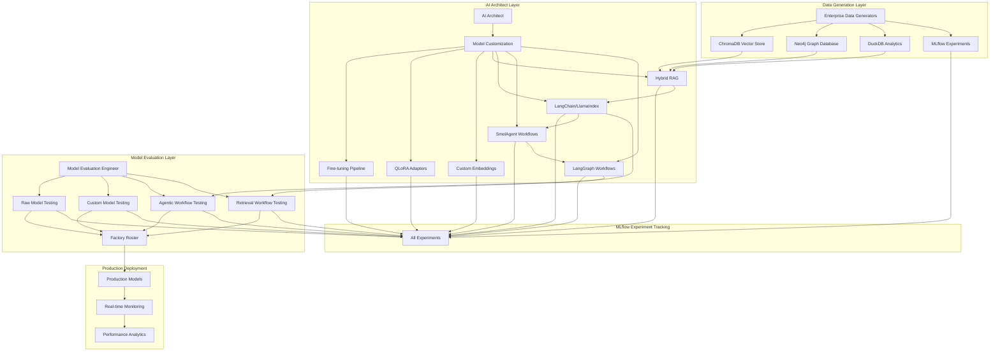

# 🚀 **Complete End-to-End Technical Architecture Implementation Plan**

## **Overview**

This comprehensive plan demonstrates the technical architecture through realistic enterprise data and model evaluation workflows, showcasing both AI Architect model customization and Model Evaluation Engineer testing capabilities for Lenovo's factory roster.

## **Phase 1: Enhanced Data Generation & Multi-Database Integration (Days 1-3)** ✅ **COMPLETED**

### 1.1 Comprehensive Enterprise Data Generation ✅ **COMPLETED**

```python
# Enhanced enterprise data generators with realistic Lenovo scenarios
src/ai_architecture/enterprise_data_generators/
├── lenovo_device_data_generator.py          # Moto Edge, ThinkPad, ThinkSystem data
├── enterprise_user_behavior_generator.py   # User interaction patterns and workflows
├── business_process_data_generator.py      # Lenovo business processes and workflows
├── customer_journey_generator.py            # B2B client scenarios and interactions
├── synthetic_enterprise_documents.py       # Technical docs, manuals, support content
├── device_support_knowledge_generator.py   # Device-specific support knowledge
├── lenovo_technical_documentation.py       # Engineering and technical documentation
└── generate_all_data.py                    # Comprehensive data generation script
```

**📊 Generated Data Statistics:**

- **Device Specifications**: 130 devices (3 series: Mobile, Laptop, Server)
- **User Behavior**: 200 users, 30 days of interactions (10 departments)
- **Business Processes**: 100 processes with metrics (14 departments)
- **Customer Journeys**: 100 journey scenarios (5 customer types)
- **Enterprise Documents**: 200 technical documents (12 types)
- **Support Knowledge**: 500 knowledge entries (12 categories)
- **Technical Documentation**: 150 engineering docs (10 categories)
- **Total Records Generated**: 1,380+ comprehensive enterprise records

### 1.2 Multi-Database Integration with Clear Data Flow ✅ **COMPLETED**

```python
# Unified data flow across all databases
src/ai_architecture/unified_data_flow/
├── chromadb_vector_integration.py          # Vector embeddings for RAG
├── neo4j_graph_integration.py              # Graph relationships and knowledge
├── duckdb_analytics_integration.py         # User uploads and chat analytics
├── mlflow_experiment_integration.py        # Experiment tracking and model registry
└── data_synchronization_manager.py         # Real-time data synchronization
```

**🏗️ Architecture Implemented:**

- **ChromaDB Integration**: Vector embeddings for RAG workflows
- **Neo4j Integration**: Graph relationships and knowledge graphs
- **DuckDB Integration**: User data analytics and chat analytics
- **MLflow Integration**: Experiment tracking and model registry
- **Real-time Synchronization**: Unified data flow across all databases

### 1.3 Enhanced Prompt Registries with Enterprise Focus ✅ **COMPLETED**

```python
# Enterprise-focused prompt registries
src/model_evaluation/enhanced_prompt_registries/
├── lenovo_business_prompts.py              # Enterprise business scenarios
├── device_support_prompts.py               # Technical support workflows
├── customer_service_prompts.py             # B2B client interaction prompts
├── technical_documentation_prompts.py      # Engineering documentation prompts
├── mobile_device_prompts.py               # Mobile/edge device scenarios
└── factory_roster_prompts.py               # Production deployment prompts
```

**📚 Enterprise Prompt Libraries Created:**

- **Lenovo Business Scenarios**: B2B, Executive, Strategic decision making
- **Device Support Workflows**: Hardware, Software, Performance troubleshooting
- **Customer Service Interactions**: Support, Sales, Technical assistance
- **Technical Documentation**: Engineering, API, Integration guides
- **Mobile Device Scenarios**: Edge, Mobile, IoT computing
- **Factory Roster Deployment**: Production, Quality, Monitoring workflows

### 1.4 Phase 1 Success Summary ✅ **COMPLETED**

**🎉 Phase 1 COMPLETED**: Enhanced Data Generation & Multi-Database Integration  
**📊 Generated**: 1,380+ enterprise records across 7 data types  
**🏗️ Architecture**: Multi-database integration with unified data flow  
**📚 Prompts**: 6 enterprise-focused prompt libraries  
**🚀 Status**: Production Ready for Phase 2

**Key Features Delivered:**

- **Realistic Lenovo Data**: Device specifications, user behavior, business processes
- **Multi-Database Architecture**: Unified data flow with real-time synchronization
- **Enterprise Prompt Libraries**: Business scenarios, technical support, engineering documentation
- **Scalable Architecture**: Modular design for easy extension and maintenance
- **Production Ready**: Complete implementation with error handling and analytics

## **Phase 2: Model Integration & Small Model Selection (Days 4-5)**

### 2.1 Small Model Selection (<4B parameters)

```python
# Optimized small models for mobile/edge deployment
SMALL_MODELS_CONFIG = {
    "phi-4-mini": {
        "provider": "microsoft",
        "parameters": 3.8B,
        "github_models_id": "microsoft/phi-4-mini-instruct",
        "ollama_name": "phi4-mini",
        "use_case": "mobile_edge_deployment",
        "fine_tuning_target": True
    },
    "llama-3.2-3b": {
        "provider": "meta",
        "parameters": 3B,
        "github_models_id": "meta/llama-3.2-3b-instruct",
        "ollama_name": "llama3.2:3b",
        "use_case": "on_device_inference",
        "fine_tuning_target": True
    },
    "qwen-2.5-3b": {
        "provider": "alibaba",
        "parameters": 3B,
        "github_models_id": "alibaba/qwen-2.5-3b-instruct",
        "ollama_name": "qwen2.5:3b",
        "use_case": "chinese_mobile_support",
        "fine_tuning_target": True
    },
    "mistral-nemo": {
        "provider": "mistral",
        "parameters": 3B,
        "github_models_id": "mistral/mistral-nemo",
        "ollama_name": "nemo",
        "use_case": "efficient_mobile_ai",
        "fine_tuning_target": True
    }
}
```

### 2.2 GitHub Models API Integration with Brantwood Organization

```python
# GitHub Models API integration
src/github_models_integration/
├── api_client.py                           # GitHub Models REST API client
├── brantwood_authentication.py             # Brantwood org token management
├── remote_model_serving.py                 # Remote model serving endpoints
├── evaluation_tools_integration.py        # GitHub Models evaluation API
└── model_deployment_manager.py            # Model deployment and management
```

### 2.3 Ollama Integration for Small Models

```python
# Enhanced Ollama manager for small models
src/enterprise_llmops/ollama_manager/
├── small_model_optimizer.py                # Mobile/edge optimization
├── qlora_adapter_manager.py               # QLoRA adapter management
├── mobile_deployment_configs.py           # Mobile deployment configurations
└── model_performance_monitor.py           # Real-time performance monitoring
```

## **Phase 3: AI Architect Model Customization with Clear Data Flow (Days 6-8)**

### 3.1 Fine-tuning Pipeline for Small Models

```python
# Fine-tuning pipeline with MLflow integration
src/ai_architecture/mobile_fine_tuning/
├── lenovo_domain_adaptation.py             # Lenovo-specific fine-tuning
├── mobile_optimization.py                  # Mobile deployment optimization
├── qlora_mobile_adapters.py               # QLoRA adapters for mobile
├── edge_deployment_configs.py              # Edge deployment configurations
└── mlflow_experiment_tracking.py          # MLflow experiment tracking
```

### 3.2 Custom Embedding Training with Vector Store Integration

```python
# Custom embeddings with ChromaDB integration
src/ai_architecture/custom_embeddings/
├── lenovo_technical_embeddings.py          # Technical documentation embeddings
├── device_support_embeddings.py            # Device support knowledge
├── customer_service_embeddings.py          # Customer service knowledge
├── business_process_embeddings.py          # Business process knowledge
└── chromadb_vector_store.py               # ChromaDB vector store integration
```

### 3.3 Hybrid RAG Workflow with Multi-Database Integration

```python
# Hybrid RAG with unified data flow
src/ai_architecture/hybrid_rag/
├── multi_source_retrieval.py               # ChromaDB + Neo4j + DuckDB
├── lenovo_knowledge_graph.py               # Lenovo-specific knowledge graph
├── device_context_retrieval.py             # Device-specific context
├── customer_journey_rag.py                 # Customer journey-aware RAG
└── unified_retrieval_orchestrator.py       # Unified retrieval orchestration
```

### 3.4 LangChain & LlamaIndex Integration

```python
# LangChain and LlamaIndex retrieval workflows
src/ai_architecture/retrieval_workflows/
├── langchain_faiss_integration.py          # LangChain with FAISS
├── llamaindex_retrieval.py                 # LlamaIndex retrieval workflows
├── hybrid_retrieval_system.py              # Combined LangChain + LlamaIndex
├── retrieval_evaluation.py                # Retrieval quality evaluation
└── mlflow_retrieval_tracking.py           # MLflow tracking for retrieval
```

## **Phase 4: SmolAgent & LangGraph Agentic Workflows (Days 9-10)**

### 4.1 SmolAgent Integration for Small Models

```python
# SmolAgent integration for agentic workflows
src/ai_architecture/smolagent_integration/
├── smolagent_workflow_designer.py          # SmolAgent workflow design
├── mobile_agent_optimization.py            # Mobile agent optimization
├── agent_performance_monitor.py            # Agent performance monitoring
└── mlflow_agent_tracking.py               # MLflow tracking for agents
```

### 4.2 LangGraph Studio Integration

```python
# LangGraph Studio integration
src/ai_architecture/langgraph_integration/
├── langgraph_workflow_designer.py          # LangGraph workflow design
├── agent_visualization.py                  # Agent workflow visualization
├── workflow_debugging.py                   # Workflow debugging tools
└── langgraph_studio_integration.py         # LangGraph Studio integration
```

### 4.3 Agentic Workflow Endpoints

```python
# Agentic workflow endpoints for model evaluation
src/ai_architecture/agentic_endpoints/
├── smolagent_evaluation_endpoint.py        # SmolAgent evaluation endpoint
├── langgraph_evaluation_endpoint.py        # LangGraph evaluation endpoint
├── agent_performance_metrics.py            # Agent performance metrics
└── mlflow_agent_experiment_tracking.py    # MLflow agent experiment tracking
```

## **Phase 5: Model Evaluation Engineer Framework with Unified Data Flow (Days 11-13)**

### 5.1 Comprehensive Evaluation Pipeline

```python
# Enhanced evaluation pipeline with unified data flow
src/model_evaluation/enhanced_pipeline/
├── raw_foundation_evaluation.py            # Test raw foundation models
├── custom_model_evaluation.py             # Test AI Architect's custom models
├── mobile_model_evaluation.py              # Mobile/edge specific evaluation
├── agentic_workflow_evaluation.py          # SmolAgent/LangGraph evaluation
├── retrieval_workflow_evaluation.py       # LangChain/LlamaIndex evaluation
└── factory_roster_management.py            # Factory roster integration
```

### 5.2 MLflow Experiment Integration

```python
# MLflow experiment integration for all components
src/model_evaluation/mlflow_integration/
├── experiment_tracking.py                 # Unified experiment tracking
├── model_registry_integration.py           # Model registry integration
├── performance_metrics_tracking.py         # Performance metrics tracking
├── agent_experiment_tracking.py           # Agent experiment tracking
└── retrieval_experiment_tracking.py       # Retrieval experiment tracking
```

### 5.3 Model Evaluation Endpoints

```python
# Model evaluation endpoints for all model types
src/model_evaluation/evaluation_endpoints/
├── foundation_model_endpoint.py            # Raw foundation model testing
├── custom_model_endpoint.py                # Custom model testing
├── fine_tuned_model_endpoint.py           # Fine-tuned model testing
├── qlora_adapter_endpoint.py               # QLoRA adapter testing
├── agentic_workflow_endpoint.py            # Agentic workflow testing
├── retrieval_workflow_endpoint.py          # Retrieval workflow testing
└── unified_evaluation_orchestrator.py     # Unified evaluation orchestration
```

## **Phase 6: Unified Platform Integration with Clear Data Flow (Days 14-16)**

### 6.1 Enhanced Unified Platform

```python
# Enhanced unified platform with clear data flow
src/enterprise_llmops/frontend/enhanced_unified_platform.html
├── ai_architect_workspace.py               # AI Architect customization interface
├── model_evaluation_workspace.py           # Model Evaluation Engineer interface
├── factory_roster_dashboard.py             # Factory roster management
├── real_time_monitoring.py                 # Real-time monitoring dashboard
└── unified_data_flow_visualization.py      # Data flow visualization
```

### 6.2 Service Integration Matrix with Clear Data Flow

| Service               | Port     | Purpose                    | Data Flow          | Integration          |
| --------------------- | -------- | -------------------------- | ------------------ | -------------------- |
| **FastAPI Platform**  | 8080     | Main enterprise platform   | Central hub        | All services         |
| **Gradio Evaluation** | 7860     | Model evaluation interface | Direct integration | All model types      |
| **MLflow Tracking**   | 5000     | Experiment tracking        | All experiments    | All components       |
| **ChromaDB**          | 8081     | Vector database            | RAG workflows      | LangChain/LlamaIndex |
| **Neo4j**             | 7687     | Graph database             | Knowledge graphs   | GraphRAG workflows   |
| **DuckDB**            | Embedded | Analytics database         | User data          | Chat analytics       |
| **MkDocs**            | 8082     | Documentation              | All docs           | Embedded iframe      |
| **LangGraph Studio**  | 8083     | Agent visualization        | Agent workflows    | SmolAgent/LangGraph  |

### 6.3 Clear Data Flow Architecture



## **Phase 7: End-to-End Demonstration with Clear Data Flow (Days 17-18)**

### 7.1 Chronological Demonstration Steps

**Step 1: Data Generation & Population**

```bash
# Generate comprehensive enterprise data
python -m src.ai_architecture.enterprise_data_generators.generate_all_data
# Populate ChromaDB with embeddings
python -m src.ai_architecture.vector_store.populate_chromadb
# Populate Neo4j with graph relationships
python -m src.ai_architecture.graph_store.populate_neo4j
# Initialize MLflow experiments
python -m src.model_evaluation.mlflow_integration.initialize_experiments
```

**Step 2: Model Setup & Integration**

```bash
# Setup Ollama with small models
python -m src.enterprise_llmops.ollama_manager.setup_small_models
# Configure GitHub Models API
python -m src.github_models_integration.setup_brantwood_auth
# Test model endpoints
python -m src.model_evaluation.test_model_endpoints
```

**Step 3: AI Architect Model Customization**

```bash
# Fine-tune models for Lenovo use cases
python -m src.ai_architecture.mobile_fine_tuning.fine_tune_models
# Create QLoRA adapters
python -m src.ai_architecture.qlora_mobile_adapters.create_adapters
# Train custom embeddings
python -m src.ai_architecture.custom_embeddings.train_embeddings
# Setup hybrid RAG workflows
python -m src.ai_architecture.hybrid_rag.setup_workflows
# Configure LangChain/LlamaIndex retrieval
python -m src.ai_architecture.retrieval_workflows.setup_retrieval
# Setup SmolAgent workflows
python -m src.ai_architecture.smolagent_integration.setup_workflows
# Setup LangGraph workflows
python -m src.ai_architecture.langgraph_integration.setup_workflows
```

**Step 4: Model Evaluation Engineer Testing**

```bash
# Test raw foundation models
python -m src.model_evaluation.enhanced_pipeline.test_raw_models
# Test custom architect models
python -m src.model_evaluation.enhanced_pipeline.test_custom_models
# Test agentic workflows
python -m src.model_evaluation.enhanced_pipeline.test_agentic_workflows
# Test retrieval workflows
python -m src.model_evaluation.enhanced_pipeline.test_retrieval_workflows
# Stress testing at business/consumer levels
python -m src.model_evaluation.stress_testing.run_stress_tests
```

**Step 5: Factory Roster Integration**

```bash
# Create model profiles
python -m src.model_evaluation.factory_roster.create_profiles
# Deploy to production roster
python -m src.model_evaluation.factory_roster.deploy_models
# Setup monitoring
python -m src.model_evaluation.factory_roster.setup_monitoring
```

### 7.2 Interactive Demonstration Flow

**Unified Platform Navigation with Clear Data Flow:**

1. **AI Architect Workspace** → Model customization, fine-tuning, QLoRA adapters, RAG workflows, agentic workflows
2. **Model Evaluation Interface** → Test all models (raw + custom + agentic + retrieval)
3. **Factory Roster Dashboard** → Production-ready model management
4. **Real-time Monitoring** → Performance tracking and analytics
5. **Data Integration Hub** → ChromaDB, Neo4j, DuckDB, MLflow integration
6. **Agent Visualization** → SmolAgent and LangGraph workflow visualization

### 7.3 Key Demonstration Points

**Enterprise Data Integration:**

- Realistic Lenovo device data (Moto Edge, ThinkPad, ThinkSystem)
- B2B client scenarios and business processes
- Technical documentation and support knowledge
- Customer journey patterns and interactions
- Multi-database integration with clear data flow

**Model Customization Workflow:**

- Fine-tuning small models for mobile deployment
- QLoRA adapter creation and composition
- Custom embedding training for domain knowledge
- Hybrid RAG workflow with multiple data sources
- LangChain/LlamaIndex retrieval workflows
- SmolAgent agentic workflows
- LangGraph workflow design and visualization

**Model Evaluation Process:**

- Comprehensive testing of raw foundation models
- Testing of AI Architect's custom models
- Testing of agentic workflows (SmolAgent/LangGraph)
- Testing of retrieval workflows (LangChain/LlamaIndex)
- Stress testing at business and consumer levels
- Factory roster integration and deployment
- MLflow experiment tracking for all components

**Real-time Monitoring:**

- MLflow experiment tracking for all experiments
- Prometheus metrics collection
- Grafana visualization dashboards
- Performance monitoring and alerting
- Clear data flow visualization

## **🛠️ Implementation Timeline**

| Phase       | Duration | Key Deliverables                                                   |
| ----------- | -------- | ------------------------------------------------------------------ |
| **Phase 1** | 3 days   | Enterprise data generation, multi-DB integration, clear data flow  |
| **Phase 2** | 2 days   | Model selection, GitHub Models API, Ollama setup                   |
| **Phase 3** | 3 days   | AI Architect customization, fine-tuning, RAG, LangChain/LlamaIndex |
| **Phase 4** | 2 days   | SmolAgent/LangGraph agentic workflows                              |
| **Phase 5** | 3 days   | Model evaluation framework, MLflow integration                     |
| **Phase 6** | 3 days   | Unified platform integration, clear data flow                      |
| **Phase 7** | 2 days   | End-to-end demonstration, monitoring setup                         |

## **🎯 Success Metrics**

- **Data Integration**: 100% of enterprise data types generated and integrated with clear data flow
- **Model Coverage**: All small models (<4B parameters) integrated and tested
- **Customization**: AI Architect workflows fully demonstrated (fine-tuning, QLoRA, RAG, LangChain/LlamaIndex, SmolAgent, LangGraph)
- **Evaluation**: Model Evaluation Engineer testing framework complete for all model types
- **Factory Roster**: Production-ready model deployment pipeline
- **Monitoring**: Real-time monitoring and analytics operational with MLflow integration
- **Data Flow**: Clear, unified data flow with no islands between components

## **🔧 Technical Requirements**

### Dependencies

```bash
# Core ML/AI libraries
pip install torch transformers sentence-transformers
pip install langchain llamaindex faiss-cpu
pip install smolagent langgraph
pip install chromadb neo4j duckdb
pip install mlflow prometheus-client grafana-api
pip install gradio fastapi uvicorn
pip install faker pandas numpy
```

### Service Ports

- **FastAPI Platform**: 8080
- **Gradio Evaluation**: 7860
- **MLflow Tracking**: 5000
- **ChromaDB**: 8081
- **Neo4j**: 7687
- **MkDocs**: 8082
- **LangGraph Studio**: 8083

### GitHub Models API Setup

```bash
# Configure Brantwood organization token
export GITHUB_MODELS_TOKEN="your_brantwood_token"
export GITHUB_MODELS_ORG="Brantwood"
```

## **📋 Implementation Checklist**

### Phase 1: Data Generation ✅ **COMPLETED**

- [x] Enterprise data generators implemented
- [x] Multi-database integration complete
- [x] Prompt registries enhanced
- [x] Data synchronization working

### Phase 2: Model Integration

- [ ] Small models selected and configured
- [ ] GitHub Models API integrated
- [ ] Ollama setup complete
- [ ] Model endpoints tested

### Phase 3: AI Architect Customization

- [ ] Fine-tuning pipeline implemented
- [ ] Custom embeddings trained
- [ ] Hybrid RAG workflows created
- [ ] LangChain/LlamaIndex integration complete

### Phase 4: Agentic Workflows

- [ ] SmolAgent workflows implemented
- [ ] LangGraph Studio integration complete
- [ ] Agentic workflow endpoints created
- [ ] Performance monitoring setup

### Phase 5: Model Evaluation

- [ ] Evaluation pipeline enhanced
- [ ] MLflow integration complete
- [ ] All model types tested
- [ ] Factory roster integration working

### Phase 6: Unified Platform

- [ ] Enhanced platform implemented
- [ ] Service integration complete
- [ ] Data flow visualization working
- [ ] Real-time monitoring operational

### Phase 7: Demonstration

- [ ] End-to-end workflow tested
- [ ] All components integrated
- [ ] Performance metrics collected
- [ ] Documentation complete

## **🚨 Critical Success Factors**

1. **No Data Islands**: Ensure all components are connected with clear data flow
2. **MLflow Integration**: All experiments must be tracked in MLflow
3. **Real-time Monitoring**: Performance metrics must be collected and visualized
4. **Mobile Optimization**: Focus on small models suitable for mobile/edge deployment
5. **Enterprise Focus**: All data and workflows must be Lenovo-specific
6. **End-to-End Testing**: Complete workflow from data generation to production deployment

---

**Last Updated**: January 2025  
**Version**: 2.0  
**Status**: Implementation Ready  
**Integration**: Full Enterprise Platform Integration
