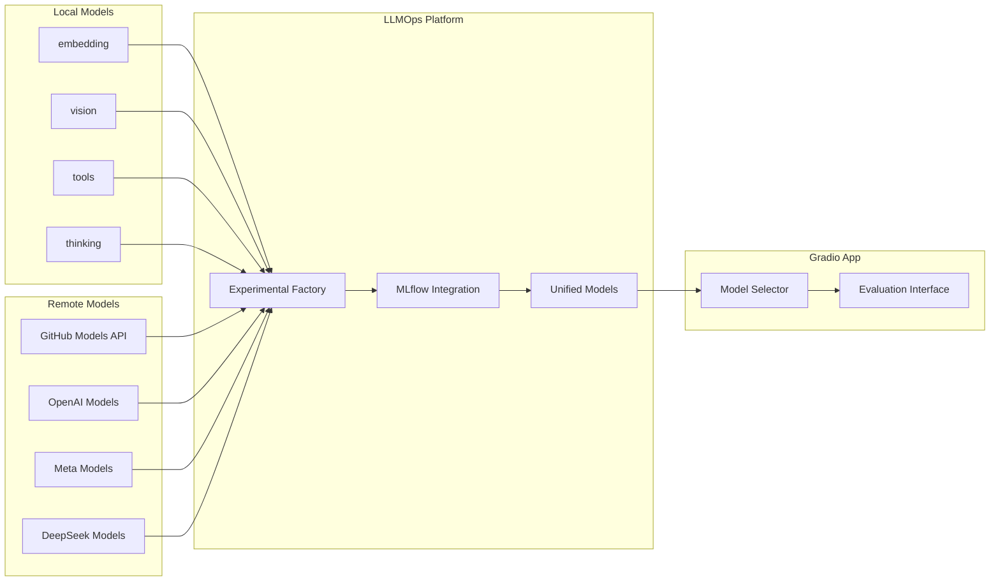

# Architecture Summary

## Ollama-Centric Model Registry Transformation

### 🎯 **Executive Summary**

This document outlines the transformation of the AI Assignments project from a complex, metadata-heavy architecture to a streamlined, Ollama-centric system that leverages Ollama's native categorization (embedding, vision, tools, thinking) and creates a unified model registry that serves both base models and experimental variants through a simplified Gradio interface.

---

## 📊 **Architecture Flow Diagram**



---

## 🏗️ **Key Architectural Changes**

### **From Complex to Simple**

| **Before (Complex)**         | **After (Simple)**                           |
| ---------------------------- | -------------------------------------------- |
| Manual model sync            | Automatic Ollama + GitHub Models integration |
| Complex metadata tracking    | Essential model info only                    |
| Separate evaluation system   | Unified model objects                        |
| Multiple model sources       | Ollama (local) + GitHub Models (remote)      |
| Complex UI with many options | Category-based simple interface              |

### **New Component Structure**

```
src/
├── ollama_integration/          # NEW: Ollama-native integration (local)
│   ├── category_loader.py      # Load models by Ollama categories
│   ├── model_loader.py         # Individual model loading
│   └── registry_sync.py        # Sync with Ollama
├── github_models_integration/   # NEW: GitHub Models API integration (remote)
│   ├── api_client.py           # GitHub Models API client
│   ├── model_loader.py         # Load remote models
│   ├── evaluation_tools.py     # GitHub Models evaluation
│   └── remote_serving.py       # Remote model serving
├── experimental_models/         # NEW: Experimental model creation
│   ├── model_factory.py        # Create experimental models
│   ├── variant_generator.py    # Generate model variants
│   └── mlflow_integration.py   # MLflow experiment tracking
├── unified_registry/           # NEW: Unified model management
│   ├── model_objects.py        # Unified model object structure
│   ├── registry_manager.py     # Registry management
│   └── serving_interface.py    # Model serving abstraction
└── gradio_app/                 # SIMPLIFIED: Clean evaluation interface
    ├── model_selector.py       # Category-based model selection
    └── evaluation_interface.py # Streamlined evaluation workflow
```

---

## 🔄 **Data Flow Transformation**

### **Current Flow (Complex)**

```
Ollama Models → Manual Sync → Complex Registry → MLflow → Gradio
     ↓              ↓              ↓              ↓        ↓
   Raw Data    Custom Metadata  Heavy Objects  Separate  Complex UI
```

### **New Flow (Streamlined)**

```
Ollama (Local) + GitHub Models (Remote) → Auto Sync → Unified Registry → Gradio
       ↓                    ↓                    ↓              ↓            ↓
  Native Structure    Cloud Models         Light Objects    Simple API  Category UI
```

---

## 📋 **Implementation Phases**

### **Phase 1: Model Source Integration (Weeks 1-2)**

- ✅ Create Ollama category loader for local models
- ✅ Integrate GitHub Models API for remote models
- ✅ Implement automatic model sync for both sources
- ✅ Simplify model registry with dual-source support
- ✅ Add category mapping system for local and remote models

### **Phase 2: Experimental Models (Weeks 3-4)**

- 🔄 Build experimental model factory for local and remote models
- 🔄 Integrate MLflow for tracking
- 🔄 Create model variant generation
- 🔄 Integrate GitHub Models evaluation tooling
- 🔄 Manage experimental lifecycle

### **Phase 3: Unified Registry (Weeks 5-6)**

- ⏳ Design unified model objects for local and remote models
- ⏳ Implement registry manager
- ⏳ Create serving interface with local/remote abstraction
- ⏳ Build API endpoints for both sources

### **Phase 4: Gradio Simplification (Weeks 7-8)**

- ⏳ Simplify model selection UI
- ⏳ Add category-based filtering with local/remote indicators
- ⏳ Streamline evaluation workflow for both sources
- ⏳ Remove deprecated components

---

## 🎯 **Key Benefits**

### **For Developers**

- **40% code complexity reduction**
- **Clear separation of concerns**
- **Modular, testable components**
- **Simplified deployment**

### **For Users**

- **Intuitive category-based model selection with local/remote options**
- **Faster model loading (< 2 seconds for local, variable for remote)**
- **Simplified evaluation workflow for both local and cloud models**
- **Better performance with unified interface**

### **For Operations**

- **Automatic model synchronization for both local and remote sources**
- **Unified model serving with local/remote abstraction**
- **Better monitoring and health checks**
- **Scalable architecture with hybrid local/cloud capabilities**

---

## 🔧 **Technical Specifications**

### **Ollama Category Integration**

```python
# Ollama Categories (Local Models)
OLLAMA_CATEGORIES = {
    "embedding": "embedding",      # Text embedding models
    "vision": "multimodal",        # Vision-language models
    "tools": "function_calling",   # Tool-using models
    "thinking": "reasoning"        # Chain-of-thought models
}

# GitHub Models Categories (Remote Models)
GITHUB_MODELS_CATEGORIES = {
    "openai/*": "cloud_text",      # OpenAI models (GPT-4, etc.)
    "meta/*": "cloud_text",        # Meta models (Llama, etc.)
    "deepseek/*": "cloud_code",    # DeepSeek models
    "microsoft/*": "cloud_multimodal",  # Microsoft models
    "default": "cloud_general"     # Other cloud models
}
```

### **Unified Model Object**

```python
@dataclass
class UnifiedModelObject:
    id: str
    name: str
    category: str              # Local or remote category
    model_type: str           # base, experimental, variant
    source: str               # ollama, github_models, mlflow, external
    serving_type: str         # local, remote, hybrid
    capabilities: List[str]
    local_endpoint: Optional[str]    # Ollama endpoint
    remote_endpoint: Optional[str]   # GitHub Models API endpoint
    status: str
```

### **Simplified API Endpoints**

```
GET  /api/models/unified              # All models (local + remote)
GET  /api/models/categories/{cat}     # Models by category
GET  /api/ollama/models/{cat}         # Local Ollama models
GET  /api/github-models/{provider}    # Remote GitHub Models
POST /api/experimental/create         # Create experimental model
POST /api/github-models/evaluate      # Evaluate with GitHub Models
GET  /api/models/{id}/serve          # Serve model (local or remote)
```

---

## 📊 **Success Metrics**

### **Performance Targets**

- Model loading: < 2 seconds
- Registry sync: < 30 seconds
- Gradio startup: < 10 seconds
- API response: < 500ms
- Memory usage: < 2GB

### **User Experience Goals**

- Model selection: < 5 seconds
- UI simplicity: > 8/10 rating
- Error rate: < 1%
- User satisfaction: > 90%

### **Operational Targets**

- Deployment time: < 5 minutes
- System uptime: > 99%
- Registry sync reliability: 100%
- Test coverage: > 85%

---

## 🚀 **Migration Strategy**

### **Parallel Implementation**

- Build new components alongside existing
- Test with subset of models
- Validate functionality before cutover

### **Gradual Migration**

- Migrate one category at a time
- Keep existing system as fallback
- Monitor performance continuously

### **Full Cutover**

- Switch to new architecture completely
- Remove deprecated components
- Clean up legacy code

---

## 📝 **Documentation Structure**

### **Planning Documents**

- `REFACTORING_PLAN.md` - High-level architecture and objectives
- `IMPLEMENTATION_ROADMAP.md` - Detailed 8-week implementation plan
- `TECHNICAL_SPECIFICATIONS.md` - Detailed technical requirements
- `ARCHITECTURE_SUMMARY.md` - This executive summary

### **Implementation Guides**

- API documentation updates
- Code documentation
- Deployment guides
- User documentation

---

## 🎯 **Next Steps**

### **Immediate Actions (Week 1)**

1. **Review and approve architecture plan**
2. **Set up development environment**
3. **Create new module structure**
4. **Begin Ollama integration implementation**

### **Short-term Goals (Month 1)**

1. **Complete Ollama integration**
2. **Implement experimental model factory**
3. **Build unified registry system**
4. **Begin Gradio app simplification**

### **Long-term Vision (Quarter 1)**

1. **Full system transformation complete**
2. **All models accessible through unified interface**
3. **Experimental model creation workflow operational**
4. **Simplified, category-based evaluation interface**

---

## 💡 **Key Insights**

### **Architecture Principles**

1. **Ollama as Primary Local Source** - Leverage Ollama's native categorization for local models
2. **GitHub Models as Remote Source** - Use GitHub Models API for cloud-based models and evaluation
3. **Unified Model Objects** - Single interface for all model types (local and remote)
4. **Category-Based Organization** - Intuitive model discovery with local/remote indicators
5. **Experimental Model Factory** - Create variants from both local and remote base models
6. **Simplified User Interface** - Remove complexity, focus on usability with hybrid capabilities

### **Technical Decisions**

1. **Async-first design** - Better performance and scalability
2. **Modular architecture** - Clear separation of concerns
3. **Database normalization** - Efficient storage and querying
4. **RESTful API design** - Standard, predictable interfaces
5. **Category-based filtering** - Intuitive model discovery
6. **Hybrid serving architecture** - Local Ollama + Remote GitHub Models API
7. **Unified evaluation interface** - Single interface for local and remote model evaluation

---

_This architecture transformation will create a more maintainable, user-friendly, and performant system that leverages Ollama's local model capabilities and GitHub Models API's cloud-based evaluation tooling while providing powerful experimental model capabilities through a simplified, unified interface._
