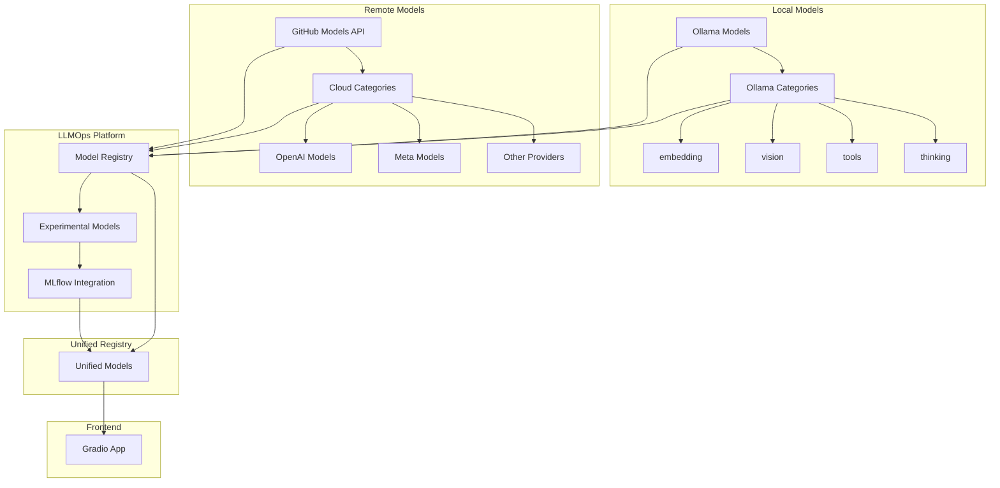
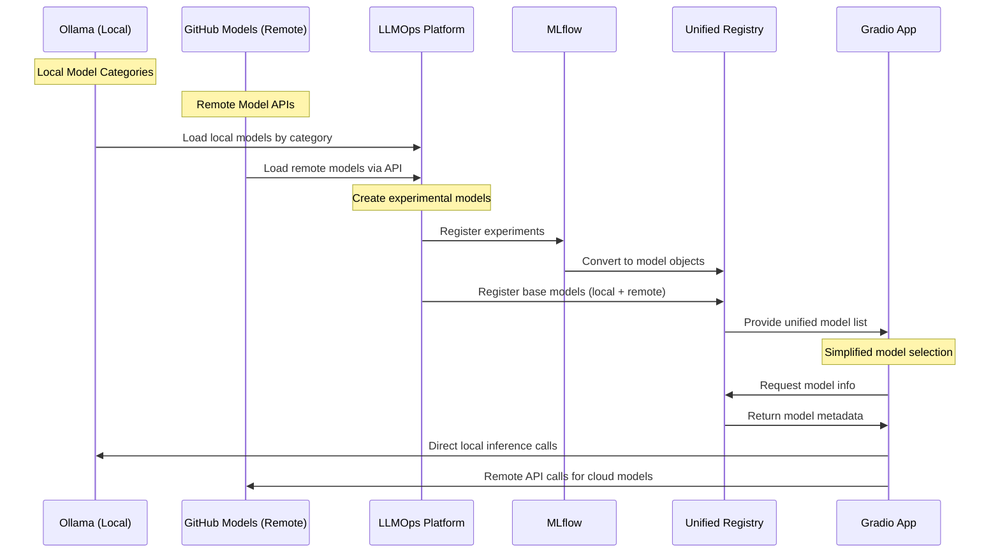

# AI Assignments Refactoring Plan

## Ollama-Centric Model Registry Architecture

### 🎯 **Vision Statement**

Transform the current system into a streamlined, Ollama-centric architecture where:

1. **Ollama serves as the primary local model registry** with native categories (embedding, vision, tools, thinking)
2. **GitHub Models API provides remote model serving and evaluation tooling** for cloud-based models
3. **LLMOps platform creates experimental models** from both Ollama base models and GitHub Models
4. **MLflow experiments become additional model objects** in the downstream system
5. **Gradio app receives simplified model objects** from the unified registry with both local and remote serving capabilities

---

## 📊 **Current vs Target Architecture**

### **Current Flow (Complex)**

```
Ollama Models → Enterprise Registry → MLflow → Gradio App
     ↓              ↓                  ↓         ↓
  Manual Sync   Complex Metadata   Separate   Complex UI
```

### **Target Flow (Simplified)**

```
Ollama (Local) + GitHub Models (Remote) → Experimental Models → Unified Model Objects → Gradio App
       ↓                    ↓                       ↓                       ↓                ↓
   Native Categories    Cloud Models        LLMOps Creation         MLflow Integration   Clean UI
```

---

## 🏗️ **System Architecture Overview**



---

## 🔄 **Data Flow Architecture**



---

## 📋 **Model Source & Category Mapping**

### **Ollama (Local Models)**

| Ollama Category | Our System Category | Description             | Implementation              |
| --------------- | ------------------- | ----------------------- | --------------------------- |
| `embedding`     | `embedding`         | Text embedding models   | Direct integration          |
| `vision`        | `multimodal`        | Vision-language models  | Direct integration          |
| `tools`         | `function_calling`  | Tool-using models       | Enhanced with tool registry |
| `thinking`      | `reasoning`         | Chain-of-thought models | Direct integration          |

### **GitHub Models API (Remote Models)**

| GitHub Models Provider | Our System Category | Description                 | Implementation                |
| ---------------------- | ------------------- | --------------------------- | ----------------------------- |
| `openai/*`             | `cloud_text`        | OpenAI models (GPT-4, etc.) | GitHub Models API integration |
| `meta/*`               | `cloud_text`        | Meta models (Llama, etc.)   | GitHub Models API integration |
| `deepseek/*`           | `cloud_code`        | DeepSeek models             | GitHub Models API integration |
| `microsoft/*`          | `cloud_multimodal`  | Microsoft models            | GitHub Models API integration |
| Other providers        | `cloud_general`     | Other cloud models          | GitHub Models API integration |

---

## 🎯 **Refactoring Objectives**

### **1. Simplify Model Registry**

- **Remove**: Complex metadata tracking
- **Keep**: Essential model information
- **Add**: Ollama category integration + GitHub Models API integration

### **2. Unify Model Objects**

- **Local Models**: Direct from Ollama
- **Remote Models**: From GitHub Models API
- **Experimental Models**: From MLflow experiments
- **Common Interface**: Unified model object structure with serving abstraction

### **3. Streamline Gradio App**

- **Remove**: Complex model selection UI
- **Keep**: Core evaluation functionality
- **Add**: Category-based filtering + Local/Remote model serving

### **4. Enhance LLMOps Platform**

- **Add**: Experimental model creation from both local and remote models
- **Improve**: MLflow integration
- **Simplify**: Model serving pipeline with local/remote abstraction
- **Integrate**: GitHub Models API for evaluation tooling and remote serving

---

## 🔧 **Implementation Phases**

### **Phase 1: Model Source Integration**

- [ ] Create Ollama category loader for local models
- [ ] Integrate GitHub Models API for remote models
- [ ] Implement category-based model filtering
- [ ] Update model registry to use both local and remote sources

### **Phase 2: Experimental Model Creation**

- [ ] Build experimental model factory for local and remote models
- [ ] Integrate with MLflow for experiment tracking
- [ ] Create model variant generation
- [ ] Implement GitHub Models evaluation tooling integration

### **Phase 3: Unified Registry**

- [ ] Design unified model object structure for local and remote models
- [ ] Implement model object factory
- [ ] Create model serving interface with local/remote abstraction
- [ ] Implement GitHub Models API integration for remote serving

### **Phase 4: Gradio Simplification**

- [ ] Refactor Gradio app for simplified model selection
- [ ] Implement category-based filtering with local/remote indicators
- [ ] Remove complex metadata displays
- [ ] Add unified evaluation interface for local and remote models

---

## 📁 **File Structure Changes**

### **New Files to Create**

```
src/
├── ollama_integration/
│   ├── __init__.py
│   ├── category_loader.py
│   ├── model_loader.py
│   └── registry_sync.py
├── github_models_integration/
│   ├── __init__.py
│   ├── api_client.py
│   ├── model_loader.py
│   ├── evaluation_tools.py
│   └── remote_serving.py
├── experimental_models/
│   ├── __init__.py
│   ├── model_factory.py
│   ├── variant_generator.py
│   └── mlflow_integration.py
└── unified_registry/
    ├── __init__.py
    ├── model_objects.py
    ├── registry_manager.py
    └── serving_interface.py
```

### **Files to Modify**

```
src/enterprise_llmops/
├── model_registry.py          # Simplify metadata
├── frontend/fastapi_app.py    # Add Ollama + GitHub Models endpoints
└── main.py                    # Update initialization

src/gradio_app/
├── main.py                    # Simplify UI
├── model_selector.py          # Category-based selection with local/remote
└── evaluation_interface.py    # Streamlined interface for both sources
```

### **Files to Remove/Deprecate**

```
src/model_evaluation/
├── prompt_registries.py       # Move to experimental_models
├── dataset_generator.py       # Simplify or remove
└── complex_evaluation.py      # Replace with simple version
```

---

## 🎨 **Unified Model Object Structure**

```python
@dataclass
class UnifiedModelObject:
    """Unified model object for all model types"""
    # Core identification
    id: str
    name: str
    version: str

    # Model source integration
    ollama_name: Optional[str]  # For local models
    github_models_id: Optional[str]  # For remote models
    category: str  # embedding, vision, tools, thinking, cloud_text, etc.

    # Model characteristics
    model_type: str  # base, experimental, variant
    source: str      # ollama, github_models, mlflow, external
    serving_type: str  # local, remote, hybrid

    # Capabilities
    capabilities: List[str]
    parameters: Dict[str, Any]

    # Serving information
    local_endpoint: Optional[str]  # Ollama endpoint
    remote_endpoint: Optional[str]  # GitHub Models API endpoint
    status: str

    # Metadata
    created_at: datetime
    updated_at: datetime
    description: str
```

---

## 🚀 **Benefits of New Architecture**

### **For Developers**

- **Simplified codebase**: Remove complex metadata management
- **Clear separation**: Ollama handles models, LLMOps handles experiments
- **Better testing**: Isolated components with clear interfaces

### **For Users**

- **Intuitive model selection**: Category-based organization
- **Faster model loading**: Direct Ollama integration
- **Better performance**: Reduced overhead from complex metadata

### **For Operations**

- **Easier deployment**: Simplified model serving
- **Better monitoring**: Clear model object lifecycle
- **Scalable architecture**: Modular design for future growth

---

## 📊 **Success Metrics**

### **Technical Metrics**

- [ ] Model loading time: < 2 seconds
- [ ] Registry sync time: < 30 seconds
- [ ] Gradio app startup: < 10 seconds
- [ ] Code complexity reduction: 40%

### **User Experience Metrics**

- [ ] Model selection time: < 5 seconds
- [ ] UI simplicity score: > 8/10
- [ ] Category-based filtering: 100% functional
- [ ] Error rate: < 1%

### **Operational Metrics**

- [ ] Deployment time: < 5 minutes
- [ ] Model registry sync: 100% reliable
- [ ] System uptime: > 99%
- [ ] Memory usage: < 2GB

---

## 🔄 **Migration Strategy**

### **Step 1: Parallel Implementation**

- Build new components alongside existing ones
- Test new architecture with subset of models
- Validate functionality before migration

### **Step 2: Gradual Migration**

- Migrate one category at a time
- Keep existing system as fallback
- Monitor performance and user feedback

### **Step 3: Full Cutover**

- Switch to new architecture completely
- Remove deprecated components
- Clean up legacy code

---

## 📝 **Next Steps**

1. **Review and approve this plan**
2. **Create detailed implementation specifications**
3. **Set up development environment for new components**
4. **Begin Phase 1 implementation**
5. **Establish testing and validation procedures**

---

_This refactoring plan transforms the AI Assignments project into a streamlined, Ollama-centric architecture that simplifies model management while maintaining powerful experimental capabilities._
