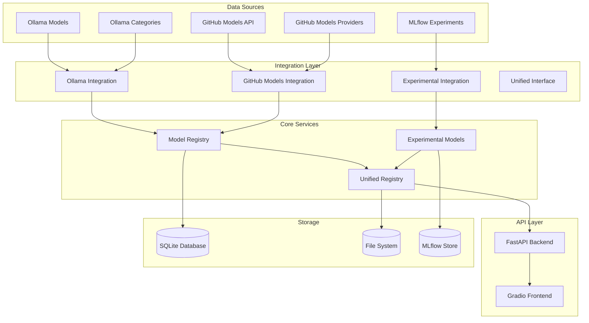

# Technical Specifications

## Ollama-Centric Model Registry Architecture

### 🏗️ **System Architecture Overview**



---

## 🔧 **Core Components Specification**

### **1. Ollama Integration Module (Local Models)**

#### **1.1 Category Loader (`src/ollama_integration/category_loader.py`)**

```python
class OllamaCategoryLoader:
    """Loads and manages Ollama model categories"""

    def __init__(self, ollama_base_url: str = "http://localhost:11434"):
        self.ollama_base_url = ollama_base_url
        self.categories = {
            "embedding": [],
            "vision": [],
            "tools": [],
            "thinking": [],
            "cloud": []
        }

    async def load_models_by_category(self, category: str) -> List[Dict]:
        """Load models for a specific category"""

    async def sync_all_categories(self) -> Dict[str, List[Dict]]:
        """Sync all categories with Ollama"""

    async def get_model_details(self, model_name: str) -> Dict:
        """Get detailed information about a specific model"""
```

**Key Features:**

- Async Ollama API integration
- Category-based model filtering
- Model metadata extraction
- Caching for performance

#### **1.2 Model Loader (`src/ollama_integration/model_loader.py`)**

```python
class OllamaModelLoader:
    """Loads individual models from Ollama"""

    def __init__(self, category_loader: OllamaCategoryLoader):
        self.category_loader = category_loader

    async def load_model(self, model_name: str) -> OllamaModel:
        """Load a specific model with full metadata"""

    async def load_models_batch(self, model_names: List[str]) -> List[OllamaModel]:
        """Load multiple models efficiently"""

    async def validate_model(self, model_name: str) -> bool:
        """Validate that a model is available and working"""
```

#### **1.3 Registry Sync (`src/ollama_integration/registry_sync.py`)**

```python
class OllamaRegistrySync:
    """Synchronizes Ollama models with the unified registry"""

    def __init__(self, model_loader: OllamaModelLoader,
                 unified_registry: UnifiedRegistry):
        self.model_loader = model_loader
        self.unified_registry = unified_registry

    async def sync_models(self) -> SyncResult:
        """Sync all Ollama models with unified registry"""

    async def sync_category(self, category: str) -> SyncResult:
        """Sync models for a specific category"""

    async def update_model(self, model_name: str) -> bool:
        """Update a specific model in the registry"""
```

---

### **2. GitHub Models Integration Module (Remote Models)**

#### **2.1 API Client (`src/github_models_integration/api_client.py`)**

```python
class GitHubModelsAPIClient:
    """Client for GitHub Models API integration"""

    def __init__(self, github_token: str):
        self.github_token = github_token
        self.base_url = "https://api.github.com/models"
        self.rate_limiter = RateLimiter()

    async def get_available_models(self) -> List[Dict]:
        """Get all available models from GitHub Models API"""

    async def get_models_by_provider(self, provider: str) -> List[Dict]:
        """Get models by specific provider (openai, meta, etc.)"""

    async def evaluate_model(self, model_id: str, request_data: Dict) -> Dict:
        """Evaluate a model using GitHub Models API"""

    async def get_model_details(self, model_id: str) -> Dict:
        """Get detailed information about a specific model"""
```

#### **2.2 Model Loader (`src/github_models_integration/model_loader.py`)**

```python
class GitHubModelsLoader:
    """Loads models from GitHub Models API"""

    def __init__(self, api_client: GitHubModelsAPIClient):
        self.api_client = api_client

    async def load_models_by_provider(self, provider: str) -> List[GitHubModel]:
        """Load models for a specific provider"""

    async def load_all_models(self) -> List[GitHubModel]:
        """Load all available models"""

    async def validate_model_access(self, model_id: str) -> bool:
        """Validate that a model is accessible via API"""
```

#### **2.3 Evaluation Tools (`src/github_models_integration/evaluation_tools.py`)**

```python
class GitHubModelsEvaluator:
    """Evaluation tools using GitHub Models API"""

    def __init__(self, api_client: GitHubModelsAPIClient):
        self.api_client = api_client

    async def run_evaluation(self,
                           model_id: str,
                           evaluation_config: Dict) -> EvaluationResult:
        """Run evaluation using GitHub Models API"""

    async def batch_evaluate(self,
                           model_ids: List[str],
                           evaluation_config: Dict) -> List[EvaluationResult]:
        """Run batch evaluation for multiple models"""

    async def compare_models(self,
                           model_ids: List[str],
                           test_data: List[Dict]) -> ComparisonResult:
        """Compare multiple models using GitHub Models API"""
```

#### **2.4 Remote Serving (`src/github_models_integration/remote_serving.py`)**

```python
class GitHubModelsRemoteServing:
    """Remote model serving via GitHub Models API"""

    def __init__(self, api_client: GitHubModelsAPIClient):
        self.api_client = api_client

    async def serve_model(self, model_id: str) -> ServingEndpoint:
        """Create a serving endpoint for a remote model"""

    async def make_inference(self,
                           model_id: str,
                           input_data: Dict) -> Dict:
        """Make inference call to remote model"""

    async def get_serving_status(self, model_id: str) -> Dict:
        """Get serving status for a remote model"""
```

---

### **3. Experimental Models Module**

#### **3.1 Model Factory (`src/experimental_models/model_factory.py`)**

```python
class ExperimentalModelFactory:
    """Creates experimental models from base models"""

    def __init__(self, mlflow_manager: MLflowManager):
        self.mlflow_manager = mlflow_manager
        self.variant_generators = {
            "parameter_tuning": ParameterTuningGenerator(),
            "prompt_engineering": PromptEngineeringGenerator(),
            "fine_tuning": FineTuningGenerator(),
            "ensemble": EnsembleGenerator()
        }

    async def create_experimental_model(self,
                                      base_model: str,
                                      experiment_type: str,
                                      parameters: Dict) -> ExperimentalModel:
        """Create an experimental model from a base model"""

    async def create_model_variant(self,
                                  base_model: str,
                                  variant_config: Dict) -> ModelVariant:
        """Create a variant of an existing model"""

    async def list_experimental_models(self,
                                     base_model: Optional[str] = None) -> List[ExperimentalModel]:
        """List all experimental models"""
```

#### **3.2 Variant Generator (`src/experimental_models/variant_generator.py`)**

```python
class BaseVariantGenerator:
    """Base class for model variant generators"""

    async def generate_variant(self, base_model: str, config: Dict) -> ModelVariant:
        """Generate a model variant"""

class ParameterTuningGenerator(BaseVariantGenerator):
    """Generates variants by tuning model parameters"""

class PromptEngineeringGenerator(BaseVariantGenerator):
    """Generates variants through prompt engineering"""

class FineTuningGenerator(BaseVariantGenerator):
    """Generates variants through fine-tuning"""

class EnsembleGenerator(BaseVariantGenerator):
    """Generates ensemble variants"""
```

#### **3.3 MLflow Integration (`src/experimental_models/mlflow_integration.py`)**

```python
class ExperimentalMLflowIntegration:
    """Integrates experimental models with MLflow"""

    def __init__(self, mlflow_manager: MLflowManager):
        self.mlflow_manager = mlflow_manager

    async def create_experiment(self,
                               model_name: str,
                               experiment_config: Dict) -> str:
        """Create MLflow experiment for model"""

    async def log_model_variant(self,
                               experiment_id: str,
                               variant: ModelVariant,
                               metrics: Dict) -> str:
        """Log model variant to MLflow"""

    async def get_experiment_models(self,
                                   experiment_id: str) -> List[ModelVariant]:
        """Get all models from an experiment"""
```

---

### **4. Unified Registry Module**

#### **4.1 Model Objects (`src/unified_registry/model_objects.py`)**

```python
@dataclass
class UnifiedModelObject:
    """Unified model object for all model types"""

    # Core identification
    id: str
    name: str
    version: str

    # Ollama integration
    ollama_name: Optional[str]
    category: str  # embedding, vision, tools, thinking, external

    # Model characteristics
    model_type: str  # base, experimental, variant
    source: str      # ollama, mlflow, external

    # Capabilities
    capabilities: List[str]
    parameters: Dict[str, Any]

    # Serving information
    endpoint: str
    status: str  # available, busy, error

    # Metadata
    created_at: datetime
    updated_at: datetime
    description: str

    # Performance metrics
    performance_metrics: Dict[str, float]

    def to_dict(self) -> Dict[str, Any]:
        """Convert to dictionary"""

    @classmethod
    def from_dict(cls, data: Dict[str, Any]) -> 'UnifiedModelObject':
        """Create from dictionary"""

    def get_serving_endpoint(self) -> str:
        """Get the serving endpoint for this model"""

    def is_available(self) -> bool:
        """Check if model is available for serving"""

@dataclass
class ModelCapability:
    """Model capability specification"""
    name: str
    type: str  # text, vision, embedding, function_calling
    description: str
    parameters: Dict[str, Any]
    examples: List[str]

@dataclass
class ModelServingConfig:
    """Model serving configuration"""
    endpoint: str
    protocol: str  # http, grpc, websocket
    timeout: int
    max_concurrent_requests: int
    health_check_interval: int
```

#### **4.2 Registry Manager (`src/unified_registry/registry_manager.py`)**

```python
class UnifiedRegistryManager:
    """Manages the unified model registry"""

    def __init__(self, db_path: str):
        self.db_path = db_path
        self.db = DatabaseManager(db_path)
        self.model_objects: Dict[str, UnifiedModelObject] = {}

    async def register_model(self, model: UnifiedModelObject) -> bool:
        """Register a model in the unified registry"""

    async def get_model(self, model_id: str) -> Optional[UnifiedModelObject]:
        """Get a model by ID"""

    async def list_models(self,
                         category: Optional[str] = None,
                         model_type: Optional[str] = None,
                         source: Optional[str] = None) -> List[UnifiedModelObject]:
        """List models with optional filtering"""

    async def update_model(self, model_id: str, updates: Dict) -> bool:
        """Update model information"""

    async def delete_model(self, model_id: str) -> bool:
        """Delete a model from the registry"""

    async def sync_with_sources(self) -> SyncResult:
        """Sync with all model sources"""
```

#### **4.3 Serving Interface (`src/unified_registry/serving_interface.py`)**

```python
class ModelServingInterface:
    """Interface for model serving"""

    def __init__(self, registry_manager: UnifiedRegistryManager):
        self.registry_manager = registry_manager
        self.serving_endpoints: Dict[str, str] = {}

    async def serve_model(self, model_id: str) -> str:
        """Start serving a model and return endpoint"""

    async def stop_serving(self, model_id: str) -> bool:
        """Stop serving a model"""

    async def get_serving_status(self, model_id: str) -> Dict:
        """Get serving status for a model"""

    async def health_check(self, model_id: str) -> bool:
        """Perform health check on a serving model"""

    async def list_serving_models(self) -> List[Dict]:
        """List all currently serving models"""
```

---

## 🗄️ **Database Schema**

### **Unified Models Table**

```sql
CREATE TABLE unified_models (
    id TEXT PRIMARY KEY,
    name TEXT NOT NULL,
    version TEXT NOT NULL,
    ollama_name TEXT,
    category TEXT NOT NULL,
    model_type TEXT NOT NULL,
    source TEXT NOT NULL,
    capabilities TEXT,  -- JSON array
    parameters TEXT,    -- JSON object
    endpoint TEXT,
    status TEXT,
    created_at TIMESTAMP DEFAULT CURRENT_TIMESTAMP,
    updated_at TIMESTAMP DEFAULT CURRENT_TIMESTAMP,
    description TEXT,
    performance_metrics TEXT,  -- JSON object
    UNIQUE(name, version)
);

CREATE INDEX idx_category ON unified_models(category);
CREATE INDEX idx_model_type ON unified_models(model_type);
CREATE INDEX idx_source ON unified_models(source);
CREATE INDEX idx_status ON unified_models(status);
CREATE INDEX idx_ollama_name ON unified_models(ollama_name);
```

### **Model Capabilities Table**

```sql
CREATE TABLE model_capabilities (
    id INTEGER PRIMARY KEY AUTOINCREMENT,
    model_id TEXT NOT NULL,
    capability_name TEXT NOT NULL,
    capability_type TEXT NOT NULL,
    description TEXT,
    parameters TEXT,  -- JSON object
    examples TEXT,    -- JSON array
    FOREIGN KEY (model_id) REFERENCES unified_models(id)
);

CREATE INDEX idx_model_id ON model_capabilities(model_id);
CREATE INDEX idx_capability_type ON model_capabilities(capability_type);
```

### **Model Serving Status Table**

```sql
CREATE TABLE model_serving_status (
    id INTEGER PRIMARY KEY AUTOINCREMENT,
    model_id TEXT NOT NULL,
    endpoint TEXT NOT NULL,
    status TEXT NOT NULL,
    started_at TIMESTAMP DEFAULT CURRENT_TIMESTAMP,
    last_health_check TIMESTAMP,
    health_status TEXT,
    concurrent_requests INTEGER DEFAULT 0,
    total_requests INTEGER DEFAULT 0,
    FOREIGN KEY (model_id) REFERENCES unified_models(id)
);

CREATE INDEX idx_model_id_status ON model_serving_status(model_id);
CREATE INDEX idx_status ON model_serving_status(status);
```

---

## 🔌 **API Specifications**

### **Ollama Integration Endpoints**

#### **GET /api/ollama/categories**

```json
{
  "categories": {
    "embedding": ["all-minilm", "sentence-transformers"],
    "vision": ["llava", "instructblip"],
    "tools": ["function-calling-model"],
    "thinking": ["llama3.1", "mistral"],
    "cloud": ["gpt-4", "claude-3"]
  }
}
```

#### **GET /api/ollama/models/{category}**

```json
{
  "category": "embedding",
  "models": [
    {
      "name": "all-minilm",
      "size": 90000000,
      "digest": "sha256:abc123",
      "capabilities": ["text-embedding"],
      "parameters": {
        "embedding_dimension": 384,
        "max_tokens": 512
      }
    }
  ]
}
```

#### **POST /api/ollama/sync**

```json
{
  "result": "success",
  "synced_models": 15,
  "categories": {
    "embedding": 3,
    "vision": 2,
    "tools": 1,
    "thinking": 9
  },
  "duration": "2.5s"
}
```

### **Experimental Models Endpoints**

#### **POST /api/experimental/create**

```json
{
  "base_model": "llama3.1:8b",
  "experiment_type": "parameter_tuning",
  "parameters": {
    "temperature": 0.7,
    "max_tokens": 2048,
    "top_p": 0.9
  }
}
```

#### **GET /api/experimental/models**

```json
{
  "experimental_models": [
    {
      "id": "exp_llama3_001",
      "base_model": "llama3.1:8b",
      "experiment_type": "parameter_tuning",
      "created_at": "2025-01-21T10:00:00Z",
      "mlflow_run_id": "run_12345",
      "status": "active"
    }
  ]
}
```

### **Unified Registry Endpoints**

#### **GET /api/models/unified**

```json
{
  "models": [
    {
      "id": "llama3_8b_base",
      "name": "llama3.1:8b",
      "version": "1.0.0",
      "category": "thinking",
      "model_type": "base",
      "source": "ollama",
      "capabilities": ["text_generation", "reasoning"],
      "status": "available",
      "endpoint": "http://localhost:11434/api/generate"
    }
  ]
}
```

#### **GET /api/models/categories/{category}**

```json
{
  "category": "thinking",
  "models": [
    {
      "id": "llama3_8b_base",
      "name": "llama3.1:8b",
      "status": "available"
    },
    {
      "id": "mistral_7b_base",
      "name": "mistral:7b",
      "status": "available"
    }
  ]
}
```

---

## 🎨 **Gradio App Specifications**

### **Simplified Model Selection Interface**

```python
class SimplifiedModelSelector:
    """Simplified model selection for Gradio app"""

    def __init__(self, unified_registry: UnifiedRegistryManager):
        self.registry = unified_registry

    def create_model_selection_interface(self):
        """Create the model selection interface"""
        with gr.Row():
            category_dropdown = gr.Dropdown(
                choices=["All", "embedding", "vision", "tools", "thinking"],
                value="All",
                label="Model Category"
            )

            model_dropdown = gr.Dropdown(
                choices=[],
                label="Select Model"
            )

            load_button = gr.Button("Load Model", variant="primary")

        return category_dropdown, model_dropdown, load_button

    async def update_model_list(self, category: str):
        """Update model list based on selected category"""
        if category == "All":
            models = await self.registry.list_models()
        else:
            models = await self.registry.list_models(category=category)

        return gr.Dropdown(
            choices=[(f"{m.name} ({m.model_type})", m.id) for m in models],
            value=models[0].id if models else None
        )
```

### **Category-Based Evaluation Interface**

```python
class CategoryBasedEvaluator:
    """Evaluation interface organized by model categories"""

    def __init__(self, model_selector: SimplifiedModelSelector):
        self.model_selector = model_selector

    def create_evaluation_interface(self):
        """Create category-specific evaluation interface"""

        # Embedding category
        with gr.Tab("Embedding Models"):
            embedding_interface = self.create_embedding_interface()

        # Vision category
        with gr.Tab("Vision Models"):
            vision_interface = self.create_vision_interface()

        # Tools category
        with gr.Tab("Tool Models"):
            tools_interface = self.create_tools_interface()

        # Thinking category
        with gr.Tab("Thinking Models"):
            thinking_interface = self.create_thinking_interface()
```

---

## 🔒 **Security & Performance Specifications**

### **Security Measures**

- API authentication for experimental model creation
- Rate limiting on model serving endpoints
- Input validation for all model parameters
- Secure model artifact storage

### **Performance Requirements**

- Model loading: < 2 seconds
- Registry sync: < 30 seconds
- API response time: < 500ms
- Memory usage: < 2GB
- Concurrent model serving: up to 10 models

### **Monitoring & Logging**

- Model serving health checks
- Performance metrics collection
- Error tracking and alerting
- Usage analytics

---

_This technical specification provides the detailed implementation requirements for the Ollama-centric model registry architecture._
