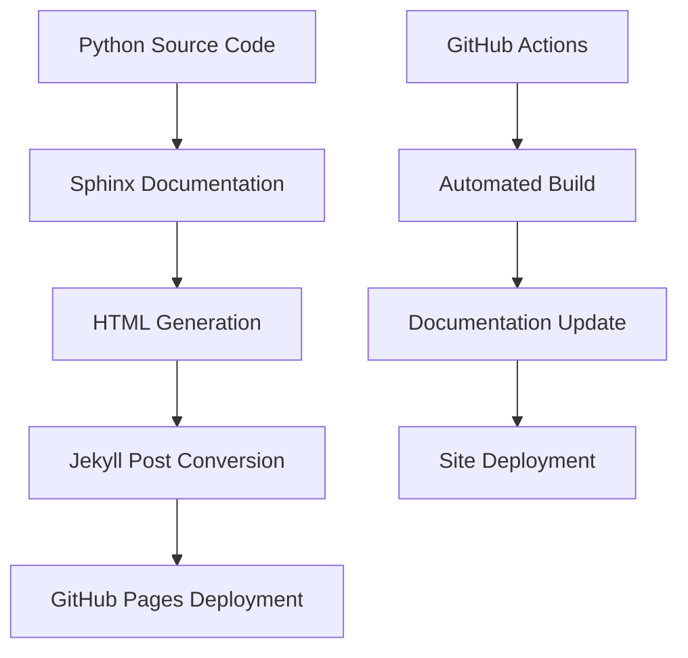

# API Documentation Integration Guide

This guide explains how the API documentation is automatically generated from Python docstrings and integrated with the Jekyll documentation site.

## 🎯 Overview

The API documentation system provides:

- **Automatic generation** from Python docstrings
- **Sphinx integration** for comprehensive documentation
- **Jekyll integration** for seamless site integration
- **GitHub Actions automation** for continuous updates
- **Interactive features** with search and navigation

## 🏗️ Architecture

### Documentation Flow



### Key Components

1. **Sphinx Configuration** (`docs/sphinx/conf.py`)
2. **API Documentation Generator** (`docs/generate_api_docs.py`)
3. **GitHub Actions Workflow** (`.github/workflows/api-docs.yml`)
4. **Jekyll Integration** (Automatic post generation)

## 📁 File Structure

```
docs/
├── sphinx/                    # Sphinx documentation source
│   ├── conf.py               # Sphinx configuration
│   ├── index.rst             # Main documentation index
│   ├── api/                  # API reference structure
│   │   ├── index.rst
│   │   ├── ai_architecture/
│   │   ├── model_evaluation/
│   │   ├── utils/
│   │   └── gradio_app/
│   └── _build/               # Generated HTML output
├── _posts/api-docs/          # Jekyll posts for API docs
├── generate_api_docs.py      # Documentation generator script
└── requirements-docs.txt     # Documentation dependencies
```

## 🔧 Setup and Configuration

### 1. Sphinx Configuration

The Sphinx configuration (`docs/sphinx/conf.py`) includes:

- **Autodoc extensions** for automatic docstring extraction
- **Theme configuration** using Read the Docs theme
- **Cross-references** to external documentation
- **Custom extensions** for enhanced functionality

### 2. API Documentation Generator

The generator script (`docs/generate_api_docs.py`) performs:

- **Sphinx documentation generation**
- **HTML to Jekyll conversion**
- **Automatic post creation**
- **Index generation**

### 3. GitHub Actions Integration

The workflow (`.github/workflows/api-docs.yml`) provides:

- **Automatic triggering** on code changes
- **Documentation generation**
- **Jekyll site building**
- **GitHub Pages deployment**

## 🚀 Usage

### Manual Generation

To generate API documentation manually:

```bash
cd docs
python generate_api_docs.py
```

### Automatic Generation

The documentation is automatically generated when:

- **Code changes** are pushed to the main branch
- **Pull requests** are created or updated
- **Daily schedule** runs (2 AM UTC)

### Viewing Documentation

The generated documentation is available at:

- **Jekyll Site**: `https://samne.github.io/ai_assignments/`
- **API Posts**: Under the "API Documentation" category
- **Search**: Use the site search to find specific APIs

## 📚 Documentation Standards

### Python Docstrings

Follow Google-style docstrings:

```python
def example_function(param1: str, param2: int) -> bool:
    """
    Brief description of the function.

    Args:
        param1: Description of param1
        param2: Description of param2

    Returns:
        Description of return value

    Raises:
        ValueError: Description of when this exception is raised

    Example:
        >>> result = example_function("test", 42)
        >>> print(result)
        True
    """
    pass
```

### Module Documentation

Include comprehensive module docstrings:

```python
"""
Module Name

Brief description of the module's purpose and functionality.

Key Features:
- Feature 1: Description
- Feature 2: Description
- Feature 3: Description

Author: Lenovo AAITC Team
Date: Q3 2025
"""
```

### Class Documentation

Document classes with their purpose and usage:

```python
class ExampleClass:
    """
    Brief description of the class.

    This class provides functionality for...

    Attributes:
        attribute1: Description of attribute1
        attribute2: Description of attribute2

    Example:
        >>> obj = ExampleClass()
        >>> obj.method()
    """
```

## 🔍 Features

### Search Integration

- **Full-text search** across all API documentation
- **Category filtering** by module or component
- **Tag-based search** for specific functionality

### Navigation

- **Hierarchical structure** following the codebase organization
- **Cross-references** between related components
- **Breadcrumb navigation** for easy navigation

### Interactive Elements

- **Code examples** with syntax highlighting
- **Collapsible sections** for detailed information
- **Copy buttons** for code snippets
- **Responsive design** for mobile devices

## 🛠️ Customization

### Adding New Modules

1. **Create Sphinx documentation** in `docs/sphinx/api/`
2. **Update the generator script** to include new modules
3. **Add to navigation** in the main index

### Customizing Output

- **Modify Sphinx configuration** for different output formats
- **Customize Jekyll templates** for different layouts
- **Add custom CSS** for styling

### Extending Functionality

- **Add new Sphinx extensions** for enhanced features
- **Create custom converters** for specialized content
- **Integrate with external tools** for additional functionality

## 📊 Monitoring and Maintenance

### Documentation Quality

- **Regular review** of generated documentation
- **User feedback** collection and implementation
- **Performance monitoring** of generation process

### Updates and Maintenance

- **Version control** of documentation changes
- **Backup and recovery** procedures
- **Dependency management** for documentation tools

## 🐛 Troubleshooting

### Common Issues

**Documentation not generating**:

- Check Python path configuration
- Verify Sphinx installation
- Review error logs in GitHub Actions

**Missing docstrings**:

- Ensure all public functions have docstrings
- Check docstring format compliance
- Verify module imports

**Build failures**:

- Check Sphinx configuration syntax
- Verify all dependencies are installed
- Review GitHub Actions logs

### Debug Mode

Enable debug mode for detailed logging:

```bash
cd docs
python generate_api_docs.py --debug
```

## 🔗 Integration with Jekyll

### Post Generation

The system automatically creates Jekyll posts for each API component:

- **Front matter** with proper metadata
- **Markdown conversion** from HTML
- **Category and tag assignment**
- **Author and date information**

### Site Integration

- **Navigation integration** with main site
- **Search integration** across all content
- **Comment system** for user feedback
- **Analytics tracking** for usage monitoring

## 📈 Future Enhancements

### Planned Features

- **Interactive API explorer** with live examples
- **Code generation** from API documentation
- **Version comparison** for API changes
- **Multi-language support** for international users

### Integration Opportunities

- **OpenAPI specification** generation
- **Postman collection** creation
- **SDK generation** for multiple languages
- **API testing** integration

## 📞 Support

For technical support or questions about API documentation:

- **GitHub Issues**: Create an issue in the repository
- **Documentation**: Check the setup guide posts
- **Team Contact**: aaitc-support@lenovo.com

---

_This guide will be updated as new features are added to the API documentation system._
