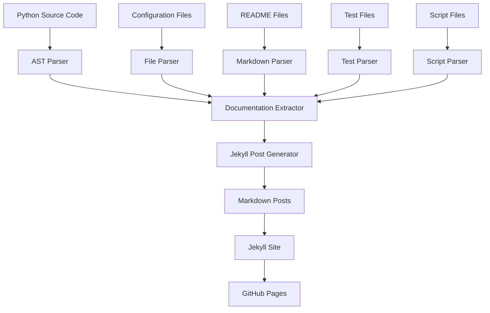

# Automated Documentation Generation System

This guide explains the comprehensive automated documentation generation system that extracts documentation from code comments, docstrings, and other sources to create Jekyll posts automatically.

## 🎯 Overview

The automated documentation generation system provides:

- **Automatic extraction** from Python source code
- **AST-based analysis** for comprehensive code understanding
- **Multi-source documentation** from various file types
- **Jekyll integration** for seamless site updates
- **Continuous updates** through GitHub Actions

## 🏗️ System Architecture

### Documentation Flow



### Key Components

1. **DocumentationExtractor**: Main extraction engine
2. **JekyllPostGenerator**: Post generation system
3. **AST Parser**: Python code analysis
4. **File Parsers**: Configuration and documentation parsing
5. **GitHub Actions**: Automated execution

## 📁 File Structure

```
docs/
├── automated_docs_generator.py    # Main generator script
├── _posts/auto-generated/         # Generated Jekyll posts
│   ├── python-*.md               # Python module documentation
│   ├── config-*.md               # Configuration documentation
│   ├── readme-*.md               # README documentation
│   ├── test-*.md                 # Test documentation
│   ├── script-*.md               # Script documentation
│   └── documentation_metadata.json # Extraction metadata
└── requirements-docs.txt         # Documentation dependencies
```

## 🔧 Extraction Sources

### 1. Python Modules

**Extracted Information**:

- Module docstrings
- Class definitions and docstrings
- Function definitions and docstrings
- Method signatures and type annotations
- Constants and properties
- Import statements

**Example Output**:

```markdown
# Python Module: ai_architecture.platform

## Overview

Hybrid AI Platform Architecture Module

This module implements the core hybrid AI platform architecture...

## Classes

### HybridAIPlatform

Enterprise hybrid AI platform architecture...

**Bases**: object

**Methods**:

- `deploy()`: Deploy the platform to specified targets
- `monitor()`: Monitor platform health and performance
```

### 2. Configuration Files

**Extracted Information**:

- Requirements and dependencies
- Configuration options
- Build settings
- Test configurations

**Supported Formats**:

- `requirements.txt`
- `pytest.ini`
- `Makefile`
- `*.ini` files

### 3. README Files

**Extracted Information**:

- Document titles
- Section structure
- Content organization
- Last modification dates

### 4. Test Files

**Extracted Information**:

- Test function documentation
- Test class documentation
- Test organization
- Coverage information

### 5. Script Files

**Extracted Information**:

- Script purpose and usage
- Main function documentation
- Utility functions
- Command-line interfaces

## 🚀 Usage

### Manual Generation

To generate documentation manually:

```bash
cd docs
python automated_docs_generator.py
```

### Automatic Generation

The system runs automatically:

- **On code changes** via GitHub Actions
- **Daily schedule** for comprehensive updates
- **Pull request validation** for documentation quality

### GitHub Actions Integration

```yaml
name: Generate Automated Documentation

on:
  push:
    branches: [main]
    paths: ["src/**"]
  schedule:
    - cron: "0 2 * * *" # Daily at 2 AM UTC

jobs:
  generate-docs:
    runs-on: ubuntu-latest
    steps:
      - uses: actions/checkout@v4
      - name: Set up Python
        uses: actions/setup-python@v4
        with:
          python-version: "3.11"
      - name: Generate documentation
        run: |
          cd docs
          python automated_docs_generator.py
      - name: Commit changes
        run: |
          git add docs/_posts/auto-generated/
          git commit -m "Auto-update documentation [skip ci]"
          git push
```

## 📚 Documentation Standards

### Python Docstrings

**Google Style** (Recommended):

```python
def example_function(param1: str, param2: int) -> bool:
    """
    Brief description of the function.

    Args:
        param1: Description of param1
        param2: Description of param2

    Returns:
        Description of return value

    Raises:
        ValueError: Description of when this exception is raised

    Example:
        >>> result = example_function("test", 42)
        >>> print(result)
        True
    """
    pass
```

**NumPy Style** (Also Supported):

```python
def example_function(param1: str, param2: int) -> bool:
    """
    Brief description of the function.

    Parameters
    ----------
    param1 : str
        Description of param1
    param2 : int
        Description of param2

    Returns
    -------
    bool
        Description of return value

    Raises
    ------
    ValueError
        Description of when this exception is raised
    """
    pass
```

### Module Documentation

```python
"""
Module Name

Brief description of the module's purpose and functionality.

Key Features:
- Feature 1: Description
- Feature 2: Description
- Feature 3: Description

Author: Lenovo AAITC Team
Date: Q3 2025
"""
```

### Class Documentation

```python
class ExampleClass:
    """
    Brief description of the class.

    This class provides functionality for...

    Attributes:
        attribute1: Description of attribute1
        attribute2: Description of attribute2

    Example:
        >>> obj = ExampleClass()
        >>> obj.method()
    """
```

## 🔍 Advanced Features

### AST Analysis

The system uses Python's Abstract Syntax Tree (AST) for:

- **Deep code analysis** without execution
- **Type annotation extraction**
- **Dependency analysis**
- **Code structure understanding**

### Intelligent Parsing

- **Context-aware extraction** based on file types
- **Hierarchical organization** of documentation
- **Cross-reference generation** between components
- **Metadata preservation** for tracking changes

### Quality Assurance

- **Validation** of extracted documentation
- **Error handling** for malformed code
- **Logging** of extraction process
- **Metadata tracking** for audit trails

## 🛠️ Customization

### Adding New Extractors

To add support for new file types:

```python
class CustomExtractor:
    def extract_custom_documentation(self, file_path: Path) -> Dict[str, Any]:
        """Extract documentation from custom file type."""
        # Implementation here
        pass
```

### Customizing Output Format

Modify the `JekyllPostGenerator` class to:

- **Change post structure**
- **Add custom metadata**
- **Modify content formatting**
- **Include additional information**

### Filtering and Selection

Configure what gets extracted:

```python
# In DocumentationExtractor.__init__
self.include_patterns = ['*.py', '*.md', '*.txt']
self.exclude_patterns = ['*_test.py', '*.pyc']
```

## 📊 Monitoring and Analytics

### Extraction Metrics

- **Files processed** per run
- **Documentation entries** generated
- **Processing time** and performance
- **Error rates** and issues

### Quality Metrics

- **Docstring coverage** across modules
- **Documentation completeness** scores
- **Update frequency** tracking
- **User engagement** with generated docs

## 🐛 Troubleshooting

### Common Issues

**No documentation generated**:

- Check Python path configuration
- Verify file permissions
- Review extraction logs

**Missing docstrings**:

- Ensure all public functions have docstrings
- Check docstring format compliance
- Verify module imports

**Build failures**:

- Check AST parsing errors
- Verify file encoding
- Review GitHub Actions logs

### Debug Mode

Enable detailed logging:

```python
import logging
logging.basicConfig(level=logging.DEBUG)
```

### Validation

Test extraction on specific files:

```python
extractor = DocumentationExtractor('src/ai_architecture')
doc = extractor.extract_module_documentation(Path('platform.py'))
print(json.dumps(doc, indent=2))
```

## 🔗 Integration Points

### Jekyll Site Integration

- **Automatic post generation** in `_posts/auto-generated/`
- **Category and tag assignment** for organization
- **Search integration** across all generated content
- **Navigation updates** for new documentation

### GitHub Actions Integration

- **Triggered on code changes** for immediate updates
- **Scheduled runs** for comprehensive documentation
- **Pull request validation** for documentation quality
- **Deployment automation** to GitHub Pages

### Development Workflow

- **Pre-commit hooks** for documentation validation
- **CI/CD integration** for automated updates
- **Version control** of generated documentation
- **Rollback capabilities** for problematic updates

## 📈 Future Enhancements

### Planned Features

- **Multi-language support** for non-Python code
- **Interactive documentation** with live examples
- **API documentation** generation from OpenAPI specs
- **Visual diagrams** from code structure

### Integration Opportunities

- **IDE integration** for real-time documentation
- **Documentation testing** for accuracy validation
- **User feedback** collection and integration
- **Analytics dashboard** for documentation usage

## 📞 Support

For technical support or questions about automated documentation:

- **GitHub Issues**: Create an issue in the repository
- **Documentation**: Check the setup guide posts
- **Team Contact**: aaitc-support@lenovo.com

---

_This system continuously evolves to provide better documentation automation and integration._
