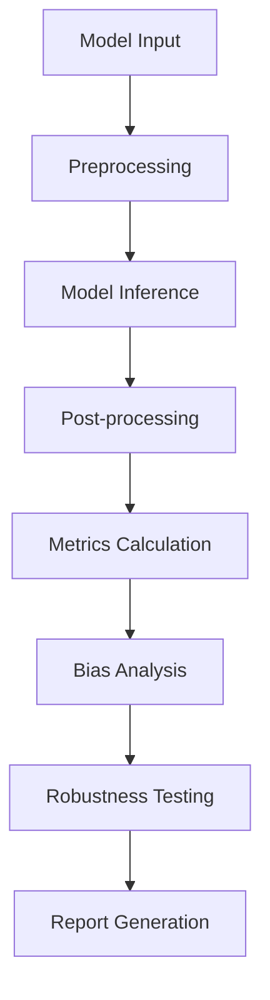

# Evaluation Framework

## Overview

The Model Evaluation Framework provides comprehensive tools for assessing AI model performance, bias detection, and robustness testing. This framework is designed to support the evaluation of various model types including language models, vision models, and multimodal systems.

## Core Components

### 1. Model Profiling

- **Performance Metrics**: Latency, throughput, memory usage, and computational efficiency
- **Resource Utilization**: CPU, GPU, and memory consumption analysis
- **Scalability Assessment**: Performance under varying load conditions

### 2. Bias Detection

- **Demographic Parity**: Ensuring fair outcomes across different demographic groups
- **Equalized Odds**: Maintaining consistent true positive and false positive rates
- **Calibration Analysis**: Checking if model confidence aligns with actual accuracy

### 3. Robustness Testing

- **Adversarial Testing**: Evaluating model resilience to adversarial inputs
- **Distribution Shift**: Testing performance on out-of-distribution data
- **Edge Case Analysis**: Identifying failure modes and limitations

## Evaluation Pipeline



## Key Metrics

### Performance Metrics

- **Accuracy**: Overall correctness of predictions
- **Precision**: True positives / (True positives + False positives)
- **Recall**: True positives / (True positives + False negatives)
- **F1-Score**: Harmonic mean of precision and recall

### Bias Metrics

- **Statistical Parity Difference**: Difference in positive prediction rates across groups
- **Equal Opportunity Difference**: Difference in true positive rates across groups
- **Calibration Difference**: Difference in calibration across groups

### Robustness Metrics

- **Adversarial Robustness**: Performance under adversarial attacks
- **Distribution Shift Sensitivity**: Performance degradation on shifted data
- **Failure Mode Analysis**: Systematic identification of model limitations

## Usage Example

```python
from model_evaluation.pipeline import EvaluationPipeline
from model_evaluation.config import EvaluationConfig

# Initialize evaluation pipeline
config = EvaluationConfig(
    model_path="path/to/model",
    test_dataset="path/to/test_data",
    bias_analysis=True,
    robustness_testing=True
)

pipeline = EvaluationPipeline(config)

# Run comprehensive evaluation
results = pipeline.evaluate()

# Generate detailed report
pipeline.generate_report("evaluation_report.html")
```

## Configuration Options

### EvaluationConfig Parameters

- `model_path`: Path to the model to be evaluated
- `test_dataset`: Path to the test dataset
- `bias_analysis`: Enable bias detection analysis
- `robustness_testing`: Enable robustness testing
- `performance_profiling`: Enable performance profiling
- `output_dir`: Directory for output files and reports

### Custom Metrics

The framework supports custom metrics through the plugin system:

```python
from model_evaluation.prompt_registries import MetricRegistry

@MetricRegistry.register("custom_metric")
def custom_metric(y_true, y_pred):
    # Custom metric implementation
    return metric_value
```

## Best Practices

1. **Comprehensive Testing**: Always run all three evaluation components (performance, bias, robustness)
2. **Baseline Comparison**: Compare results against baseline models or previous versions
3. **Iterative Improvement**: Use evaluation results to guide model improvements
4. **Documentation**: Maintain detailed records of evaluation procedures and results
5. **Regular Monitoring**: Implement continuous monitoring for production models

## Troubleshooting

### Common Issues

- **Memory Issues**: Reduce batch size or use gradient checkpointing
- **Slow Evaluation**: Enable parallel processing or use faster hardware
- **Missing Metrics**: Ensure all required dependencies are installed

### Performance Optimization

- Use GPU acceleration when available
- Implement batch processing for large datasets
- Cache intermediate results to avoid redundant computations

## Integration with Model Lifecycle

The evaluation framework integrates seamlessly with the model lifecycle management system, providing automated evaluation at key stages:

- **Development Phase**: Continuous evaluation during model development
- **Validation Phase**: Comprehensive evaluation before deployment
- **Production Phase**: Ongoing monitoring and evaluation
- **Retirement Phase**: Final evaluation for model archival
