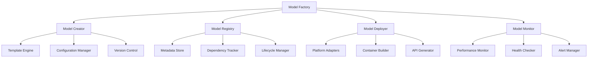

# Model Factory

## Overview

The Model Factory is a comprehensive system for creating, managing, and deploying AI models with standardized interfaces and configurations. It provides a unified approach to model lifecycle management, from creation to deployment, ensuring consistency and reproducibility across different model types and use cases.

## Core Features

### 1. Model Creation

- **Template-based Creation**: Use predefined templates for common model architectures
- **Custom Architecture Support**: Create models with custom architectures
- **Configuration Management**: Centralized configuration for model parameters
- **Version Control**: Automatic versioning and tracking of model configurations

### 2. Model Management

- **Model Registry**: Centralized repository for all models
- **Metadata Tracking**: Comprehensive metadata for each model
- **Dependency Management**: Track model dependencies and requirements
- **Lifecycle Tracking**: Monitor model lifecycle stages

### 3. Model Deployment

- **Multi-Platform Support**: Deploy to various platforms (cloud, edge, mobile)
- **Containerization**: Docker-based deployment packages
- **API Generation**: Automatic REST API generation
- **Scaling Management**: Automatic scaling based on demand

## Architecture



## Model Creation

### Template-based Creation

```python
from model_factory import ModelFactory

# Create model from template
factory = ModelFactory()
model = factory.create_model(
    template="bert_classifier",
    config={
        "num_classes": 10,
        "max_length": 512,
        "dropout": 0.1
    }
)
```

### Custom Architecture Creation

```python
# Create custom model
custom_model = factory.create_custom_model(
    architecture="transformer",
    layers={
        "embedding": {"vocab_size": 30000, "embed_dim": 768},
        "transformer": {"num_layers": 12, "num_heads": 12},
        "classifier": {"num_classes": 5}
    },
    config={
        "activation": "gelu",
        "normalization": "layer_norm"
    }
)
```

### Configuration Management

```python
# Model configuration
config = {
    "model": {
        "architecture": "bert",
        "pretrained": "bert-base-uncased",
        "num_classes": 3,
        "dropout": 0.1
    },
    "training": {
        "batch_size": 32,
        "learning_rate": 2e-5,
        "epochs": 10,
        "optimizer": "adamw"
    },
    "data": {
        "max_length": 512,
        "tokenizer": "bert-base-uncased",
        "preprocessing": "standard"
    }
}

model = factory.create_from_config(config)
```

## Model Registry

### Model Registration

```python
# Register model in factory
model_id = factory.register_model(
    model=model,
    name="sentiment_classifier",
    version="1.0.0",
    description="BERT-based sentiment classification model",
    tags=["nlp", "classification", "sentiment"],
    metadata={
        "dataset": "imdb",
        "accuracy": 0.92,
        "training_time": "2.5 hours"
    }
)
```

### Model Retrieval

```python
# Retrieve model by ID
model = factory.get_model("sentiment_classifier:1.0.0")

# Search models by criteria
models = factory.search_models(
    tags=["nlp", "classification"],
    min_accuracy=0.90,
    framework="transformers"
)
```

### Model Versioning

```python
# Create new version
new_version = factory.create_version(
    base_model="sentiment_classifier:1.0.0",
    improvements=["better_accuracy", "faster_inference"],
    config_updates={"dropout": 0.05}
)
```

## Model Deployment

### Local Deployment

```python
# Deploy model locally
deployment = factory.deploy_model(
    model_id="sentiment_classifier:1.0.0",
    platform="local",
    config={
        "host": "0.0.0.0",
        "port": 8081,
        "workers": 4
    }
)
```

### Cloud Deployment

```python
# Deploy to cloud platform
cloud_deployment = factory.deploy_model(
    model_id="sentiment_classifier:1.0.0",
    platform="aws",
    config={
        "instance_type": "ml.m5.large",
        "scaling": {"min_instances": 1, "max_instances": 10},
        "auto_scaling": True
    }
)
```

### Container Deployment

```python
# Create deployment container
container = factory.create_container(
    model_id="sentiment_classifier:1.0.0",
    base_image="python:3.9-slim",
    requirements=["transformers", "torch", "fastapi"]
)

# Deploy container
deployment = factory.deploy_container(
    container=container,
    platform="kubernetes",
    replicas=3
)
```

## API Generation

### Automatic API Creation

```python
# Generate REST API
api = factory.generate_api(
    model_id="sentiment_classifier:1.0.0",
    api_type="rest",
    endpoints=["predict", "health", "metrics"],
    documentation=True
)
```

### Custom API Configuration

```python
# Custom API configuration
api_config = {
    "endpoints": {
        "predict": {
            "method": "POST",
            "path": "/predict",
            "input_schema": "json",
            "output_schema": "json"
        },
        "batch_predict": {
            "method": "POST",
            "path": "/batch_predict",
            "input_schema": "json",
            "output_schema": "json"
        }
    },
    "authentication": "bearer_token",
    "rate_limiting": {"requests_per_minute": 100}
}

api = factory.generate_api(
    model_id="sentiment_classifier:1.0.0",
    config=api_config
)
```

## Model Monitoring

### Performance Monitoring

```python
# Set up monitoring
monitoring = factory.setup_monitoring(
    model_id="sentiment_classifier:1.0.0",
    metrics=[
        "latency",
        "throughput",
        "error_rate",
        "accuracy"
    ],
    alerts={
        "latency": {"threshold": 100, "unit": "ms"},
        "error_rate": {"threshold": 0.05, "unit": "percentage"}
    }
)
```

### Health Checks

```python
# Configure health checks
health_config = {
    "endpoint": "/health",
    "checks": [
        {"name": "model_loaded", "type": "model_availability"},
        {"name": "memory_usage", "type": "resource", "threshold": 0.8},
        {"name": "response_time", "type": "performance", "threshold": 100}
    ],
    "interval": 30
}

factory.configure_health_checks(
    model_id="sentiment_classifier:1.0.0",
    config=health_config
)
```

## Integration Examples

### MLflow Integration

```python
# Integrate with MLflow
mlflow_integration = factory.integrate_mlflow(
    tracking_uri="http://localhost:5000",
    experiment_name="sentiment_classification"
)

# Log model to MLflow
mlflow_integration.log_model(
    model_id="sentiment_classifier:1.0.0",
    model_name="sentiment_classifier",
    model_version="1.0.0"
)
```

### Kubernetes Integration

```python
# Deploy to Kubernetes
k8s_deployment = factory.deploy_to_kubernetes(
    model_id="sentiment_classifier:1.0.0",
    namespace="ai-models",
    config={
        "replicas": 3,
        "resources": {
            "requests": {"cpu": "500m", "memory": "1Gi"},
            "limits": {"cpu": "1000m", "memory": "2Gi"}
        },
        "service": {"type": "LoadBalancer", "port": 80}
    }
)
```

## Best Practices

### Model Development

1. **Use Templates**: Leverage predefined templates for common architectures
2. **Version Control**: Always version your models and configurations
3. **Documentation**: Maintain comprehensive documentation for each model
4. **Testing**: Implement comprehensive testing before deployment

### Deployment

1. **Environment Parity**: Ensure consistent environments across stages
2. **Resource Planning**: Plan resources based on expected load
3. **Monitoring**: Implement comprehensive monitoring and alerting
4. **Rollback Strategy**: Have rollback plans for failed deployments

### Maintenance

1. **Regular Updates**: Keep models and dependencies updated
2. **Performance Monitoring**: Continuously monitor model performance
3. **Security**: Implement proper security measures
4. **Backup**: Regular backups of models and configurations

## Troubleshooting

### Common Issues

- **Model Loading Errors**: Check model format and dependencies
- **Deployment Failures**: Verify platform compatibility and resources
- **Performance Issues**: Monitor resource usage and optimize configuration
- **API Errors**: Check endpoint configuration and input validation

### Debugging Tools

```python
# Model debugging
debug_info = factory.debug_model("sentiment_classifier:1.0.0")
print(debug_info)

# Deployment debugging
deployment_logs = factory.get_deployment_logs(
    model_id="sentiment_classifier:1.0.0",
    deployment_id="deployment_123"
)
```

## Example Workflow

```python
from model_factory import ModelFactory

# Initialize factory
factory = ModelFactory()

# 1. Create model from template
model = factory.create_model(
    template="bert_classifier",
    config={
        "num_classes": 3,
        "pretrained": "bert-base-uncased"
    }
)

# 2. Train model (pseudo-code)
# model.train(training_data)

# 3. Register model
model_id = factory.register_model(
    model=model,
    name="sentiment_classifier",
    version="1.0.0"
)

# 4. Deploy model
deployment = factory.deploy_model(
    model_id=model_id,
    platform="local",
    config={"port": 8081}
)

# 5. Generate API
api = factory.generate_api(
    model_id=model_id,
    api_type="rest"
)

# 6. Set up monitoring
factory.setup_monitoring(
    model_id=model_id,
    metrics=["latency", "accuracy"]
)

print(f"Model deployed successfully at: {deployment.url}")
```
