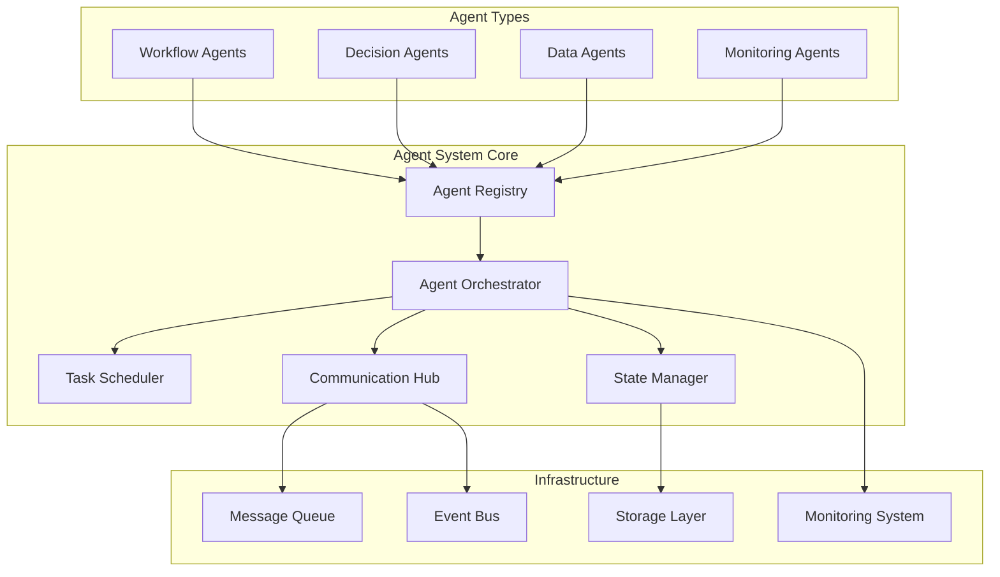

# Agent System

## Overview

The Agent System provides a comprehensive framework for building, deploying, and managing autonomous AI agents. These agents can perform complex tasks, interact with each other, and adapt to changing environments while maintaining consistency and reliability in their operations.

## System Architecture

### Core Components



## Agent Types and Capabilities

### 1. Workflow Agents

Workflow agents manage complex business processes and coordinate multiple tasks:

#### Features

- **Process Orchestration**: Manage multi-step business processes
- **Task Coordination**: Coordinate tasks across different systems
- **Error Handling**: Robust error handling and recovery mechanisms
- **Progress Tracking**: Track and report on workflow progress

#### Implementation

```python
# agents/workflow_agent.py
from typing import Dict, List, Optional, Callable
import asyncio
from dataclasses import dataclass
from enum import Enum
import uuid
import time

class WorkflowStatus(Enum):
    PENDING = "pending"
    RUNNING = "running"
    COMPLETED = "completed"
    FAILED = "failed"
    CANCELLED = "cancelled"

@dataclass
class WorkflowStep:
    id: str
    name: str
    action: Callable
    dependencies: List[str] = None
    retry_count: int = 0
    max_retries: int = 3
    timeout: int = 300
    status: WorkflowStatus = WorkflowStatus.PENDING
    result: Optional[Dict] = None
    error: Optional[str] = None
    started_at: Optional[float] = None
    completed_at: Optional[float] = None

class WorkflowAgent:
    def __init__(self, agent_id: str, config: Dict):
        self.agent_id = agent_id
        self.config = config
        self.workflow_steps: Dict[str, WorkflowStep] = {}
        self.current_workflow: Optional[str] = None
        self.status = WorkflowStatus.PENDING

    def add_step(self, step_id: str, name: str, action: Callable,
                 dependencies: List[str] = None, **kwargs) -> WorkflowStep:
        """Add a step to the workflow"""
        step = WorkflowStep(
            id=step_id,
            name=name,
            action=action,
            dependencies=dependencies or [],
            **kwargs
        )
        self.workflow_steps[step_id] = step
        return step

    async def execute_workflow(self, workflow_id: str) -> Dict:
        """Execute the complete workflow"""
        self.current_workflow = workflow_id
        self.status = WorkflowStatus.RUNNING

        try:
            # Build execution graph
            execution_order = self._build_execution_order()

            # Execute steps in order
            for step_ids in execution_order:
                # Execute parallel steps
                await self._execute_parallel_steps(step_ids)

            self.status = WorkflowStatus.COMPLETED
            return self._get_workflow_results()

        except Exception as e:
            self.status = WorkflowStatus.FAILED
            raise

    def _build_execution_order(self) -> List[List[str]]:
        """Build execution order based on dependencies"""
        execution_order = []
        completed_steps = set()

        while len(completed_steps) < len(self.workflow_steps):
            ready_steps = []

            for step_id, step in self.workflow_steps.items():
                if (step_id not in completed_steps and
                    all(dep in completed_steps for dep in step.dependencies)):
                    ready_steps.append(step_id)

            if not ready_steps:
                raise Exception("Circular dependency detected in workflow")

            execution_order.append(ready_steps)
            completed_steps.update(ready_steps)

        return execution_order

    async def _execute_parallel_steps(self, step_ids: List[str]):
        """Execute multiple steps in parallel"""
        tasks = []

        for step_id in step_ids:
            task = asyncio.create_task(self._execute_step(step_id))
            tasks.append(task)

        await asyncio.gather(*tasks, return_exceptions=True)

    async def _execute_step(self, step_id: str):
        """Execute a single workflow step"""
        step = self.workflow_steps[step_id]
        step.status = WorkflowStatus.RUNNING
        step.started_at = time.time()

        try:
            # Execute step action
            result = await step.action()
            step.result = result
            step.status = WorkflowStatus.COMPLETED
            step.completed_at = time.time()

        except Exception as e:
            step.error = str(e)
            step.status = WorkflowStatus.FAILED

            # Retry logic
            if step.retry_count < step.max_retries:
                step.retry_count += 1
                step.status = WorkflowStatus.PENDING
                await asyncio.sleep(2 ** step.retry_count)  # Exponential backoff
                await self._execute_step(step_id)
            else:
                raise

    def _get_workflow_results(self) -> Dict:
        """Get results from all completed steps"""
        results = {}
        for step_id, step in self.workflow_steps.items():
            if step.status == WorkflowStatus.COMPLETED:
                results[step_id] = step.result
        return results
```

### 2. Decision Agents

Decision agents make intelligent decisions based on data and rules:

#### Features

- **Rule Engine**: Flexible rule-based decision making
- **Machine Learning Integration**: ML-based decision making
- **Context Awareness**: Make decisions based on current context
- **Decision Tracking**: Track and audit all decisions

#### Implementation

```python
# agents/decision_agent.py
from typing import Dict, List, Optional, Any
import json
from dataclasses import dataclass
from abc import ABC, abstractmethod

@dataclass
class DecisionContext:
    user_id: str
    session_id: str
    timestamp: float
    data: Dict[str, Any]
    metadata: Dict[str, Any] = None

@dataclass
class DecisionResult:
    decision: str
    confidence: float
    reasoning: str
    alternatives: List[Dict] = None
    metadata: Dict[str, Any] = None

class DecisionRule:
    def __init__(self, rule_id: str, condition: str, action: str, priority: int = 0):
        self.rule_id = rule_id
        self.condition = condition
        self.action = action
        self.priority = priority
        self.active = True

    def evaluate(self, context: DecisionContext) -> bool:
        """Evaluate if rule condition is met"""
        # Simple condition evaluation - in practice, use a proper rule engine
        try:
            # This is a simplified implementation
            # In practice, you'd use a proper rule engine like Drools or similar
            return eval(self.condition, {"context": context, "data": context.data})
        except:
            return False

class DecisionEngine(ABC):
    @abstractmethod
    def make_decision(self, context: DecisionContext) -> DecisionResult:
        pass

class RuleBasedDecisionEngine(DecisionEngine):
    def __init__(self):
        self.rules: List[DecisionRule] = []
        self.decision_history: List[Dict] = []

    def add_rule(self, rule: DecisionRule):
        """Add a decision rule"""
        self.rules.append(rule)
        self.rules.sort(key=lambda x: x.priority, reverse=True)

    def make_decision(self, context: DecisionContext) -> DecisionResult:
        """Make decision based on rules"""

        # Evaluate rules in priority order
        for rule in self.rules:
            if rule.active and rule.evaluate(context):
                decision = DecisionResult(
                    decision=rule.action,
                    confidence=1.0,
                    reasoning=f"Rule {rule.rule_id} matched",
                    metadata={"rule_id": rule.rule_id}
                )

                # Log decision
                self._log_decision(context, decision)
                return decision

        # Default decision if no rules match
        default_decision = DecisionResult(
            decision="default_action",
            confidence=0.5,
            reasoning="No rules matched, using default action"
        )

        self._log_decision(context, default_decision)
        return default_decision

    def _log_decision(self, context: DecisionContext, decision: DecisionResult):
        """Log decision for audit purposes"""
        log_entry = {
            "timestamp": context.timestamp,
            "user_id": context.user_id,
            "session_id": context.session_id,
            "decision": decision.decision,
            "confidence": decision.confidence,
            "reasoning": decision.reasoning,
            "context_data": context.data
        }
        self.decision_history.append(log_entry)

class MLBasedDecisionEngine(DecisionEngine):
    def __init__(self, model_path: str):
        self.model_path = model_path
        self.model = self._load_model()

    def _load_model(self):
        """Load ML model for decision making"""
        # Implementation depends on your ML framework
        pass

    def make_decision(self, context: DecisionContext) -> DecisionResult:
        """Make decision using ML model"""

        # Prepare features from context
        features = self._extract_features(context)

        # Make prediction
        prediction = self.model.predict([features])
        confidence = self.model.predict_proba([features]).max()

        decision = DecisionResult(
            decision=str(prediction[0]),
            confidence=float(confidence),
            reasoning="ML model prediction",
            metadata={"model_path": self.model_path}
        )

        return decision

    def _extract_features(self, context: DecisionContext) -> List[float]:
        """Extract features from decision context"""
        # Implementation depends on your feature engineering approach
        return []

class DecisionAgent:
    def __init__(self, agent_id: str, decision_engine: DecisionEngine):
        self.agent_id = agent_id
        self.decision_engine = decision_engine
        self.decision_cache: Dict[str, DecisionResult] = {}

    async def make_decision(self, context: DecisionContext) -> DecisionResult:
        """Make a decision for the given context"""

        # Check cache first
        cache_key = self._generate_cache_key(context)
        if cache_key in self.decision_cache:
            return self.decision_cache[cache_key]

        # Make decision
        decision = self.decision_engine.make_decision(context)

        # Cache decision
        self.decision_cache[cache_key] = decision

        return decision

    def _generate_cache_key(self, context: DecisionContext) -> str:
        """Generate cache key for context"""
        # Simple hash-based cache key
        context_str = json.dumps(context.data, sort_keys=True)
        return f"{context.user_id}_{hash(context_str)}"
```

### 3. Data Agents

Data agents handle data processing, transformation, and analysis tasks:

#### Features

- **Data Ingestion**: Collect data from various sources
- **Data Processing**: Transform and clean data
- **Data Analysis**: Perform statistical and ML analysis
- **Data Quality**: Ensure data quality and consistency

#### Implementation

```python
# agents/data_agent.py
from typing import Dict, List, Optional, Any, Callable
import pandas as pd
import numpy as np
from abc import ABC, abstractmethod
import asyncio
from dataclasses import dataclass

@dataclass
class DataSource:
    source_id: str
    source_type: str  # database, api, file, stream
    connection_config: Dict[str, Any]
    schema: Optional[Dict] = None

@dataclass
class DataProcessingTask:
    task_id: str
    task_type: str  # ingestion, transformation, analysis, quality_check
    config: Dict[str, Any]
    dependencies: List[str] = None
    status: str = "pending"
    result: Optional[Any] = None

class DataProcessor(ABC):
    @abstractmethod
    async def process(self, data: Any, config: Dict) -> Any:
        pass

class DataIngestionProcessor(DataProcessor):
    async def process(self, data_source: DataSource, config: Dict) -> pd.DataFrame:
        """Ingest data from source"""

        if data_source.source_type == "database":
            return await self._ingest_from_database(data_source, config)
        elif data_source.source_type == "api":
            return await self._ingest_from_api(data_source, config)
        elif data_source.source_type == "file":
            return await self._ingest_from_file(data_source, config)
        else:
            raise ValueError(f"Unsupported source type: {data_source.source_type}")

    async def _ingest_from_database(self, source: DataSource, config: Dict) -> pd.DataFrame:
        """Ingest data from database"""
        # Implementation depends on your database connector
        pass

    async def _ingest_from_api(self, source: DataSource, config: Dict) -> pd.DataFrame:
        """Ingest data from API"""
        # Implementation depends on your API client
        pass

    async def _ingest_from_file(self, source: DataSource, config: Dict) -> pd.DataFrame:
        """Ingest data from file"""
        # Implementation depends on file format
        pass

class DataTransformationProcessor(DataProcessor):
    async def process(self, data: pd.DataFrame, config: Dict) -> pd.DataFrame:
        """Transform data according to configuration"""

        transformations = config.get("transformations", [])

        for transformation in transformations:
            transformation_type = transformation.get("type")

            if transformation_type == "filter":
                data = await self._apply_filter(data, transformation)
            elif transformation_type == "aggregate":
                data = await self._apply_aggregation(data, transformation)
            elif transformation_type == "join":
                data = await self._apply_join(data, transformation)
            elif transformation_type == "custom":
                data = await self._apply_custom_transformation(data, transformation)

        return data

    async def _apply_filter(self, data: pd.DataFrame, config: Dict) -> pd.DataFrame:
        """Apply filter transformation"""
        condition = config.get("condition")
        return data.query(condition)

    async def _apply_aggregation(self, data: pd.DataFrame, config: Dict) -> pd.DataFrame:
        """Apply aggregation transformation"""
        group_by = config.get("group_by", [])
        aggregations = config.get("aggregations", {})
        return data.groupby(group_by).agg(aggregations).reset_index()

    async def _apply_join(self, data: pd.DataFrame, config: Dict) -> pd.DataFrame:
        """Apply join transformation"""
        # Implementation for joining with other datasets
        pass

    async def _apply_custom_transformation(self, data: pd.DataFrame, config: Dict) -> pd.DataFrame:
        """Apply custom transformation"""
        function = config.get("function")
        return function(data)

class DataQualityProcessor(DataProcessor):
    async def process(self, data: pd.DataFrame, config: Dict) -> Dict[str, Any]:
        """Perform data quality checks"""

        quality_checks = config.get("quality_checks", [])
        results = {}

        for check in quality_checks:
            check_type = check.get("type")

            if check_type == "completeness":
                results[check_type] = await self._check_completeness(data, check)
            elif check_type == "consistency":
                results[check_type] = await self._check_consistency(data, check)
            elif check_type == "validity":
                results[check_type] = await self._check_validity(data, check)
            elif check_type == "uniqueness":
                results[check_type] = await self._check_uniqueness(data, check)

        return results

    async def _check_completeness(self, data: pd.DataFrame, config: Dict) -> Dict[str, float]:
        """Check data completeness"""
        columns = config.get("columns", data.columns.tolist())
        completeness = {}

        for column in columns:
            null_count = data[column].isnull().sum()
            total_count = len(data)
            completeness[column] = 1 - (null_count / total_count)

        return completeness

    async def _check_consistency(self, data: pd.DataFrame, config: Dict) -> Dict[str, Any]:
        """Check data consistency"""
        # Implementation for consistency checks
        return {}

    async def _check_validity(self, data: pd.DataFrame, config: Dict) -> Dict[str, Any]:
        """Check data validity"""
        # Implementation for validity checks
        return {}

    async def _check_uniqueness(self, data: pd.DataFrame, config: Dict) -> Dict[str, Any]:
        """Check data uniqueness"""
        # Implementation for uniqueness checks
        return {}

class DataAgent:
    def __init__(self, agent_id: str, config: Dict):
        self.agent_id = agent_id
        self.config = config
        self.processors: Dict[str, DataProcessor] = {}
        self.data_sources: Dict[str, DataSource] = {}
        self.processing_tasks: Dict[str, DataProcessingTask] = {}

        # Initialize processors
        self.processors["ingestion"] = DataIngestionProcessor()
        self.processors["transformation"] = DataTransformationProcessor()
        self.processors["quality"] = DataQualityProcessor()

    def add_data_source(self, source: DataSource):
        """Add a data source"""
        self.data_sources[source.source_id] = source

    async def process_data(self, task: DataProcessingTask) -> Any:
        """Process data according to task configuration"""

        task.status = "running"

        try:
            if task.task_type == "ingestion":
                source_id = task.config.get("source_id")
                source = self.data_sources[source_id]
                result = await self.processors["ingestion"].process(source, task.config)

            elif task.task_type == "transformation":
                input_data = task.config.get("input_data")
                result = await self.processors["transformation"].process(input_data, task.config)

            elif task.task_type == "quality_check":
                input_data = task.config.get("input_data")
                result = await self.processors["quality"].process(input_data, task.config)

            task.result = result
            task.status = "completed"

            return result

        except Exception as e:
            task.status = "failed"
            task.result = {"error": str(e)}
            raise
```

### 4. Monitoring Agents

Monitoring agents continuously monitor system health and performance:

#### Features

- **Health Monitoring**: Monitor system and service health
- **Performance Monitoring**: Track performance metrics
- **Alert Management**: Generate and manage alerts
- **Incident Response**: Automatic incident response

#### Implementation

```python
# agents/monitoring_agent.py
from typing import Dict, List, Optional, Callable
import asyncio
import time
from dataclasses import dataclass
from enum import Enum
import psutil
import requests

class AlertSeverity(Enum):
    LOW = "low"
    MEDIUM = "medium"
    HIGH = "high"
    CRITICAL = "critical"

@dataclass
class Alert:
    alert_id: str
    title: str
    description: str
    severity: AlertSeverity
    source: str
    timestamp: float
    metadata: Dict[str, Any] = None
    acknowledged: bool = False
    resolved: bool = False

@dataclass
class MonitoringMetric:
    name: str
    value: float
    unit: str
    timestamp: float
    tags: Dict[str, str] = None

class MonitoringCheck:
    def __init__(self, check_id: str, name: str, check_function: Callable,
                 interval: int = 60, threshold: Dict = None):
        self.check_id = check_id
        self.name = name
        self.check_function = check_function
        self.interval = interval
        self.threshold = threshold or {}
        self.last_run: Optional[float] = None
        self.last_result: Optional[Dict] = None

    async def run_check(self) -> Dict:
        """Run the monitoring check"""
        try:
            result = await self.check_function()
            self.last_result = result
            self.last_run = time.time()
            return result
        except Exception as e:
            return {"error": str(e), "status": "failed"}

class SystemHealthCheck:
    async def check_cpu_usage(self) -> Dict:
        """Check CPU usage"""
        cpu_percent = psutil.cpu_percent(interval=1)
        return {
            "metric": "cpu_usage",
            "value": cpu_percent,
            "unit": "percent",
            "status": "ok" if cpu_percent < 80 else "warning" if cpu_percent < 90 else "critical"
        }

    async def check_memory_usage(self) -> Dict:
        """Check memory usage"""
        memory = psutil.virtual_memory()
        return {
            "metric": "memory_usage",
            "value": memory.percent,
            "unit": "percent",
            "status": "ok" if memory.percent < 80 else "warning" if memory.percent < 90 else "critical"
        }

    async def check_disk_usage(self) -> Dict:
        """Check disk usage"""
        disk = psutil.disk_usage('/')
        disk_percent = (disk.used / disk.total) * 100
        return {
            "metric": "disk_usage",
            "value": disk_percent,
            "unit": "percent",
            "status": "ok" if disk_percent < 80 else "warning" if disk_percent < 90 else "critical"
        }

class ServiceHealthCheck:
    async def check_service_endpoint(self, url: str, timeout: int = 5) -> Dict:
        """Check if service endpoint is responding"""
        try:
            response = requests.get(url, timeout=timeout)
            return {
                "metric": "service_response",
                "value": response.status_code,
                "unit": "status_code",
                "status": "ok" if response.status_code == 200 else "warning",
                "response_time": response.elapsed.total_seconds()
            }
        except requests.exceptions.RequestException as e:
            return {
                "metric": "service_response",
                "value": 0,
                "unit": "status_code",
                "status": "critical",
                "error": str(e)
            }

class MonitoringAgent:
    def __init__(self, agent_id: str, config: Dict):
        self.agent_id = agent_id
        self.config = config
        self.checks: Dict[str, MonitoringCheck] = {}
        self.alerts: List[Alert] = []
        self.metrics_history: List[MonitoringMetric] = []
        self.alert_handlers: List[Callable] = []

        # Initialize default checks
        self._initialize_default_checks()

    def _initialize_default_checks(self):
        """Initialize default monitoring checks"""
        health_checker = SystemHealthCheck()
        service_checker = ServiceHealthCheck()

        # System health checks
        self.add_check("cpu_check", "CPU Usage Check", health_checker.check_cpu_usage, 60)
        self.add_check("memory_check", "Memory Usage Check", health_checker.check_memory_usage, 60)
        self.add_check("disk_check", "Disk Usage Check", health_checker.check_disk_usage, 300)

        # Service health checks
        services = self.config.get("services", [])
        for service in services:
            check_id = f"service_check_{service['name']}"
            check_function = lambda url=service['url']: service_checker.check_service_endpoint(url)
            self.add_check(check_id, f"Service Check - {service['name']}", check_function, 30)

    def add_check(self, check_id: str, name: str, check_function: Callable,
                  interval: int = 60, threshold: Dict = None):
        """Add a monitoring check"""
        check = MonitoringCheck(check_id, name, check_function, interval, threshold)
        self.checks[check_id] = check

    def add_alert_handler(self, handler: Callable):
        """Add alert handler"""
        self.alert_handlers.append(handler)

    async def start_monitoring(self):
        """Start monitoring loop"""
        while True:
            await self._run_all_checks()
            await asyncio.sleep(10)  # Check every 10 seconds

    async def _run_all_checks(self):
        """Run all monitoring checks"""
        current_time = time.time()

        for check in self.checks.values():
            if (check.last_run is None or
                current_time - check.last_run >= check.interval):
                await self._run_check(check)

    async def _run_check(self, check: MonitoringCheck):
        """Run a single check"""
        result = await check.run_check()

        # Store metric
        if "metric" in result:
            metric = MonitoringMetric(
                name=result["metric"],
                value=result["value"],
                unit=result.get("unit", ""),
                timestamp=time.time(),
                tags={"check_id": check.check_id}
            )
            self.metrics_history.append(metric)

        # Check for alerts
        if result.get("status") in ["warning", "critical"]:
            await self._create_alert(check, result)

    async def _create_alert(self, check: MonitoringCheck, result: Dict):
        """Create alert from check result"""
        severity = AlertSeverity.CRITICAL if result["status"] == "critical" else AlertSeverity.MEDIUM

        alert = Alert(
            alert_id=f"{check.check_id}_{int(time.time())}",
            title=f"{check.name} - {result['status'].upper()}",
            description=f"Check {check.check_id} returned status: {result['status']}",
            severity=severity,
            source=self.agent_id,
            timestamp=time.time(),
            metadata=result
        )

        self.alerts.append(alert)

        # Send alert to handlers
        for handler in self.alert_handlers:
            try:
                await handler(alert)
            except Exception as e:
                print(f"Error in alert handler: {e}")

    async def acknowledge_alert(self, alert_id: str):
        """Acknowledge an alert"""
        for alert in self.alerts:
            if alert.alert_id == alert_id:
                alert.acknowledged = True
                break

    async def resolve_alert(self, alert_id: str):
        """Resolve an alert"""
        for alert in self.alerts:
            if alert.alert_id == alert_id:
                alert.resolved = True
                break

    def get_metrics_summary(self, hours: int = 24) -> Dict:
        """Get metrics summary for the last N hours"""
        cutoff_time = time.time() - (hours * 3600)
        recent_metrics = [m for m in self.metrics_history if m.timestamp >= cutoff_time]

        summary = {}
        for metric in recent_metrics:
            if metric.name not in summary:
                summary[metric.name] = {
                    "values": [],
                    "min": float('inf'),
                    "max": float('-inf'),
                    "avg": 0
                }

            summary[metric.name]["values"].append(metric.value)
            summary[metric.name]["min"] = min(summary[metric.name]["min"], metric.value)
            summary[metric.name]["max"] = max(summary[metric.name]["max"], metric.value)

        # Calculate averages
        for metric_name, data in summary.items():
            if data["values"]:
                data["avg"] = sum(data["values"]) / len(data["values"])

        return summary
```

## Agent Communication and Coordination

### Inter-Agent Communication

```python
# agents/communication.py
from typing import Dict, List, Optional, Any
import asyncio
import json
from dataclasses import dataclass
from enum import Enum

class MessageType(Enum):
    TASK_REQUEST = "task_request"
    TASK_RESPONSE = "task_response"
    STATUS_UPDATE = "status_update"
    EVENT_NOTIFICATION = "event_notification"
    HEARTBEAT = "heartbeat"

@dataclass
class AgentMessage:
    message_id: str
    sender_id: str
    recipient_id: str
    message_type: MessageType
    payload: Dict[str, Any]
    timestamp: float
    correlation_id: Optional[str] = None

class AgentCommunicationHub:
    def __init__(self):
        self.agents: Dict[str, 'Agent'] = {}
        self.message_queue: asyncio.Queue = asyncio.Queue()
        self.message_handlers: Dict[str, List[Callable]] = {}
        self.running = False

    def register_agent(self, agent: 'Agent'):
        """Register an agent for communication"""
        self.agents[agent.agent_id] = agent
        self.message_handlers[agent.agent_id] = []

    def add_message_handler(self, agent_id: str, handler: Callable):
        """Add message handler for agent"""
        if agent_id not in self.message_handlers:
            self.message_handlers[agent_id] = []
        self.message_handlers[agent_id].append(handler)

    async def send_message(self, message: AgentMessage):
        """Send message to agent"""
        await self.message_queue.put(message)

    async def start_message_processing(self):
        """Start processing messages"""
        self.running = True
        while self.running:
            try:
                message = await asyncio.wait_for(self.message_queue.get(), timeout=1.0)
                await self._process_message(message)
            except asyncio.TimeoutError:
                continue
            except Exception as e:
                print(f"Error processing message: {e}")

    async def _process_message(self, message: AgentMessage):
        """Process a single message"""
        if message.recipient_id in self.message_handlers:
            for handler in self.message_handlers[message.recipient_id]:
                try:
                    await handler(message)
                except Exception as e:
                    print(f"Error in message handler: {e}")

    async def broadcast_message(self, sender_id: str, message_type: MessageType,
                               payload: Dict[str, Any]):
        """Broadcast message to all agents"""
        for agent_id in self.agents.keys():
            if agent_id != sender_id:
                message = AgentMessage(
                    message_id=f"broadcast_{int(time.time())}",
                    sender_id=sender_id,
                    recipient_id=agent_id,
                    message_type=message_type,
                    payload=payload,
                    timestamp=time.time()
                )
                await self.send_message(message)
```

## Agent Orchestration

### Agent Orchestrator

```python
# agents/orchestrator.py
from typing import Dict, List, Optional
import asyncio
import time
from dataclasses import dataclass
from enum import Enum

class AgentStatus(Enum):
    IDLE = "idle"
    BUSY = "busy"
    ERROR = "error"
    OFFLINE = "offline"

@dataclass
class AgentTask:
    task_id: str
    agent_type: str
    task_config: Dict
    priority: int = 0
    created_at: float = 0
    assigned_agent: Optional[str] = None
    status: str = "pending"

class AgentOrchestrator:
    def __init__(self):
        self.agents: Dict[str, 'Agent'] = {}
        self.agent_status: Dict[str, AgentStatus] = {}
        self.task_queue: asyncio.PriorityQueue = asyncio.PriorityQueue()
        self.running_tasks: Dict[str, asyncio.Task] = {}
        self.communication_hub = AgentCommunicationHub()

    def register_agent(self, agent: 'Agent'):
        """Register an agent"""
        self.agents[agent.agent_id] = agent
        self.agent_status[agent.agent_id] = AgentStatus.IDLE
        self.communication_hub.register_agent(agent)

        # Add message handler for task assignment
        self.communication_hub.add_message_handler(
            agent.agent_id,
            self._handle_agent_message
        )

    async def submit_task(self, agent_type: str, task_config: Dict, priority: int = 0) -> str:
        """Submit a task to be executed by an agent"""
        task_id = f"task_{agent_type}_{int(time.time())}"

        task = AgentTask(
            task_id=task_id,
            agent_type=agent_type,
            task_config=task_config,
            priority=priority,
            created_at=time.time()
        )

        await self.task_queue.put((priority, task))
        return task_id

    async def start_orchestration(self):
        """Start the orchestration loop"""
        # Start communication hub
        asyncio.create_task(self.communication_hub.start_message_processing())

        # Start task processing
        while True:
            try:
                priority, task = await self.task_queue.get()
                await self._assign_task(task)
                self.task_queue.task_done()
            except Exception as e:
                print(f"Error in orchestration: {e}")

    async def _assign_task(self, task: AgentTask):
        """Assign task to an available agent"""
        # Find available agent of the required type
        available_agent = None
        for agent_id, agent in self.agents.items():
            if (agent.agent_type == task.agent_type and
                self.agent_status[agent_id] == AgentStatus.IDLE):
                available_agent = agent
                break

        if available_agent:
            # Assign task to agent
            task.assigned_agent = available_agent.agent_id
            task.status = "assigned"

            # Update agent status
            self.agent_status[available_agent.agent_id] = AgentStatus.BUSY

            # Send task to agent
            message = AgentMessage(
                message_id=f"task_{task.task_id}",
                sender_id="orchestrator",
                recipient_id=available_agent.agent_id,
                message_type=MessageType.TASK_REQUEST,
                payload=task.task_config,
                timestamp=time.time(),
                correlation_id=task.task_id
            )

            await self.communication_hub.send_message(message)

            # Create task monitoring
            monitor_task = asyncio.create_task(
                self._monitor_task_execution(task)
            )
            self.running_tasks[task.task_id] = monitor_task
        else:
            # No available agent, requeue task
            await self.task_queue.put((task.priority, task))

    async def _monitor_task_execution(self, task: AgentTask):
        """Monitor task execution"""
        # Wait for task completion or timeout
        try:
            await asyncio.sleep(task.task_config.get("timeout", 300))

            # If we get here, task timed out
            task.status = "timeout"
            self.agent_status[task.assigned_agent] = AgentStatus.IDLE

        except Exception as e:
            task.status = "failed"
            task.error = str(e)
            self.agent_status[task.assigned_agent] = AgentStatus.ERROR

    async def _handle_agent_message(self, message: AgentMessage):
        """Handle messages from agents"""
        if message.message_type == MessageType.TASK_RESPONSE:
            # Task completed
            task_id = message.correlation_id
            if task_id in self.running_tasks:
                task = self.running_tasks[task_id]
                task.status = "completed"
                task.result = message.payload

                # Update agent status
                self.agent_status[message.sender_id] = AgentStatus.IDLE

                # Clean up
                del self.running_tasks[task_id]

        elif message.message_type == MessageType.STATUS_UPDATE:
            # Agent status update
            agent_id = message.sender_id
            new_status = message.payload.get("status")
            if new_status:
                self.agent_status[agent_id] = AgentStatus(new_status)
```

## Best Practices

### 1. Agent Design

- **Single Responsibility**: Each agent should have a single, well-defined responsibility
- **Stateless Design**: Design agents to be stateless when possible
- **Error Handling**: Implement robust error handling and recovery mechanisms
- **Resource Management**: Properly manage resources and connections

### 2. Communication

- **Asynchronous Communication**: Use asynchronous communication patterns
- **Message Queuing**: Implement reliable message queuing
- **Event-Driven Architecture**: Design around events and messages
- **Circuit Breakers**: Implement circuit breakers for external dependencies

### 3. Monitoring and Observability

- **Comprehensive Logging**: Log all important agent activities
- **Metrics Collection**: Collect performance and health metrics
- **Distributed Tracing**: Track requests across agent interactions
- **Alert Management**: Implement proper alerting and notification

### 4. Security

- **Authentication**: Implement proper authentication for agent communication
- **Authorization**: Enforce access controls and permissions
- **Data Encryption**: Encrypt sensitive data in transit and at rest
- **Audit Logging**: Maintain audit logs for security compliance

This comprehensive agent system provides the foundation for building sophisticated AI agent applications that can work together to solve complex problems while maintaining reliability, scalability, and observability.
