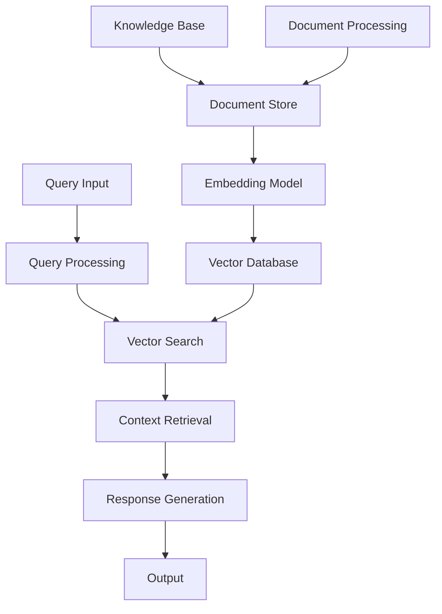

# RAG System

## Overview

The Retrieval-Augmented Generation (RAG) System provides intelligent knowledge retrieval and context-aware response generation. It combines vector search capabilities with language models to deliver accurate, relevant, and up-to-date information.

## Architecture



## Core Components

### 1. Document Processing
- **Text Extraction**: Extract text from various document formats
- **Chunking**: Split documents into manageable chunks
- **Embedding Generation**: Create vector embeddings for semantic search
- **Metadata Extraction**: Extract and store document metadata

### 2. Vector Search Engine
- **Semantic Search**: Find relevant documents using vector similarity
- **Hybrid Search**: Combine vector and keyword search
- **Ranking**: Rank results by relevance and quality
- **Filtering**: Filter results by metadata and criteria

### 3. Response Generation
- **Context Assembly**: Combine retrieved documents into context
- **Prompt Engineering**: Structure prompts for optimal generation
- **Model Integration**: Interface with language models
- **Response Refinement**: Post-process and validate responses

## Implementation

### Document Processor
```python
from typing import List, Dict, Any
import asyncio
from sentence_transformers import SentenceTransformer
import faiss
import numpy as np

class DocumentProcessor:
    def __init__(self, embedding_model: str = "all-MiniLM-L6-v2"):
        self.embedding_model = SentenceTransformer(embedding_model)
        self.chunk_size = 512
        self.chunk_overlap = 50
    
    async def process_documents(self, documents: List[Dict]) -> Dict:
        """Process documents for RAG system"""
        processed_chunks = []
        
        for doc in documents:
            chunks = self._chunk_document(doc)
            embeddings = self.embedding_model.encode([chunk['text'] for chunk in chunks])
            
            for chunk, embedding in zip(chunks, embeddings):
                processed_chunks.append({
                    'text': chunk['text'],
                    'embedding': embedding,
                    'metadata': {**doc.get('metadata', {}), **chunk.get('metadata', {})}
                })
        
        return {'chunks': processed_chunks, 'dimension': embeddings.shape[1]}
    
    def _chunk_document(self, document: Dict) -> List[Dict]:
        """Split document into chunks"""
        text = document['text']
        chunks = []
        
        start = 0
        while start < len(text):
            end = start + self.chunk_size
            chunk_text = text[start:end]
            
            chunks.append({
                'text': chunk_text,
                'metadata': {
                    'chunk_index': len(chunks),
                    'start_pos': start,
                    'end_pos': end
                }
            })
            
            start = end - self.chunk_overlap
        
        return chunks
```

### Vector Database
```python
class VectorDatabase:
    def __init__(self, dimension: int):
        self.dimension = dimension
        self.index = faiss.IndexFlatIP(dimension)  # Inner product similarity
        self.metadata_store = []
    
    def add_vectors(self, vectors: np.ndarray, metadata: List[Dict]):
        """Add vectors and metadata to database"""
        self.index.add(vectors.astype('float32'))
        self.metadata_store.extend(metadata)
    
    def search(self, query_vector: np.ndarray, top_k: int = 5) -> List[Dict]:
        """Search for similar vectors"""
        scores, indices = self.index.search(query_vector.astype('float32'), top_k)
        
        results = []
        for score, idx in zip(scores[0], indices[0]):
            if idx < len(self.metadata_store):
                results.append({
                    'metadata': self.metadata_store[idx],
                    'similarity_score': float(score)
                })
        
        return results
```

### RAG Service
```python
class RAGService:
    def __init__(self, vector_db: VectorDatabase, embedding_model: SentenceTransformer):
        self.vector_db = vector_db
        self.embedding_model = embedding_model
        self.language_model = None  # Initialize with your preferred LLM
    
    async def query(self, question: str, top_k: int = 3) -> str:
        """Process RAG query"""
        # Generate query embedding
        query_embedding = self.embedding_model.encode([question])
        
        # Search for relevant documents
        relevant_docs = self.vector_db.search(query_embedding, top_k)
        
        # Assemble context
        context = self._assemble_context(relevant_docs)
        
        # Generate response
        response = await self._generate_response(question, context)
        
        return response
    
    def _assemble_context(self, docs: List[Dict]) -> str:
        """Assemble context from retrieved documents"""
        context_parts = []
        for doc in docs:
            context_parts.append(f"Document: {doc['metadata'].get('title', 'Unknown')}\n{doc['metadata'].get('text', '')}")
        
        return "\n\n".join(context_parts)
    
    async def _generate_response(self, question: str, context: str) -> str:
        """Generate response using language model"""
        prompt = f"""
        Context: {context}
        
        Question: {question}
        
        Please answer the question based on the provided context. If the context doesn't contain enough information to answer the question, please say so.
        """
        
        # Call language model (implementation depends on your LLM)
        response = await self.language_model.generate(prompt)
        return response
```

## Advanced Features

### Multi-Modal RAG
Support for images, audio, and other media types alongside text.

### Real-Time Updates
Continuous indexing of new documents and knowledge updates.

### Query Expansion
Automatically expand queries with synonyms and related terms.

### Citation Tracking
Track and provide citations for generated responses.

## Best Practices

1. **Document Quality**: Ensure high-quality source documents
2. **Chunking Strategy**: Optimize chunk size for your use case
3. **Embedding Models**: Choose appropriate embedding models
4. **Context Length**: Balance context relevance with length limits
5. **Evaluation**: Regularly evaluate retrieval and generation quality

## Performance Optimization

- Use GPU acceleration for embedding generation
- Implement caching for frequent queries
- Optimize vector database configuration
- Use batch processing for large document sets

This RAG system provides a solid foundation for building intelligent question-answering and knowledge retrieval applications.
