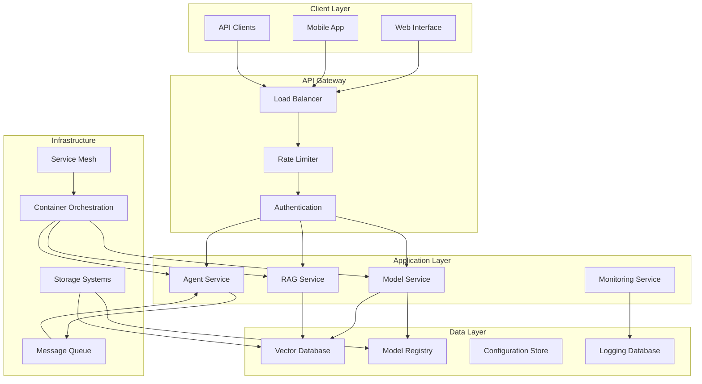

# System Architecture

## Overview

The AI Architecture System provides a comprehensive framework for building, deploying, and managing AI systems at scale. This document outlines the system architecture, components, and design patterns used to create robust, scalable, and maintainable AI solutions.

## Architecture Principles

### 1. Modularity

- **Component-based Design**: Each component has a single responsibility
- **Loose Coupling**: Components interact through well-defined interfaces
- **High Cohesion**: Related functionality is grouped together

### 2. Scalability

- **Horizontal Scaling**: System can scale by adding more instances
- **Vertical Scaling**: Components can utilize more resources
- **Elastic Scaling**: Automatic scaling based on demand

### 3. Reliability

- **Fault Tolerance**: System continues operating despite component failures
- **Redundancy**: Critical components have backup instances
- **Graceful Degradation**: System maintains partial functionality during failures

### 4. Observability

- **Comprehensive Logging**: All operations are logged with context
- **Metrics Collection**: Performance and health metrics are continuously monitored
- **Distributed Tracing**: Request flows are tracked across components

## System Components

### Core Architecture Diagram



## Component Architecture

### 1. API Gateway

The API Gateway serves as the single entry point for all client requests, providing:

#### Features

- **Request Routing**: Routes requests to appropriate services
- **Load Balancing**: Distributes load across service instances
- **Rate Limiting**: Prevents abuse and ensures fair usage
- **Authentication & Authorization**: Validates user credentials and permissions
- **Request/Response Transformation**: Modifies requests and responses as needed
- **Circuit Breaker**: Prevents cascading failures

#### Implementation

```python
# api_gateway/gateway.py
from fastapi import FastAPI, HTTPException, Depends
from fastapi.middleware.cors import CORSMiddleware
from fastapi.middleware.gzip import GZipMiddleware
from starlette.middleware.base import BaseHTTPMiddleware
import asyncio
import time

class RateLimitMiddleware(BaseHTTPMiddleware):
    def __init__(self, app, calls: int = 100, period: int = 60):
        super().__init__(app)
        self.calls = calls
        self.period = period
        self.requests = {}

    async def dispatch(self, request, call_next):
        client_ip = request.client.host
        now = time.time()

        # Clean old entries
        self.requests = {
            ip: requests for ip, requests in self.requests.items()
            if now - requests['start'] < self.period
        }

        # Check rate limit
        if client_ip in self.requests:
            if len(self.requests[client_ip]['calls']) >= self.calls:
                raise HTTPException(status_code=429, detail="Rate limit exceeded")
            self.requests[client_ip]['calls'].append(now)
        else:
            self.requests[client_ip] = {
                'start': now,
                'calls': [now]
            }

        response = await call_next(request)
        return response

class APIGateway:
    def __init__(self):
        self.app = FastAPI(title="AI System API Gateway")
        self._setup_middleware()
        self._setup_routes()

    def _setup_middleware(self):
        self.app.add_middleware(
            CORSMiddleware,
            allow_origins=["*"],
            allow_credentials=True,
            allow_methods=["*"],
            allow_headers=["*"],
        )
        self.app.add_middleware(GZipMiddleware, minimum_size=1000)
        self.app.add_middleware(RateLimitMiddleware, calls=100, period=60)

    def _setup_routes(self):
        @self.app.get("/health")
        async def health_check():
            return {"status": "healthy", "timestamp": time.time()}

        @self.app.post("/models/{model_id}/predict")
        async def predict(model_id: str, request: dict):
            # Route to model service
            pass

        @self.app.post("/agents/{agent_id}/execute")
        async def execute_agent(agent_id: str, request: dict):
            # Route to agent service
            pass
```

### 2. Model Service

The Model Service manages AI model lifecycle and inference:

#### Features

- **Model Loading**: Dynamic loading and unloading of models
- **Inference Pipeline**: Optimized inference with batching and caching
- **Model Versioning**: Support for multiple model versions
- **A/B Testing**: Traffic splitting for model comparison
- **Performance Monitoring**: Real-time performance tracking

#### Architecture

```python
# model_service/service.py
from typing import Dict, List, Optional
import asyncio
import torch
from concurrent.futures import ThreadPoolExecutor
import logging

class ModelService:
    def __init__(self, config: Dict):
        self.config = config
        self.models: Dict[str, torch.nn.Module] = {}
        self.executor = ThreadPoolExecutor(max_workers=4)
        self.logger = logging.getLogger(__name__)

    async def load_model(self, model_id: str, version: str = "latest"):
        """Load a model into memory"""
        try:
            model_path = f"models/{model_id}/{version}"
            model = torch.load(model_path, map_location='cpu')
            model.eval()

            self.models[f"{model_id}:{version}"] = model
            self.logger.info(f"Loaded model {model_id}:{version}")

        except Exception as e:
            self.logger.error(f"Failed to load model {model_id}:{version}: {e}")
            raise

    async def predict(self, model_id: str, inputs: List[Dict], version: str = "latest"):
        """Run inference on inputs"""
        model_key = f"{model_id}:{version}"

        if model_key not in self.models:
            await self.load_model(model_id, version)

        model = self.models[model_key]

        # Run inference in thread pool to avoid blocking
        loop = asyncio.get_event_loop()
        predictions = await loop.run_in_executor(
            self.executor,
            self._run_inference,
            model,
            inputs
        )

        return predictions

    def _run_inference(self, model: torch.nn.Module, inputs: List[Dict]):
        """Run inference synchronously"""
        with torch.no_grad():
            # Preprocess inputs
            processed_inputs = self._preprocess(inputs)

            # Run inference
            outputs = model(**processed_inputs)

            # Postprocess outputs
            results = self._postprocess(outputs)

            return results

    def _preprocess(self, inputs: List[Dict]):
        """Preprocess inputs for model"""
        # Implementation depends on model type
        pass

    def _postprocess(self, outputs):
        """Postprocess model outputs"""
        # Implementation depends on model type
        pass
```

### 3. Agent Service

The Agent Service manages autonomous AI agents:

#### Features

- **Agent Orchestration**: Manages multiple agents and their interactions
- **Task Scheduling**: Schedules and prioritizes agent tasks
- **State Management**: Maintains agent state and context
- **Communication**: Facilitates inter-agent communication
- **Monitoring**: Tracks agent performance and health

#### Architecture

```python
# agent_service/orchestrator.py
from typing import Dict, List, Optional
import asyncio
from dataclasses import dataclass
from enum import Enum
import uuid

class AgentStatus(Enum):
    IDLE = "idle"
    BUSY = "busy"
    ERROR = "error"
    OFFLINE = "offline"

@dataclass
class AgentTask:
    id: str
    agent_id: str
    task_type: str
    payload: Dict
    priority: int = 0
    created_at: float = 0
    started_at: Optional[float] = None
    completed_at: Optional[float] = None
    status: str = "pending"

class AgentOrchestrator:
    def __init__(self):
        self.agents: Dict[str, Dict] = {}
        self.task_queue = asyncio.PriorityQueue()
        self.running_tasks: Dict[str, asyncio.Task] = {}
        self.agent_states: Dict[str, AgentStatus] = {}

    async def register_agent(self, agent_id: str, agent_config: Dict):
        """Register a new agent"""
        self.agents[agent_id] = agent_config
        self.agent_states[agent_id] = AgentStatus.IDLE
        self.logger.info(f"Registered agent {agent_id}")

    async def submit_task(self, agent_id: str, task_type: str, payload: Dict, priority: int = 0):
        """Submit a task to an agent"""
        task = AgentTask(
            id=str(uuid.uuid4()),
            agent_id=agent_id,
            task_type=task_type,
            payload=payload,
            priority=priority
        )

        await self.task_queue.put((priority, task))
        return task.id

    async def process_tasks(self):
        """Process tasks from the queue"""
        while True:
            try:
                priority, task = await self.task_queue.get()

                if task.agent_id in self.agents:
                    # Check if agent is available
                    if self.agent_states[task.agent_id] == AgentStatus.IDLE:
                        # Start task execution
                        self.agent_states[task.agent_id] = AgentStatus.BUSY
                        task.started_at = time.time()

                        # Execute task
                        execution_task = asyncio.create_task(
                            self._execute_task(task)
                        )
                        self.running_tasks[task.id] = execution_task

                self.task_queue.task_done()

            except Exception as e:
                self.logger.error(f"Error processing task: {e}")

    async def _execute_task(self, task: AgentTask):
        """Execute a specific task"""
        try:
            agent = self.agents[task.agent_id]

            # Execute task based on agent type
            result = await self._run_agent_task(agent, task)

            task.status = "completed"
            task.completed_at = time.time()

        except Exception as e:
            task.status = "failed"
            self.logger.error(f"Task {task.id} failed: {e}")

        finally:
            # Mark agent as idle
            self.agent_states[task.agent_id] = AgentStatus.IDLE
            if task.id in self.running_tasks:
                del self.running_tasks[task.id]
```

### 4. RAG Service

The RAG (Retrieval-Augmented Generation) Service provides knowledge retrieval and generation:

#### Features

- **Vector Search**: Semantic search across knowledge bases
- **Document Processing**: Ingestion and indexing of documents
- **Context Retrieval**: Relevant context retrieval for queries
- **Response Generation**: Generating responses using retrieved context
- **Knowledge Base Management**: Managing multiple knowledge bases

#### Architecture

```python
# rag_service/service.py
from typing import List, Dict, Optional
import numpy as np
from sentence_transformers import SentenceTransformer
import faiss
import asyncio

class RAGService:
    def __init__(self, config: Dict):
        self.config = config
        self.embedding_model = SentenceTransformer(config['embedding_model'])
        self.knowledge_bases: Dict[str, faiss.Index] = {}
        self.document_store: Dict[str, List[Dict]] = {}
        self.vector_dim = 384  # Dimension of sentence transformer embeddings

    async def create_knowledge_base(self, kb_id: str):
        """Create a new knowledge base"""
        index = faiss.IndexFlatIP(self.vector_dim)  # Inner product similarity
        self.knowledge_bases[kb_id] = index
        self.document_store[kb_id] = []

    async def add_documents(self, kb_id: str, documents: List[Dict]):
        """Add documents to knowledge base"""
        if kb_id not in self.knowledge_bases:
            await self.create_knowledge_base(kb_id)

        # Extract text and metadata
        texts = [doc['text'] for doc in documents]
        metadata = [doc.get('metadata', {}) for doc in documents]

        # Generate embeddings
        embeddings = self.embedding_model.encode(texts)

        # Add to FAISS index
        index = self.knowledge_bases[kb_id]
        index.add(embeddings.astype('float32'))

        # Store documents
        self.document_store[kb_id].extend(documents)

    async def search(self, kb_id: str, query: str, top_k: int = 5) -> List[Dict]:
        """Search for relevant documents"""
        if kb_id not in self.knowledge_bases:
            raise ValueError(f"Knowledge base {kb_id} not found")

        # Generate query embedding
        query_embedding = self.embedding_model.encode([query])

        # Search in FAISS index
        index = self.knowledge_bases[kb_id]
        scores, indices = index.search(query_embedding.astype('float32'), top_k)

        # Retrieve documents
        results = []
        for score, idx in zip(scores[0], indices[0]):
            if idx < len(self.document_store[kb_id]):
                doc = self.document_store[kb_id][idx]
                doc['similarity_score'] = float(score)
                results.append(doc)

        return results

    async def generate_response(self, query: str, kb_id: str, top_k: int = 3) -> str:
        """Generate response using RAG"""
        # Retrieve relevant context
        context_docs = await self.search(kb_id, query, top_k)

        # Prepare context
        context = "\n".join([doc['text'] for doc in context_docs])

        # Generate response using language model
        # This would integrate with the model service
        response = await self._generate_with_context(query, context)

        return response

    async def _generate_with_context(self, query: str, context: str) -> str:
        """Generate response using context"""
        # This would call the model service for generation
        # Implementation depends on the language model being used
        pass
```

## Infrastructure Components

### 1. Container Orchestration

Using Kubernetes for container orchestration:

```yaml
# k8s/model-service-deployment.yaml
apiVersion: apps/v1
kind: Deployment
metadata:
  name: model-service
spec:
  replicas: 3
  selector:
    matchLabels:
      app: model-service
  template:
    metadata:
      labels:
        app: model-service
    spec:
      containers:
        - name: model-service
          image: ai-system/model-service:latest
          ports:
            - containerPort: 8000
          resources:
            requests:
              memory: "1Gi"
              cpu: "500m"
            limits:
              memory: "2Gi"
              cpu: "1000m"
          env:
            - name: MODEL_REGISTRY_URL
              value: "http://model-registry:8080"
            - name: LOG_LEVEL
              value: "INFO"
          livenessProbe:
            httpGet:
              path: /health
              port: 8000
            initialDelaySeconds: 30
            periodSeconds: 10
          readinessProbe:
            httpGet:
              path: /ready
              port: 8000
            initialDelaySeconds: 5
            periodSeconds: 5
---
apiVersion: v1
kind: Service
metadata:
  name: model-service
spec:
  selector:
    app: model-service
  ports:
    - port: 80
      targetPort: 8000
  type: LoadBalancer
```

### 2. Service Mesh

Using Istio for service mesh capabilities:

```yaml
# istio/virtual-service.yaml
apiVersion: networking.istio.io/v1alpha3
kind: VirtualService
metadata:
  name: model-service-vs
spec:
  hosts:
    - model-service
  http:
    - match:
        - headers:
            canary:
              exact: "true"
      route:
        - destination:
            host: model-service
            subset: canary
          weight: 100
    - route:
        - destination:
            host: model-service
            subset: stable
          weight: 90
        - destination:
            host: model-service
            subset: canary
          weight: 10
```

### 3. Message Queue

Using Redis for message queuing:

```python
# messaging/queue.py
import redis
import json
import asyncio
from typing import Dict, Any

class MessageQueue:
    def __init__(self, redis_url: str = "redis://localhost:6379"):
        self.redis_client = redis.from_url(redis_url)
        self.pubsub = self.redis_client.pubsub()

    async def publish(self, channel: str, message: Dict[str, Any]):
        """Publish message to channel"""
        message_json = json.dumps(message)
        self.redis_client.publish(channel, message_json)

    async def subscribe(self, channel: str, handler):
        """Subscribe to channel and handle messages"""
        self.pubsub.subscribe(channel)

        for message in self.pubsub.listen():
            if message['type'] == 'message':
                data = json.loads(message['data'])
                await handler(channel, data)

    async def enqueue(self, queue_name: str, task: Dict[str, Any]):
        """Enqueue task to queue"""
        task_json = json.dumps(task)
        self.redis_client.lpush(queue_name, task_json)

    async def dequeue(self, queue_name: str, timeout: int = 0) -> Optional[Dict[str, Any]]:
        """Dequeue task from queue"""
        result = self.redis_client.brpop(queue_name, timeout)
        if result:
            _, task_json = result
            return json.loads(task_json)
        return None
```

## Monitoring and Observability

### 1. Metrics Collection

```python
# monitoring/metrics.py
from prometheus_client import Counter, Histogram, Gauge, start_http_server
import time
import functools

# Define metrics
REQUEST_COUNT = Counter('http_requests_total', 'Total HTTP requests', ['method', 'endpoint', 'status'])
REQUEST_DURATION = Histogram('http_request_duration_seconds', 'HTTP request duration')
ACTIVE_CONNECTIONS = Gauge('active_connections', 'Number of active connections')
MODEL_INFERENCE_TIME = Histogram('model_inference_duration_seconds', 'Model inference duration', ['model_id'])

def track_requests(func):
    """Decorator to track HTTP requests"""
    @functools.wraps(func)
    async def wrapper(*args, **kwargs):
        start_time = time.time()
        try:
            result = await func(*args, **kwargs)
            REQUEST_COUNT.labels(method='POST', endpoint=func.__name__, status='200').inc()
            return result
        except Exception as e:
            REQUEST_COUNT.labels(method='POST', endpoint=func.__name__, status='500').inc()
            raise
        finally:
            REQUEST_DURATION.observe(time.time() - start_time)
    return wrapper

def start_metrics_server(port: int = 8000):
    """Start Prometheus metrics server"""
    start_http_server(port)
```

### 2. Distributed Tracing

```python
# monitoring/tracing.py
from opentelemetry import trace
from opentelemetry.exporter.jaeger.thrift import JaegerExporter
from opentelemetry.sdk.trace import TracerProvider
from opentelemetry.sdk.trace.export import BatchSpanProcessor
from opentelemetry.instrumentation.fastapi import FastAPIInstrumentor
from opentelemetry.instrumentation.requests import RequestsInstrumentor

def setup_tracing(service_name: str, jaeger_endpoint: str):
    """Setup distributed tracing"""
    # Configure tracer
    trace.set_tracer_provider(TracerProvider())
    tracer = trace.get_tracer(__name__)

    # Configure Jaeger exporter
    jaeger_exporter = JaegerExporter(
        agent_host_name="localhost",
        agent_port=6831,
    )

    # Add span processor
    span_processor = BatchSpanProcessor(jaeger_exporter)
    trace.get_tracer_provider().add_span_processor(span_processor)

    # Instrument FastAPI
    FastAPIInstrumentor.instrument_app(app)
    RequestsInstrumentor().instrument()

    return tracer
```

## Security Architecture

### 1. Authentication and Authorization

```python
# security/auth.py
from fastapi import HTTPException, Depends, status
from fastapi.security import HTTPBearer, HTTPAuthorizationCredentials
import jwt
from datetime import datetime, timedelta

security = HTTPBearer()

class AuthenticationService:
    def __init__(self, secret_key: str):
        self.secret_key = secret_key
        self.algorithm = "HS256"

    def create_access_token(self, user_id: str, expires_delta: timedelta = None):
        """Create JWT access token"""
        if expires_delta:
            expire = datetime.utcnow() + expires_delta
        else:
            expire = datetime.utcnow() + timedelta(minutes=15)

        to_encode = {"sub": user_id, "exp": expire}
        encoded_jwt = jwt.encode(to_encode, self.secret_key, algorithm=self.algorithm)
        return encoded_jwt

    def verify_token(self, token: str):
        """Verify JWT token"""
        try:
            payload = jwt.decode(token, self.secret_key, algorithms=[self.algorithm])
            user_id: str = payload.get("sub")
            if user_id is None:
                raise HTTPException(
                    status_code=status.HTTP_401_UNAUTHORIZED,
                    detail="Invalid authentication credentials",
                    headers={"WWW-Authenticate": "Bearer"},
                )
            return user_id
        except jwt.PyJWTError:
            raise HTTPException(
                status_code=status.HTTP_401_UNAUTHORIZED,
                detail="Invalid authentication credentials",
                headers={"WWW-Authenticate": "Bearer"},
            )

def get_current_user(credentials: HTTPAuthorizationCredentials = Depends(security)):
    """Get current authenticated user"""
    auth_service = AuthenticationService("your-secret-key")
    return auth_service.verify_token(credentials.credentials)
```

## Deployment Architecture

### 1. CI/CD Pipeline

```yaml
# .github/workflows/deploy.yml
name: Deploy AI System

on:
  push:
    branches: [main]

jobs:
  test:
    runs-on: ubuntu-latest
    steps:
      - uses: actions/checkout@v2
      - name: Set up Python
        uses: actions/setup-python@v2
        with:
          python-version: 3.9
      - name: Install dependencies
        run: |
          pip install -r requirements.txt
          pip install -r requirements-testing.txt
      - name: Run tests
        run: pytest tests/ -v

  build:
    needs: test
    runs-on: ubuntu-latest
    steps:
      - uses: actions/checkout@v2
      - name: Build Docker images
        run: |
          docker build -t ai-system/model-service:latest ./model-service
          docker build -t ai-system/agent-service:latest ./agent-service
          docker build -t ai-system/rag-service:latest ./rag-service

  deploy:
    needs: build
    runs-on: ubuntu-latest
    steps:
      - name: Deploy to Kubernetes
        run: |
          kubectl apply -f k8s/
          kubectl rollout status deployment/model-service
```

## Best Practices

### 1. Design Principles

- **Single Responsibility**: Each component has one clear purpose
- **Open/Closed**: Open for extension, closed for modification
- **Dependency Inversion**: Depend on abstractions, not concretions
- **Interface Segregation**: Use specific interfaces rather than general ones

### 2. Performance Optimization

- **Caching**: Implement caching at multiple levels
- **Connection Pooling**: Reuse database connections
- **Async Processing**: Use asynchronous operations where possible
- **Resource Management**: Properly manage memory and CPU resources

### 3. Security Considerations

- **Input Validation**: Validate all inputs
- **Authentication**: Implement proper authentication
- **Authorization**: Enforce access controls
- **Encryption**: Encrypt data in transit and at rest

### 4. Monitoring and Debugging

- **Comprehensive Logging**: Log all important events
- **Metrics Collection**: Collect performance metrics
- **Distributed Tracing**: Track requests across services
- **Health Checks**: Implement health check endpoints

This system architecture provides a solid foundation for building scalable, reliable, and maintainable AI systems that can handle production workloads while maintaining high performance and availability.
