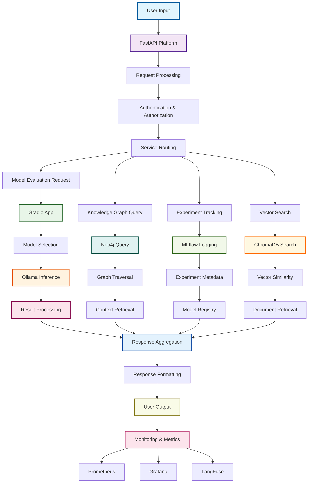
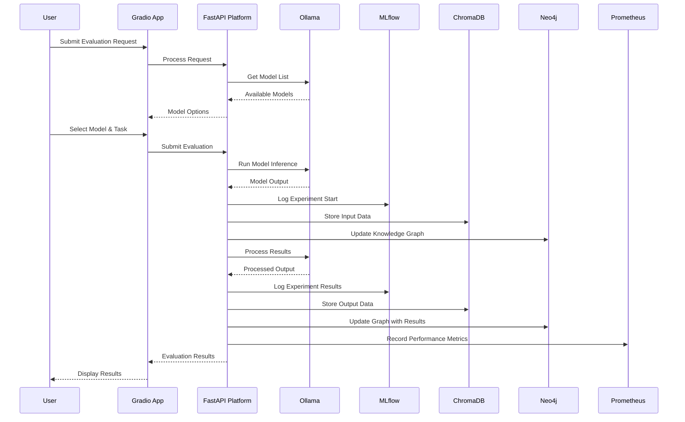
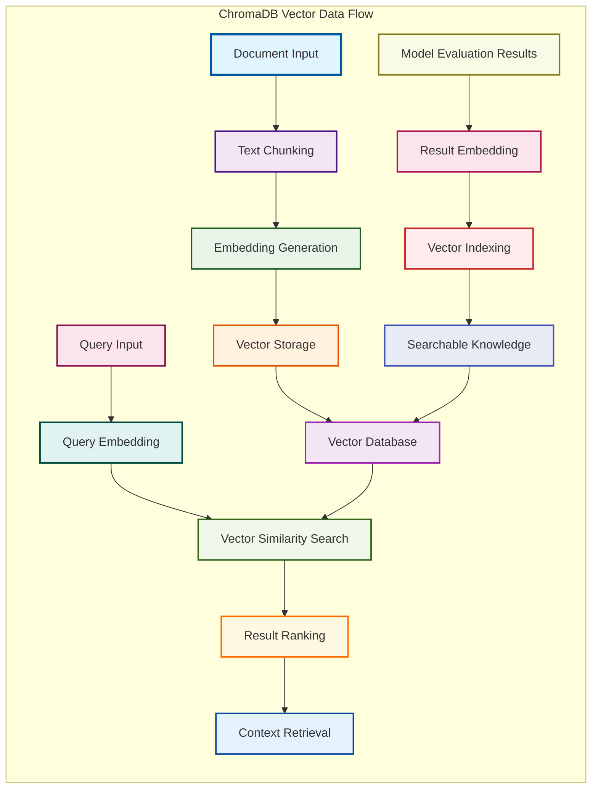
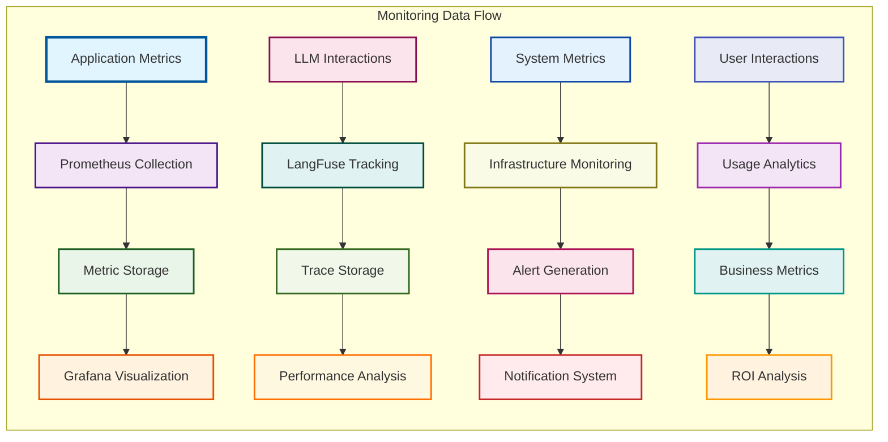
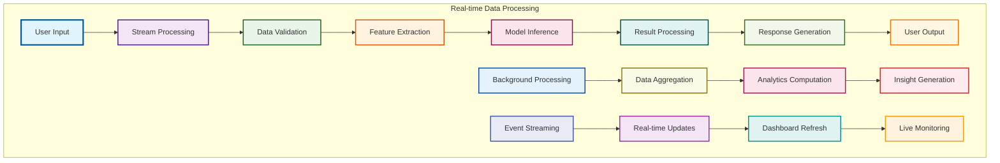

# Data Flow Diagrams

## 🎯 Overview

This section contains comprehensive data flow diagrams showing how data moves through the Lenovo AAITC platform, from user input to model output and storage.

## 🔄 Complete Data Flow Architecture

### End-to-End Data Flow

### Model Evaluation Data Flow

### Knowledge Graph Data Flow

```mermaid
graph TB
    subgraph "Neo4j Knowledge Graph Data Flow"
        A[Document Input] --> B[Text Processing]
        B --> C[Entity Recognition]
        C --> D[Relationship Extraction]
        D --> E[Graph Construction]
        
        E --> F[Knowledge Graph]
        F --> G[Graph Queries]
        G --> H[Context Retrieval]
        H --> I[RAG Enhancement]
        
        J[Faker Data Generation] --> K[Realistic Entities]
        K --> L[Relationship Patterns]
        L --> M[Graph Population]
        M --> F
        
        N[User Queries] --> O[Natural Language Processing]
        O --> P[Query Translation]
        P --> Q[Graph Traversal]
        Q --> R[Result Aggregation]
        R --> S[Response Generation]
    end
    
    style A fill:#e1f5fe,stroke:#01579b,stroke-width:3px
    style B fill:#f3e5f5,stroke:#4a148c,stroke-width:2px
    style C fill:#e8f5e8,stroke:#1b5e20,stroke-width:2px
    style D fill:#fff3e0,stroke:#e65100,stroke-width:2px
    style E fill:#fce4ec,stroke:#880e4f,stroke-width:2px
    style F fill:#e0f2f1,stroke:#004d40,stroke-width:2px
    style G fill:#f1f8e9,stroke:#33691e,stroke-width:2px
    style H fill:#fff8e1,stroke:#ff6f00,stroke-width:2px
    style I fill:#e3f2fd,stroke:#0d47a1,stroke-width:2px
    style J fill:#f9fbe7,stroke:#827717,stroke-width:2px
    style K fill:#fce4ec,stroke:#ad1457,stroke-width:2px
    style L fill:#ffebee,stroke:#c62828,stroke-width:2px
    style M fill:#e8eaf6,stroke:#3f51b5,stroke-width:2px
    style N fill:#f3e5f5,stroke:#9c27b0,stroke-width:2px
    style O fill:#e0f2f1,stroke:#009688,stroke-width:2px
    style P fill:#fff3e0,stroke:#ff9800,stroke-width:2px
    style Q fill:#fce4ec,stroke:#e91e63,stroke-width:2px
    style R fill:#e1f5fe,stroke:#00bcd4,stroke-width:2px
    style S fill:#f1f8e9,stroke:#8bc34a,stroke-width:2px
```

### Vector Database Data Flow

## 🔄 Experiment Tracking Data Flow

### MLflow Experiment Data Flow

```mermaid
graph TB
    subgraph "MLflow Experiment Tracking"
        A[Model Evaluation Start] --> B[Experiment Creation]
        B --> C[Run Initialization]
        C --> D[Parameter Logging]
        D --> E[Metric Collection]
        
        E --> F[Model Training/Inference]
        F --> G[Performance Metrics]
        G --> H[Artifact Storage]
        H --> I[Model Registry]
        
        J[Experiment Comparison] --> K[Metric Analysis]
        K --> L[Model Selection]
        L --> M[Production Deployment]
        
        N[Model Versioning] --> O[Artifact Management]
        O --> P[Deployment Tracking]
        P --> Q[Performance Monitoring]
    end
    
    style A fill:#e1f5fe,stroke:#01579b,stroke-width:3px
    style B fill:#f3e5f5,stroke:#4a148c,stroke-width:2px
    style C fill:#e8f5e8,stroke:#1b5e20,stroke-width:2px
    style D fill:#fff3e0,stroke:#e65100,stroke-width:2px
    style E fill:#fce4ec,stroke:#880e4f,stroke-width:2px
    style F fill:#e0f2f1,stroke:#004d40,stroke-width:2px
    style G fill:#f1f8e9,stroke:#33691e,stroke-width:2px
    style H fill:#fff8e1,stroke:#ff6f00,stroke-width:2px
    style I fill:#e3f2fd,stroke:#0d47a1,stroke-width:2px
    style J fill:#f9fbe7,stroke:#827717,stroke-width:2px
    style K fill:#fce4ec,stroke:#ad1457,stroke-width:2px
    style L fill:#ffebee,stroke:#c62828,stroke-width:2px
    style M fill:#e8eaf6,stroke:#3f51b5,stroke-width:2px
    style N fill:#f3e5f5,stroke:#9c27b0,stroke-width:2px
    style O fill:#e0f2f1,stroke:#009688,stroke-width:2px
    style P fill:#fff3e0,stroke:#ff9800,stroke-width:2px
    style Q fill:#fce4ec,stroke:#e91e63,stroke-width:2px
```

### QLoRA Fine-Tuning Data Flow

```mermaid
graph TB
    subgraph "QLoRA Fine-Tuning Data Flow"
        A[Base Model] --> B[Dataset Preparation]
        B --> C[Training Configuration]
        C --> D[QLoRA Adapter Creation]
        
        D --> E[Fine-Tuning Process]
        E --> F[Gradient Updates]
        F --> G[Adapter Weights]
        G --> H[Performance Evaluation]
        
        H --> I{Meets Requirements?}
        I -->|Yes| J[Adapter Registry]
        I -->|No| K[Hyperparameter Tuning]
        
        K --> E
        J --> L[Model Composition]
        L --> M[Custom MoE Architecture]
        
        M --> N[Production Deployment]
        N --> O[Performance Monitoring]
        O --> P[Continuous Improvement]
    end
    
    style A fill:#e1f5fe,stroke:#01579b,stroke-width:3px
    style B fill:#f3e5f5,stroke:#4a148c,stroke-width:2px
    style C fill:#e8f5e8,stroke:#1b5e20,stroke-width:2px
    style D fill:#fff3e0,stroke:#e65100,stroke-width:2px
    style E fill:#fce4ec,stroke:#880e4f,stroke-width:2px
    style F fill:#e0f2f1,stroke:#004d40,stroke-width:2px
    style G fill:#f1f8e9,stroke:#33691e,stroke-width:2px
    style H fill:#fff8e1,stroke:#ff6f00,stroke-width:2px
    style I fill:#e3f2fd,stroke:#0d47a1,stroke-width:2px
    style J fill:#f9fbe7,stroke:#827717,stroke-width:2px
    style K fill:#fce4ec,stroke:#ad1457,stroke-width:2px
    style L fill:#ffebee,stroke:#c62828,stroke-width:2px
    style M fill:#e8eaf6,stroke:#3f51b5,stroke-width:2px
    style N fill:#f3e5f5,stroke:#9c27b0,stroke-width:2px
    style O fill:#e0f2f1,stroke:#009688,stroke-width:2px
    style P fill:#fff3e0,stroke:#ff9800,stroke-width:2px
```

## 📊 Monitoring & Observability Data Flow

### Metrics Collection Flow

### Real-time Data Processing

---

**Last Updated**: January 19, 2025  
**Version**: 2.1.0  
**Status**: Production Ready  
**Integration**: Complete Data Flow Architecture
