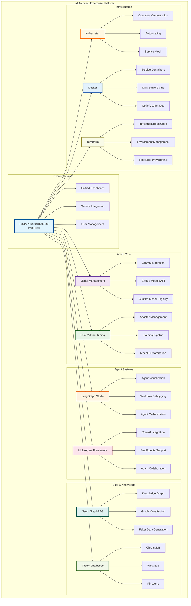
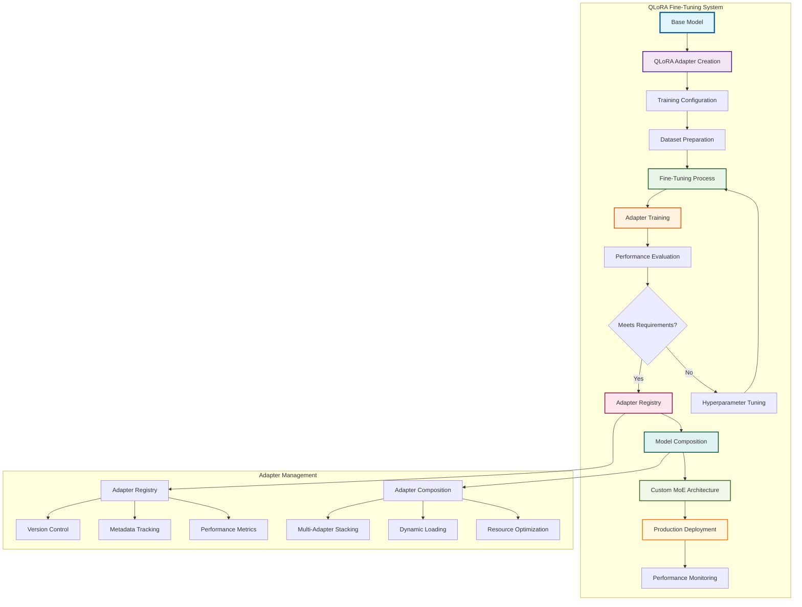
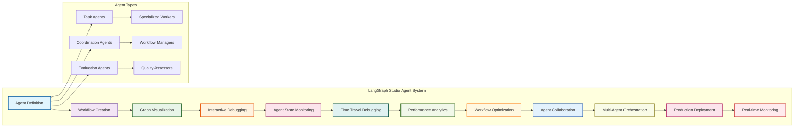
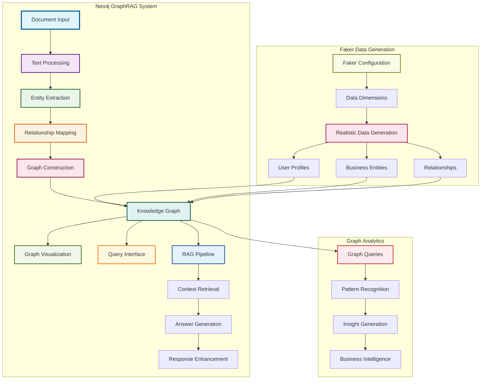
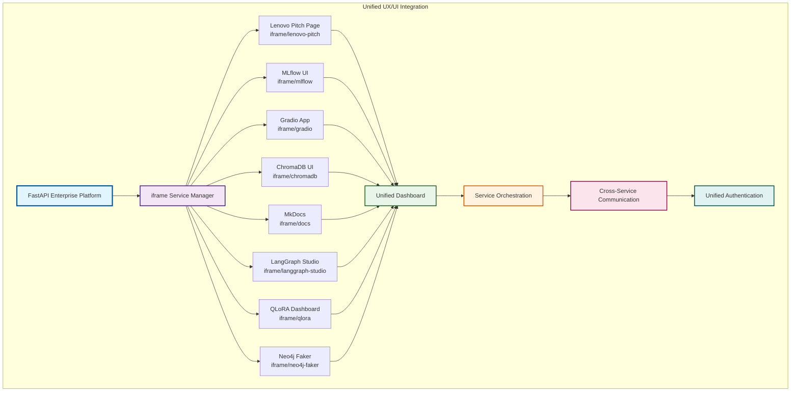
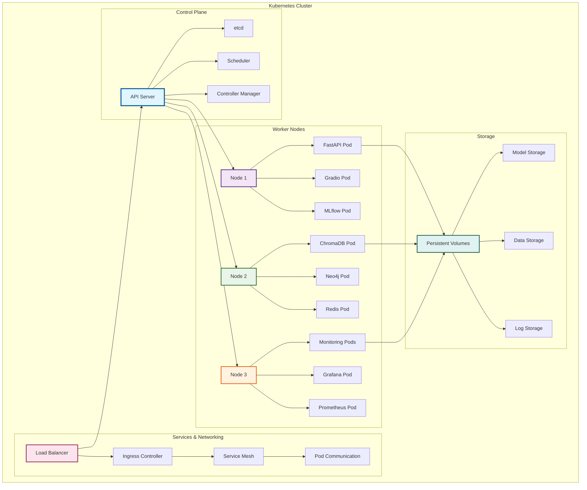

# Enterprise Platform Diagrams

## 🎯 Overview

This section contains comprehensive diagrams for the AI Architect Enterprise Platform, showcasing the advanced features and infrastructure components.

## 🏗️ Enterprise Platform Architecture

### Core Platform Components

### QLoRA Fine-Tuning Architecture

### LangGraph Studio Integration

## 🗄️ Neo4j GraphRAG System

### Knowledge Graph Architecture

### iframe Service Integration

## 🚀 Infrastructure & Deployment

### Kubernetes Deployment Architecture

---

**Last Updated**: January 19, 2025  
**Version**: 2.1.0  
**Status**: Production Ready  
**Integration**: Enterprise Platform Architecture
