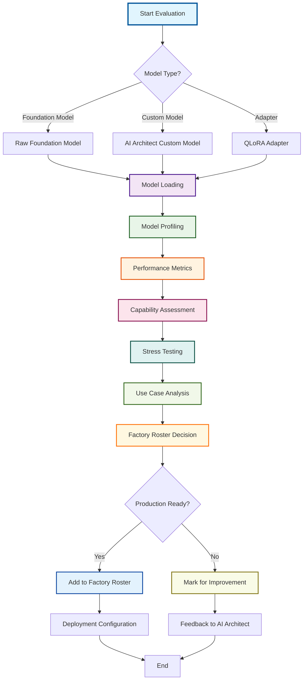
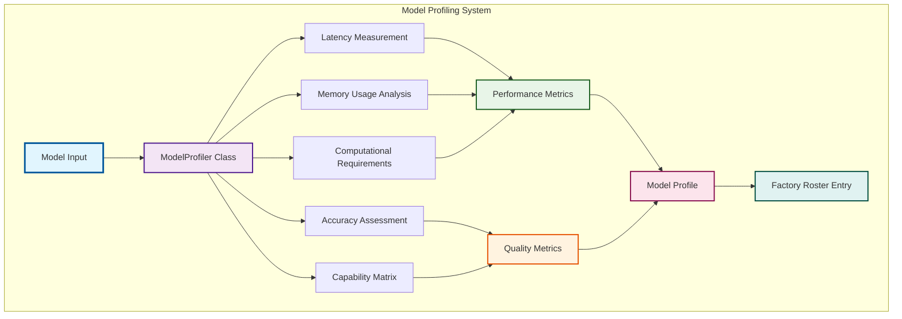
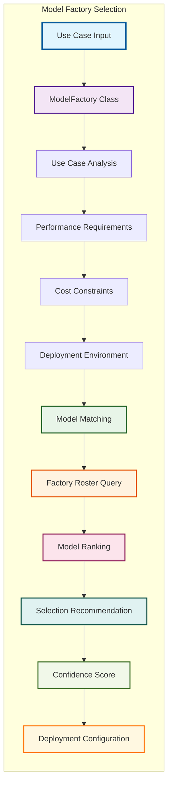
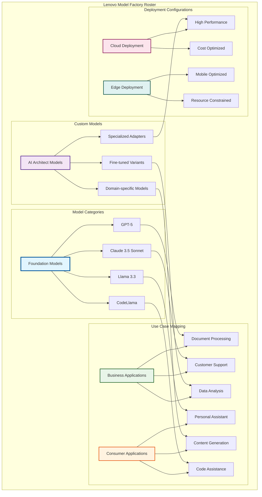
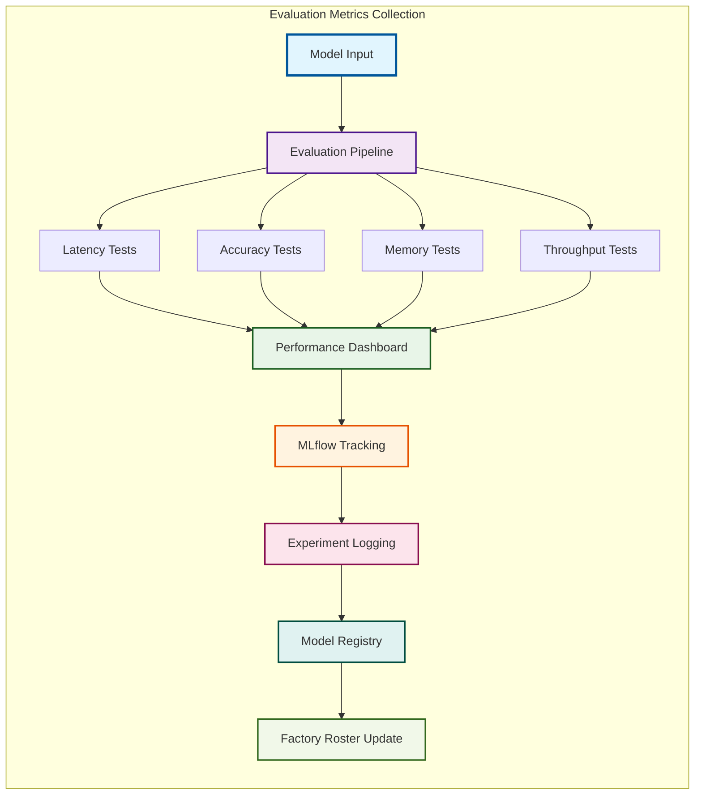
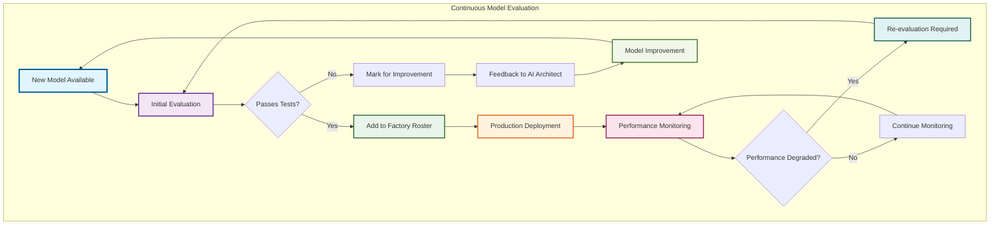

# Model Evaluation Flow Diagrams

## 🎯 Overview

This section contains detailed flow diagrams for the model evaluation process, showcasing the comprehensive testing framework and factory roster management.

## 🔄 Model Evaluation Pipeline Flow

### Complete Evaluation Workflow

### Model Profiling Process

### Model Factory Selection Process

## 🏭 Factory Roster Management

### Factory Roster Architecture

### Evaluation Metrics Flow

## 🔄 Continuous Evaluation Loop

### Model Lifecycle Management

---

**Last Updated**: January 19, 2025  
**Version**: 2.1.0  
**Status**: Production Ready  
**Integration**: Model Evaluation Framework
