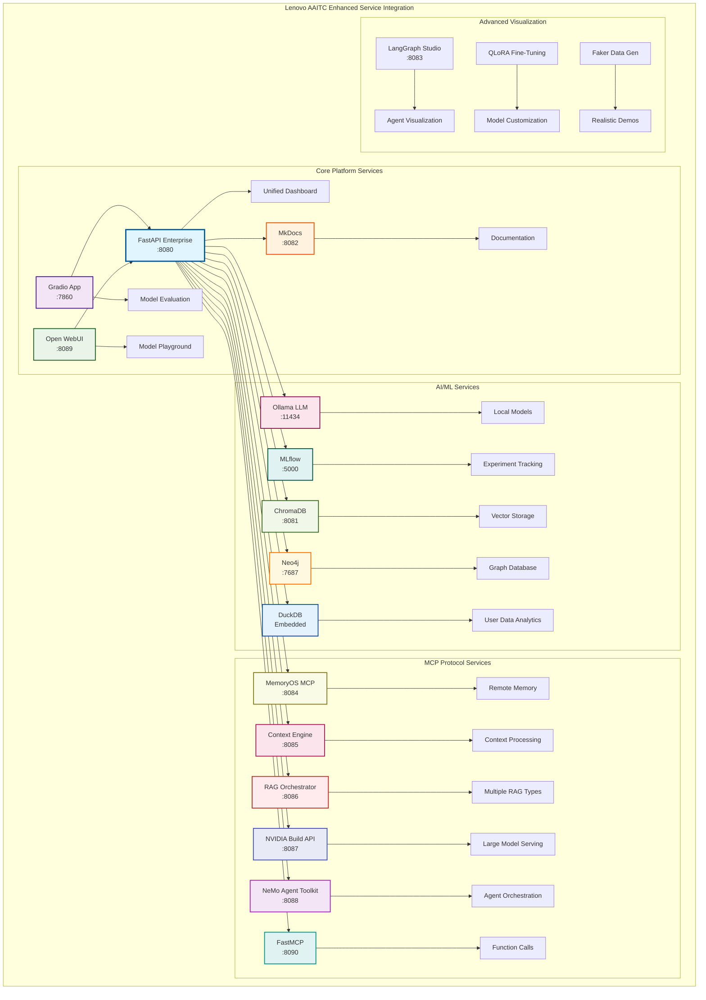
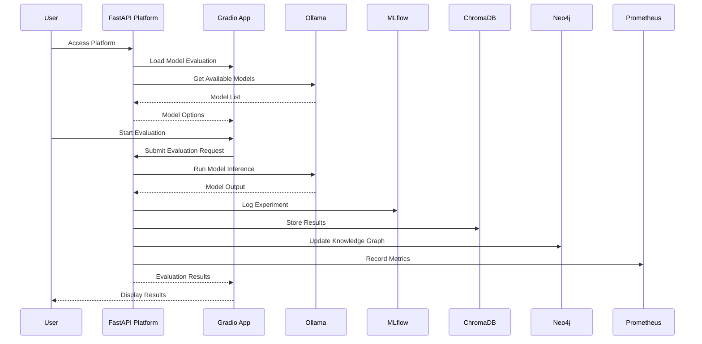
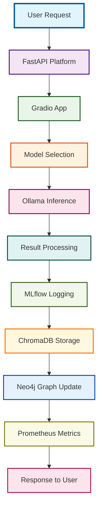
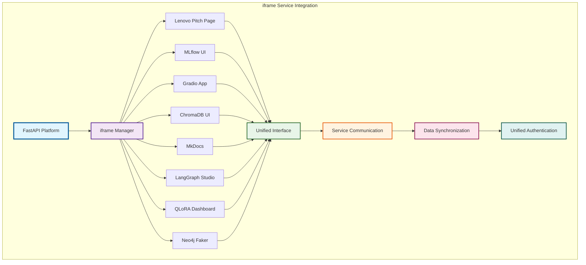
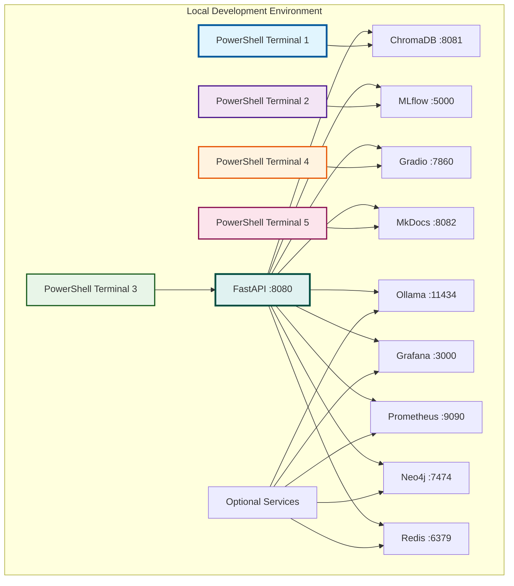
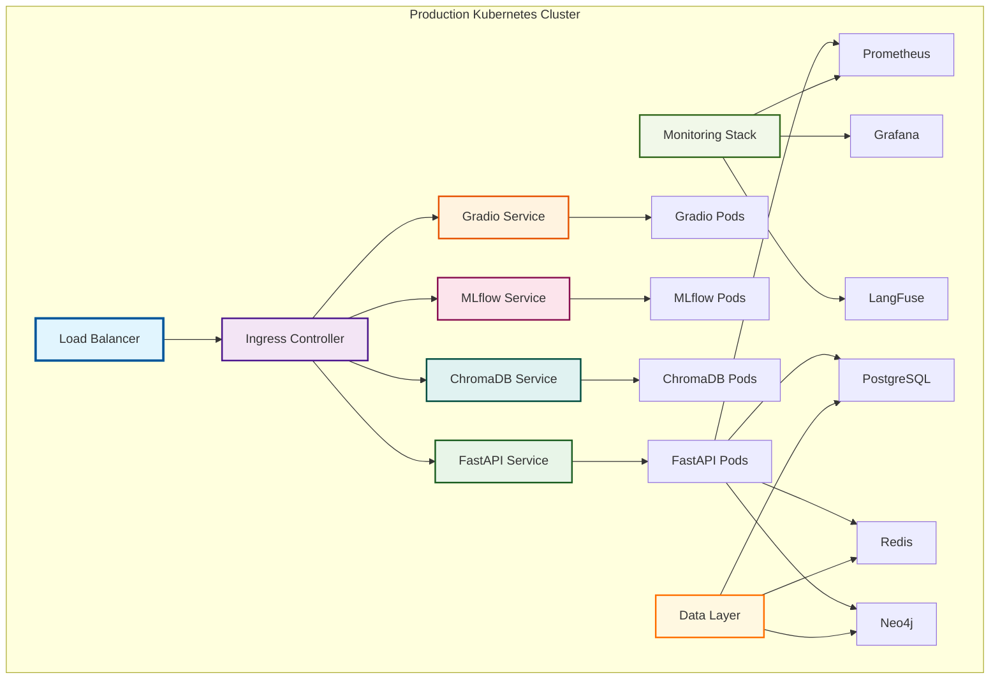
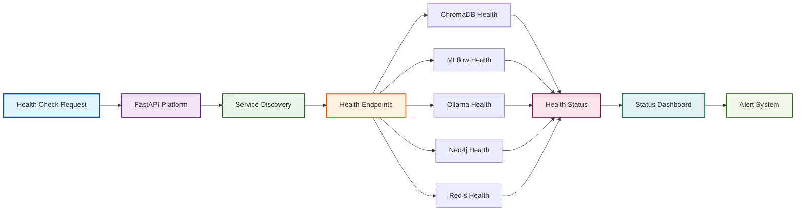

# Service Integration Diagrams

## 🎯 Overview

This section contains detailed service integration diagrams showing how all components work together in the Lenovo AAITC platform.

## 🔗 Service Integration Architecture

### Enhanced Service Integration Map with MCP Protocols

### Service Communication Flow

### Port Configuration & Service Mapping

```mermaid
graph LR
    subgraph "Service Port Configuration"
        A[FastAPI Enterprise<br/>:8080] --> A1[Main Platform]
        B[Gradio App<br/>:7860] --> B1[Model Evaluation]
        C[MkDocs<br/>:8082] --> C1[Documentation]
        D[ChromaDB<br/>:8081] --> D1[Vector Database]
        E[MLflow<br/>:5000] --> E1[Experiment Tracking]
        F[Ollama<br/>:11434] --> F1[LLM Server]
        G[Grafana<br/>:3000] --> G1[Monitoring]
        H[LangFuse<br/>:3000] --> H1[LLM Observability]
        I[Prometheus<br/>:9090] --> I1[Metrics]
        J[Neo4j<br/>:7474] --> J1[Graph Database]
        K[Redis<br/>:6379] --> K1[Cache]
        L[PostgreSQL] --> L1[Metadata]
    end

    style A fill:#e1f5fe,stroke:#01579b,stroke-width:3px
    style B fill:#f3e5f5,stroke:#4a148c,stroke-width:2px
    style C fill:#e8f5e8,stroke:#1b5e20,stroke-width:2px
    style D fill:#fff3e0,stroke:#e65100,stroke-width:2px
    style E fill:#fce4ec,stroke:#880e4f,stroke-width:2px
    style F fill:#e0f2f1,stroke:#004d40,stroke-width:2px
    style G fill:#f1f8e9,stroke:#33691e,stroke-width:2px
    style H fill:#fff8e1,stroke:#ff6f00,stroke-width:2px
    style I fill:#e3f2fd,stroke:#0d47a1,stroke-width:2px
    style J fill:#f9fbe7,stroke:#827717,stroke-width:2px
    style K fill:#fce4ec,stroke:#ad1457,stroke-width:2px
    style L fill:#ffebee,stroke:#c62828,stroke-width:2px
```

## 🔄 Data Flow Integration

### Model Evaluation Data Flow

### iframe Service Integration Flow

## 🚀 Deployment Integration

### Local Development Setup

### Production Deployment Architecture

## 🔧 Service Health & Monitoring

### Health Check Flow

---

**Last Updated**: January 19, 2025  
**Version**: 2.1.0  
**Status**: Production Ready  
**Integration**: Complete Service Integration
