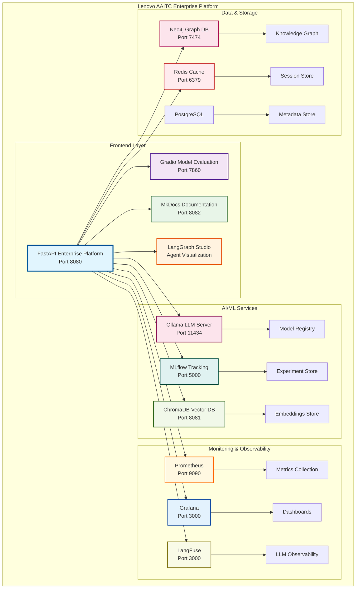
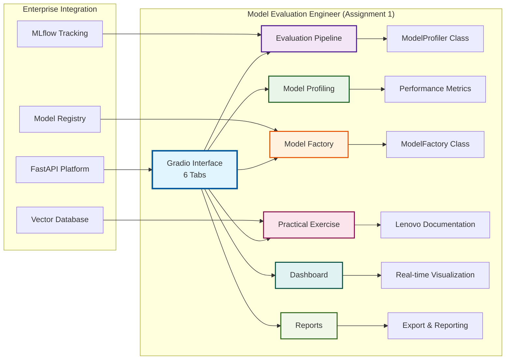
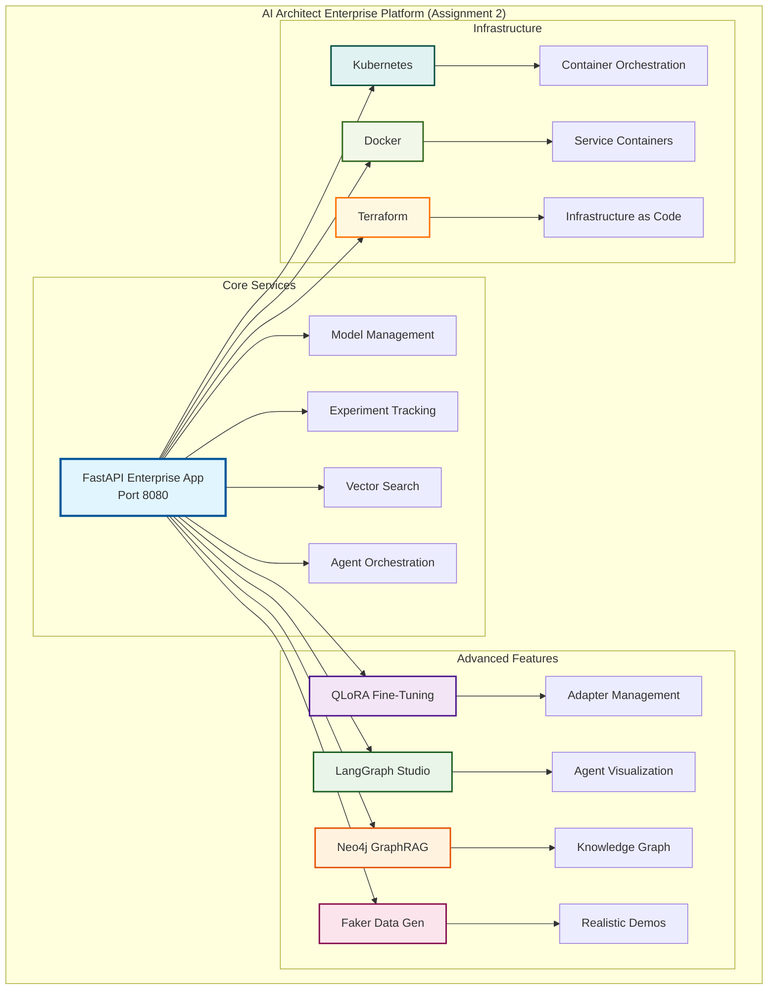
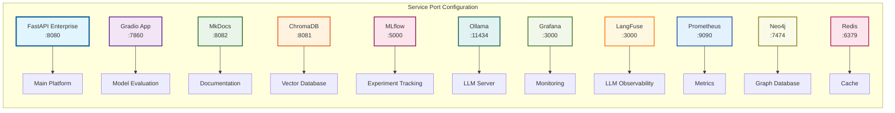
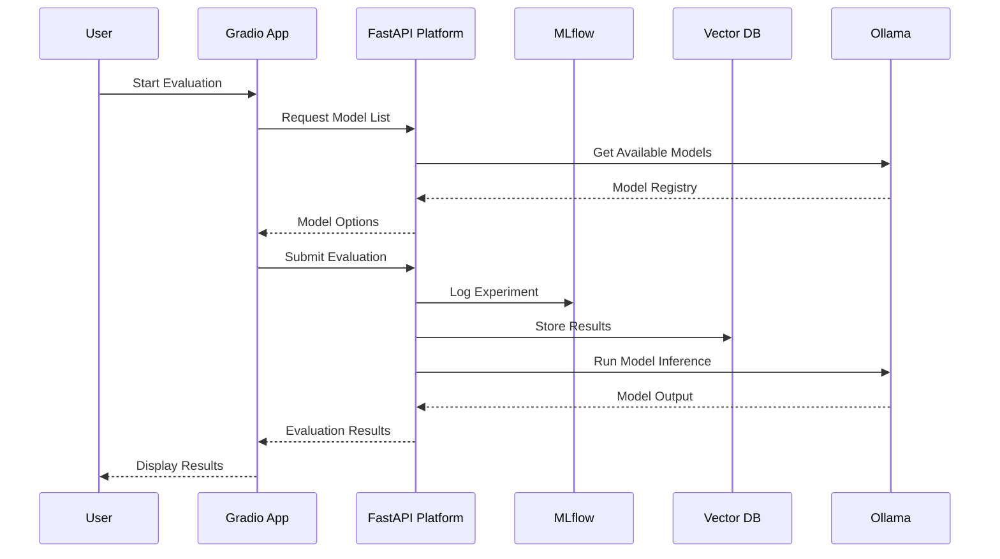
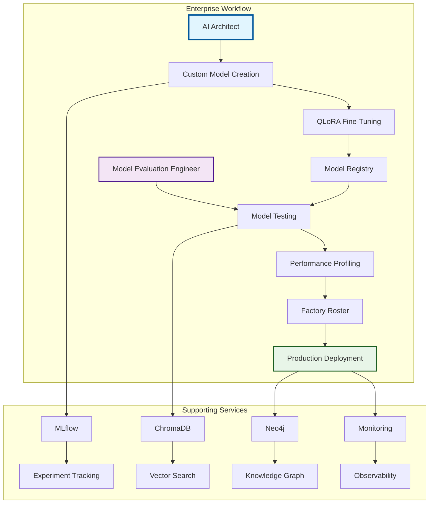

# System Architecture Diagrams

## 🎯 Overview

This section contains comprehensive system architecture diagrams for the Lenovo AAITC AI Assignments platform, showcasing the enterprise-grade architecture and service integration.

## 🏗️ Enterprise AI Architecture

### Overall System Architecture

### Assignment 1: Model Evaluation Engineer Architecture

### Assignment 2: AI Architect Enterprise Platform

## 🔧 Service Integration Architecture

### Port Configuration & Service Mapping

## 📊 Data Flow Architecture

### Model Evaluation Data Flow

### Enterprise Workflow Integration

---

**Last Updated**: January 19, 2025  
**Version**: 2.1.0  
**Status**: Production Ready  
**Integration**: Full Enterprise Architecture
