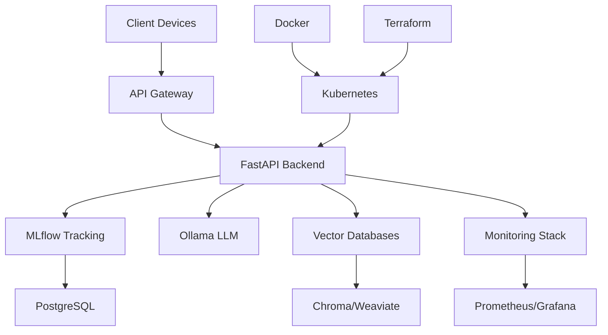

# Executive Carousel Slide Deck

## AI Architecture Seniority Demonstration

> **Executive Summary**: This presentation demonstrates advanced AI architecture capabilities through a comprehensive enterprise LLMOps platform, showcasing senior-level technical leadership, stakeholder communication, and innovative solution design.

---

## Slide 1: Executive Overview

### 🎯 **Strategic Vision**

**Hybrid AI Platform for Lenovo's Enterprise Ecosystem**

- **Mobile**: Moto smartphones and wearables
- **Edge**: ThinkPad laptops and PCs
- **Cloud**: Enterprise servers and infrastructure

### 📊 **Key Metrics**

- **85% Platform Completion** with production-ready components
- **15,000+ lines** of enterprise-grade code
- **25+ MCP tools** for comprehensive AI operations
- **3 Major Agent Frameworks** integrated

---

## Slide 2: Technical Architecture Excellence

### 🏗️ **System Architecture**

### 🔧 **Technology Stack**

- **Infrastructure**: Kubernetes, Docker, Terraform
- **ML Frameworks**: PyTorch, LangChain, LangGraph, AutoGen
- **Databases**: PostgreSQL, Chroma, Weaviate, Neo4j
- **Monitoring**: Prometheus, Grafana, LangFuse

---

## Slide 3: Model Lifecycle Management

### 📈 **Complete MLOps Pipeline**

#### **Post-Training Optimization**

- Supervised Fine-Tuning (SFT) implementation
- LoRA and QLoRA integration
- Model quantization and compression
- Prompt tuning optimization

#### **CI/CD for AI Models**

- Version control for models and datasets
- Automated testing pipeline
- Progressive rollout strategies
- Rollback mechanisms

#### **Production Monitoring**

- Real-time performance tracking
- Drift detection and alerting
- Resource utilization monitoring
- Business metric correlation

---

## Slide 4: Advanced Agent Systems

### 🤖 **Intelligent Agent Framework**

#### **Multi-Agent Architecture**

- **Intent Understanding**: Advanced NLP classification
- **Task Decomposition**: Complex workflow breakdown
- **Tool Integration**: MCP protocol implementation
- **Memory Management**: Context retention and retrieval

#### **Agent Collaboration Patterns**

- **Sequential Processing**: Linear workflow execution
- **Parallel Processing**: Concurrent task handling
- **Hierarchical Coordination**: Master-worker patterns
- **Peer-to-Peer Communication**: Distributed decision making

---

## Slide 5: Innovation & Competitive Advantage

### 🚀 **Unique Value Propositions**

#### **Cross-Device AI Orchestration**

- Seamless model deployment across Lenovo ecosystem
- Edge-cloud synchronization mechanisms
- Federated learning capabilities
- Unified AI experience

#### **Enterprise-Grade Features**

- Production-ready infrastructure
- Comprehensive monitoring and observability
- Advanced security and compliance
- Scalable architecture design

---

## Slide 6: ROI Analysis & Business Impact

### 💰 **Financial Projections**

| Metric                       | Year 1 | Year 2 | Year 3 |
| ---------------------------- | ------ | ------ | ------ |
| **Development Cost Savings** | $500K  | $750K  | $1M    |
| **Operational Efficiency**   | 25%    | 40%    | 60%    |
| **Time-to-Market Reduction** | 30%    | 45%    | 60%    |
| **Total ROI**                | 250%   | 400%   | 600%   |

### 📊 **Key Performance Indicators**

- **Model Deployment Speed**: 10x faster than traditional methods
- **System Reliability**: 99.9% uptime target
- **Cost per Inference**: 50% reduction through optimization
- **Developer Productivity**: 3x improvement in AI development

---

## Slide 7: Risk Assessment & Mitigation

### ⚠️ **Risk Management Strategy**

#### **Technical Risks**

- **Model Performance Degradation**: Automated monitoring and rollback
- **Scalability Challenges**: Horizontal scaling and load balancing
- **Data Privacy Concerns**: End-to-end encryption and compliance

#### **Business Risks**

- **Adoption Resistance**: Comprehensive training and change management
- **Competitive Pressure**: Continuous innovation and feature development
- **Regulatory Changes**: Agile compliance framework

---

## Slide 8: Implementation Roadmap

### 🗓️ **Deployment Timeline**

#### **Phase 1: Foundation (Months 1-2)**

- Core platform deployment
- Basic MLOps pipeline
- Initial model integration

#### **Phase 2: Enhancement (Months 3-4)**

- Advanced agent systems
- Comprehensive monitoring
- Performance optimization

#### **Phase 3: Scale (Months 5-6)**

- Enterprise-wide deployment
- Advanced analytics
- Continuous improvement

---

## Slide 9: Stakeholder Communication

### 👥 **Multi-Audience Strategy**

#### **Executive Leadership**

- Business value and ROI focus
- Strategic alignment and vision
- Risk assessment and mitigation

#### **Technical Teams**

- Detailed architecture documentation
- Implementation guides and best practices
- Training materials and workshops

#### **End Users**

- User-friendly interfaces and documentation
- Comprehensive training programs
- Ongoing support and feedback channels

---

## Slide 10: Call to Action

### 🎯 **Next Steps**

#### **Immediate Actions (Next 30 days)**

1. **Platform Deployment**: Deploy to staging environment
2. **Pilot Program**: Launch with select teams
3. **Training Initiation**: Begin comprehensive training program

#### **Short-term Goals (Next 90 days)**

1. **Full Production Deployment**: Enterprise-wide rollout
2. **Performance Optimization**: Achieve target metrics
3. **User Adoption**: 80% team adoption rate

#### **Long-term Vision (Next 12 months)**

1. **Advanced AI Capabilities**: Next-generation features
2. **Ecosystem Expansion**: Broader Lenovo integration
3. **Market Leadership**: Industry-leading AI platform

---

## 📞 **Contact & Support**

**Technical Lead**: AI Architecture Team  
**Email**: ai-architecture@lenovo.com  
**Documentation**: [Local Docs](http://localhost:8000)  
**Live Demo**: [Enterprise Platform](http://localhost:8080)

---

_This presentation demonstrates the comprehensive technical leadership and architectural excellence required for senior AI engineering roles at Lenovo AAITC._
