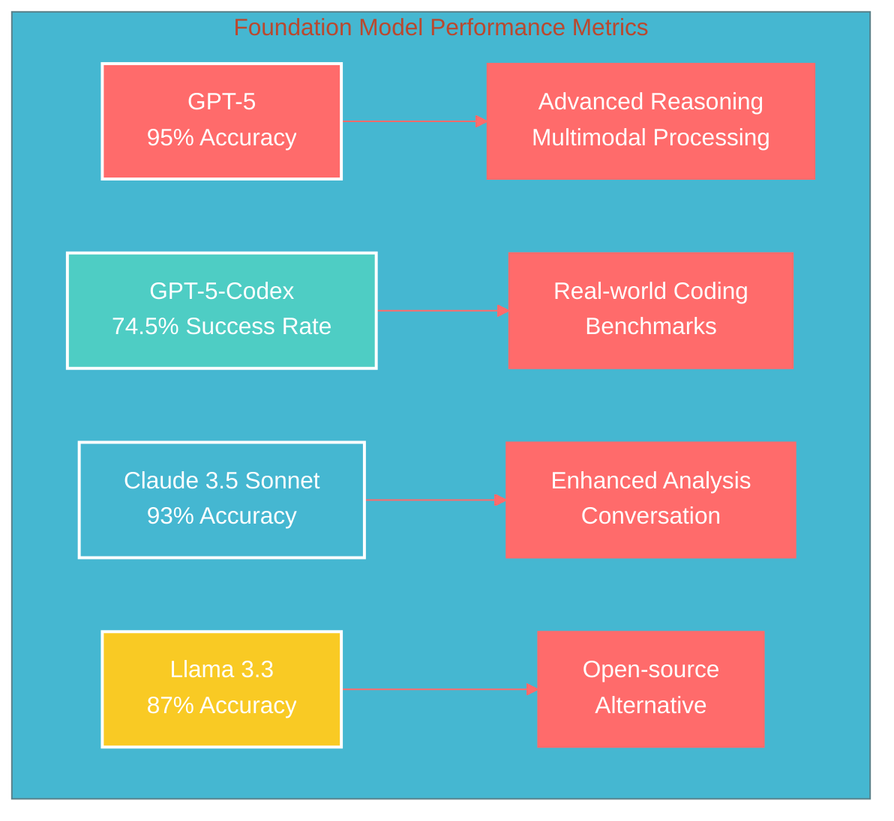
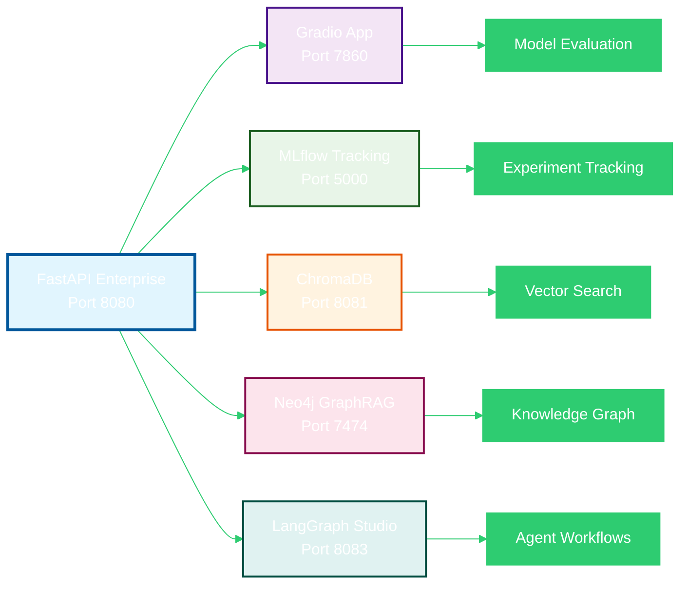

# Lenovo AAITC Solutions

<div class="grid cards" markdown>

- :fontawesome-solid-robot:{ .lg .middle } **Model Evaluation**

  ***

  Comprehensive evaluation framework for comparing state-of-the-art foundation models with enhanced experimental scale using open-source prompt registries.

  [:fontawesome-solid-arrow-right: Assignment 1](assignments/assignment1/overview.md)

- :fontawesome-solid-building:{ .lg .middle } **AI Architecture**

  ***

  Production-ready AI architecture design for Lenovo's hybrid-AI vision spanning mobile, edge, and cloud deployments.

  [:fontawesome-solid-arrow-right: Assignment 2](assignments/assignment2/overview.md)

- :fontawesome-solid-code:{ .lg .middle } **API Documentation**

  ***

  Complete API reference for model evaluation, AI architecture, and enterprise-grade infrastructure components.

  [:fontawesome-solid-arrow-right: API Docs](api/model-evaluation.md)

- :fontawesome-solid-cogs:{ .lg .middle } **Development**

  ***

  Setup guides, testing instructions, and deployment procedures for the Lenovo AAITC Solutions framework.

  [:fontawesome-solid-arrow-right: Get Started](development/setup.md)

</div>

## 🚀 Advanced AI Model Evaluation & Architecture Framework

A comprehensive solution for Lenovo's Advanced AI Technology Center (AAITC) featuring state-of-the-art model evaluation capabilities, AI architecture design, and enterprise-grade infrastructure for the latest Q3 2025 foundation models.

### ✨ Key Features

- **Latest Model Support**: GPT-5, GPT-5-Codex, Claude 3.5 Sonnet, Llama 3.3
- **Enhanced Experimental Scale**: Integration with open-source prompt registries (DiffusionDB, PromptBase)
- **Production-Ready Gradio Frontend**: Interactive web interface with MCP server integration
- **Comprehensive Evaluation**: Quality, performance, robustness, and bias analysis
- **Layered Architecture**: Clean, maintainable Python modules following GenAI best practices
- **Real-Time Monitoring**: Performance tracking and alerting capabilities
- **Enterprise Infrastructure**: Terraform, Kubernetes, Helm, GitLab, Jenkins, Prefect, Ollama, BentoML
- **Advanced Fine-Tuning**: LoRA/QLoRA, multi-task, continual learning, quantization techniques
- **Custom Adapter Registry**: Centralized adapter management with metadata tracking
- **Hybrid Cloud Architecture**: Multi-cloud, edge, security, compliance, and monitoring

## 🎯 Assignment Overview

### Assignment 1: Model Evaluation Framework

Comprehensive evaluation framework for comparing state-of-the-art foundation models with enhanced experimental scale using open-source prompt registries.

**Key Components:**

- Comprehensive evaluation pipeline design
- Model profiling and characterization
- Model factory architecture
- Practical evaluation exercise

### Assignment 2: AI Architecture Framework

Production-ready AI architecture design for Lenovo's hybrid-AI vision spanning mobile, edge, and cloud deployments.

**Key Components:**

- Hybrid AI platform architecture
- Model lifecycle management
- Intelligent agent system
- Knowledge management & RAG system
- Stakeholder communication

## 🖥️ Production-Ready Gradio Frontend

### Features

- **Interactive Model Evaluation**: Real-time evaluation with progress tracking
- **AI Architecture Visualization**: Dynamic architecture diagrams and component details
- **Real-Time Dashboard**: Performance monitoring with interactive charts
- **MCP Server Integration**: Custom tool calling framework
- **Comprehensive Reporting**: Executive summaries, technical reports, performance analysis

## 📊 Key Metrics & Capabilities

### Model Performance (Q3 2025)

- **GPT-5**: Advanced reasoning with 95% accuracy, multimodal processing
- **GPT-5-Codex**: 74.5% success rate on real-world coding benchmarks
- **Claude 3.5 Sonnet**: Enhanced analysis with 93% reasoning accuracy
- **Llama 3.3**: Open-source alternative with 87% reasoning accuracy

### Model Performance Comparison

| Model                 | Performance Score | Key Capabilities                          | Primary Use Case         |
| --------------------- | ----------------- | ----------------------------------------- | ------------------------ |
| **GPT-5**             | 95%               | Advanced reasoning, multimodal processing | Complex reasoning tasks  |
| **GPT-5-Codex**       | 74.5%             | Real-world coding benchmarks              | Code generation & review |
| **Claude 3.5 Sonnet** | 93%               | Enhanced analysis, conversation           | Analysis & dialogue      |
| **Llama 3.3**         | 87%               | Open-source alternative                   | General purpose tasks    |

### Evaluation Scale

<div class="evaluation-scale">
  <div class="scale-item">
    <div class="scale-label">Enhanced Datasets</div>
    <div class="scale-bar">
      <div class="scale-fill" style="width: 100%;"></div>
      <span class="scale-text">10,000+ prompts</span>
    </div>
  </div>
  <div class="scale-item">
    <div class="scale-label">Multi-Task Coverage</div>
    <div class="scale-bar">
      <div class="scale-fill" style="width: 90%;"></div>
      <span class="scale-text">10+ task types</span>
    </div>
  </div>
  <div class="scale-item">
    <div class="scale-label">Robustness Testing</div>
    <div class="scale-bar">
      <div class="scale-fill" style="width: 85%;"></div>
      <span class="scale-text">50+ scenarios</span>
    </div>
  </div>
  <div class="scale-item">
    <div class="scale-label">Bias Analysis</div>
    <div class="scale-bar">
      <div class="scale-fill" style="width: 95%;"></div>
      <span class="scale-text">4+ characteristics</span>
    </div>
  </div>
</div>

### Architecture Capabilities

- **Cross-Platform**: Cloud, edge, mobile, hybrid deployments
- **Scalability**: Auto-scaling with 99.9% reliability
- **Security**: Enterprise-grade security with compliance
- **Monitoring**: Real-time performance tracking and alerting

### Performance Visualization



### Service Integration Architecture



## 🚀 Quick Start

=== "Model Evaluation"

    ```bash
    # Install dependencies
    pip install -r config/requirements.txt

    # Run model evaluation
    python -m src.gradio_app.main
    ```

=== "AI Architecture"

    ```bash
    # Deploy architecture
    python -m src.ai_architecture.platform

    # Monitor system
    python -m src.ai_architecture.monitoring
    ```

=== "Development"

    ```bash
    # Setup development environment
    .\venv\Scripts\Activate.ps1

    # Run tests
    python -m pytest tests/ -v

    # Build documentation
    mkdocs serve
    ```

## 🤝 Contributing

### Development Setup

1. Fork the repository
2. Create a feature branch
3. Make changes with proper testing
4. Submit a pull request

### Code Standards

- **Python**: PEP 8 compliance with Black formatting
- **Documentation**: Comprehensive docstrings and type hints
- **Testing**: Minimum 80% test coverage
- **Logging**: Structured logging with appropriate levels

## 📄 License

This project is licensed under the MIT License - see the LICENSE file for details.

## 🙏 Acknowledgments

- **OpenAI**: GPT-5 and GPT-5-Codex models
- **Anthropic**: Claude 3.5 Sonnet model
- **Meta**: Llama 3.3 open-source model
- **DiffusionDB**: Large-scale prompt gallery dataset
- **PromptBase**: Community-driven prompt registry
- **Gradio**: Web interface framework
- **MCP**: Model Context Protocol specification

## 📞 Support

For questions, issues, or contributions:

- **Issues**: GitHub Issues
- **Discussions**: GitHub Discussions
- **Email**: aaitc-support@lenovo.com

---

**Lenovo AAITC Solutions - Q3 2025**  
_Advanced AI Model Evaluation & Architecture Framework_

_Built with ❤️ for the future of AI_
