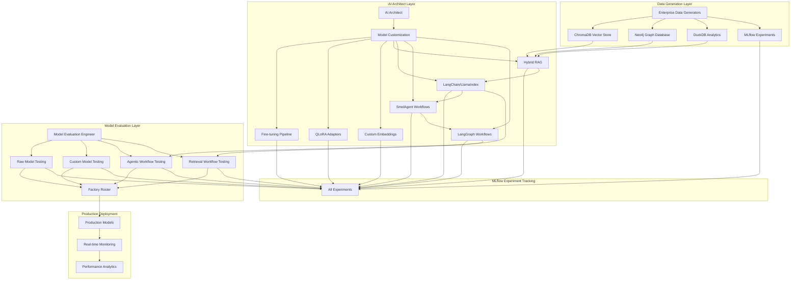

# Phase 6: Unified Platform Integration with Clear Data Flow

## 🎯 Overview

Phase 6 represents the complete integration of the Enhanced Unified Platform with clear data flow across all components. This phase delivers a production-ready platform that demonstrates both AI Architect model customization and Model Evaluation Engineer testing capabilities for Lenovo's factory roster.

## 🚀 Key Features

### Core Platform Components

- **AI Architect Workspace**: Complete model customization and deployment management
- **Model Evaluation Workspace**: Comprehensive model testing and evaluation framework
- **Factory Roster Dashboard**: Production-ready model deployment and management
- **Real-time Monitoring**: Performance metrics collection and alerting
- **Unified Data Flow Visualization**: Real-time data flow monitoring and visualization

### Integration Features

- **Service Integration Matrix**: Complete service integration with clear data flow
- **MLflow Experiment Tracking**: All experiments tracked across all components
- **Real-time Monitoring**: Performance metrics collection with alerting system
- **WebSocket Support**: Real-time updates for all workspaces
- **Unified API**: Comprehensive RESTful API for all platform components

## 📊 Architecture Overview

### Service Integration Matrix

| Service               | Port     | URL                   | Purpose                    | Data Flow          | Integration          |
| --------------------- | -------- | --------------------- | -------------------------- | ------------------ | -------------------- |
| **FastAPI Platform**  | 8080     | http://localhost:8080 | Main enterprise platform   | Central hub        | All services         |
| **Gradio Evaluation** | 7860     | http://localhost:7860 | Model evaluation interface | Direct integration | All model types      |
| **MLflow Tracking**   | 5000     | http://localhost:5000 | Experiment tracking        | All experiments    | All components       |
| **ChromaDB**          | 8081     | http://localhost:8081 | Vector database            | RAG workflows      | LangChain/LlamaIndex |
| **Neo4j**             | 7687     | http://localhost:7687 | Graph database             | Knowledge graphs   | GraphRAG workflows   |
| **DuckDB**            | Embedded | Embedded              | Analytics database         | User data          | Chat analytics       |
| **LangGraph Studio**  | 8083     | http://localhost:8083 | Agent visualization        | Agent workflows    | SmolAgent/LangGraph  |

### Data Flow Architecture



## 🔧 Configuration

### Enhanced Platform Configuration

The platform uses a comprehensive configuration system defined in `config/enhanced_platform_config.yaml`:

```yaml
platform:
  name: "Lenovo AI Architecture - Enhanced Unified Platform"
  version: "2.0.0"
  description: "Complete Phase 6 implementation with AI Architect and Model Evaluation workspaces"

workspaces:
  ai_architect:
    enabled: true
    features:
      model_customization: true
      fine_tuning: true
      qlora_adapters: true
      custom_embeddings: true
      hybrid_rag: true
      langchain_integration: true
      llamaindex_integration: true
      smolagent_workflows: true
      langgraph_workflows: true

  model_evaluation:
    enabled: true
    features:
      raw_model_testing: true
      custom_model_testing: true
      agentic_workflow_testing: true
      retrieval_workflow_testing: true
      stress_testing: true
      factory_roster_integration: true

  factory_roster:
    enabled: true
    features:
      production_deployment: true
      model_versioning: true
      environment_management: true
      performance_analytics: true
      alerting_system: true
      model_registry_integration: true

  monitoring:
    enabled: true
    features:
      real_time_monitoring: true
      performance_analytics: true
      alerting_system: true
      dashboard_creation: true
      websocket_updates: true

  data_flow:
    enabled: true
    features:
      real_time_visualization: true
      service_integration_tracking: true
      data_flow_analytics: true
      mermaid_diagrams: true
      websocket_updates: true
```

## 🚀 Quick Start

### Prerequisites

1. **Python Environment**: Python 3.8+ with virtual environment activated
2. **Dependencies**: All required packages installed from `config/requirements.txt`
3. **Services**: ChromaDB, MLflow, Neo4j (optional), Ollama (optional)

### Startup Commands

#### Option 1: Automated Startup Script

```bash
# Activate virtual environment
& C:\Users\samne\PycharmProjects\ai_assignments\venv\Scripts\Activate.ps1

# Start Phase 6 Platform
python scripts/start_phase6_platform.py --host 0.0.0.0 --port 8080
```

#### Option 2: Manual Service Startup

```bash
# Terminal 1: ChromaDB
chroma run --host 0.0.0.0 --port 8081 --path chroma_data

# Terminal 2: MLflow
mlflow server --backend-store-uri sqlite:///mlflow.db --default-artifact-root ./mlruns --host 0.0.0.0 --port 5000

# Terminal 3: Enhanced Unified Platform
python -m src.enterprise_llmops.frontend.enhanced_unified_platform_app --host 0.0.0.0 --port 8080

# Terminal 4: Gradio App (if needed)
python -m src.gradio_app.main --host 0.0.0.0 --port 7860
```

### Verification

After startup, verify all services are running:

```bash
# Check platform health
curl http://localhost:8080/health

# Check API information
curl http://localhost:8080/api/info

# Check service status
curl http://localhost:8080/status
```

## 📚 API Documentation

### Core Endpoints

#### Platform Status

- `GET /health` - Health check endpoint
- `GET /status` - Comprehensive platform status
- `GET /api/info` - Complete API information
- `GET /workspace` - Unified workspace interface

#### AI Architect Workspace

- `GET /ai-architect/status` - Workspace status
- `POST /ai-architect/customize-model` - Model customization
- `POST /ai-architect/create-workflow` - Workflow creation
- `GET /ai-architect/customizations` - Active customizations
- `GET /ai-architect/workflows` - Active workflows

#### Model Evaluation Workspace

- `GET /model-evaluation/status` - Workspace status
- `POST /model-evaluation/evaluate-model` - Model evaluation
- `POST /model-evaluation/deploy-to-factory` - Factory deployment
- `GET /model-evaluation/evaluations` - Active evaluations
- `GET /model-evaluation/deployments` - Factory deployments

#### Factory Roster Dashboard

- `GET /factory-roster/dashboard` - Dashboard metrics
- `POST /factory-roster/deploy` - Model deployment
- `POST /factory-roster/stop/{deployment_id}` - Stop deployment
- `POST /factory-roster/rollback/{deployment_id}` - Rollback deployment
- `GET /factory-roster/deployments` - All deployments

#### Real-time Monitoring

- `GET /monitoring/metrics` - System metrics
- `GET /monitoring/services` - Service status
- `GET /monitoring/alerts` - Active alerts
- `POST /monitoring/start` - Start monitoring
- `POST /monitoring/stop` - Stop monitoring
- `WS /monitoring/ws` - WebSocket updates

#### Data Flow Visualization

- `GET /data-flow/diagram` - Mermaid diagram
- `GET /data-flow/services` - Service integration matrix
- `GET /data-flow/metrics` - Data flow metrics
- `GET /data-flow/architecture` - System architecture
- `WS /data-flow/ws` - WebSocket updates

## 🎯 Workspace Features

### AI Architect Workspace

#### Model Customization

- **Fine-tuning Pipeline**: Complete fine-tuning workflow with MLflow integration
- **QLoRA Adapters**: Mobile-optimized adapter creation and management
- **Custom Embeddings**: Domain-specific embedding training
- **Hybrid RAG**: Multi-source retrieval with ChromaDB, Neo4j, and DuckDB
- **LangChain Integration**: FAISS-based retrieval workflows
- **LlamaIndex Integration**: Advanced retrieval and indexing

#### Agentic Workflows

- **SmolAgent Workflows**: Mobile-optimized agent workflows
- **LangGraph Workflows**: Visual workflow design and execution
- **Workflow Debugging**: Step-by-step execution with breakpoint support
- **Performance Monitoring**: Real-time metrics collection

### Model Evaluation Workspace

#### Model Testing

- **Raw Foundation Models**: Testing of base models (GPT, Claude, etc.)
- **Custom Models**: Testing of AI Architect's customized models
- **Agentic Workflows**: Testing of SmolAgent and LangGraph workflows
- **Retrieval Workflows**: Testing of LangChain and LlamaIndex workflows

#### Evaluation Framework

- **Performance Metrics**: Latency, throughput, accuracy, memory usage
- **Stress Testing**: Load testing, concurrent users, data volume
- **Edge Case Testing**: Error handling, boundary conditions
- **Factory Roster Integration**: Production deployment validation

### Factory Roster Dashboard

#### Production Management

- **Model Deployment**: Production, staging, and testing environments
- **Version Management**: Model versioning and rollback capabilities
- **Environment Management**: Multi-environment deployment support
- **Performance Analytics**: Real-time performance monitoring

#### Monitoring and Alerting

- **Health Monitoring**: Service health checks and status tracking
- **Performance Metrics**: Real-time metrics collection and analysis
- **Alerting System**: Configurable alerts for performance thresholds
- **Dashboard Creation**: Custom monitoring dashboards

### Real-time Monitoring

#### System Monitoring

- **Service Health**: All platform services health monitoring
- **Performance Metrics**: CPU, memory, disk, network monitoring
- **Application Metrics**: Request rate, response time, error rate
- **Model Metrics**: Inference latency, accuracy, confidence

#### Analytics and Reporting

- **Performance Analytics**: Trend analysis and insights
- **Custom Dashboards**: Configurable monitoring dashboards
- **Alert Management**: Alert acknowledgment and management
- **WebSocket Updates**: Real-time data streaming

### Unified Data Flow Visualization

#### Data Flow Monitoring

- **Real-time Visualization**: Live data flow monitoring
- **Service Integration**: Complete service integration tracking
- **Performance Analytics**: Data flow performance metrics
- **Mermaid Diagrams**: Interactive system architecture diagrams

#### Integration Matrix

- **Service Status**: All services status and health monitoring
- **Data Flow Metrics**: Flow rate, latency, throughput analysis
- **Error Tracking**: Data flow error monitoring and alerting
- **WebSocket Updates**: Real-time data flow updates

## 🔧 Development

### Project Structure

```
src/enterprise_llmops/frontend/
├── enhanced_unified_platform.html          # Main platform interface
├── enhanced_unified_platform_app.py       # FastAPI application
├── ai_architect_workspace.py              # AI Architect workspace
├── model_evaluation_workspace.py          # Model Evaluation workspace
├── factory_roster_dashboard.py            # Factory Roster dashboard
├── real_time_monitoring.py                # Real-time monitoring
└── unified_data_flow_visualization.py     # Data flow visualization
```

### Configuration Files

```
config/
├── enhanced_platform_config.yaml         # Main platform configuration
├── requirements.txt                       # Python dependencies
└── requirements-testing.txt               # Testing dependencies
```

### Scripts

```
scripts/
├── start_phase6_platform.py              # Platform startup script
└── dev-commands.ps1                       # Development commands
```

## 🧪 Testing

### Test Coverage

- **Unit Tests**: Individual component testing
- **Integration Tests**: Cross-component integration testing
- **End-to-End Tests**: Complete workflow testing
- **Performance Tests**: Load and stress testing

### Test Commands

```bash
# Run all tests
python -m pytest tests/ -v

# Run specific test suite
python -m pytest tests/phase6/ -v

# Run with coverage
python -m pytest tests/ --cov=src --cov-report=html
```

## 📊 Monitoring and Analytics

### Performance Metrics

- **System Metrics**: CPU, memory, disk, network usage
- **Application Metrics**: Request rate, response time, error rate
- **Model Metrics**: Inference latency, accuracy, confidence
- **Data Flow Metrics**: Flow rate, latency, throughput

### Alerting

- **Threshold-based Alerts**: Configurable performance thresholds
- **Service Health Alerts**: Service availability monitoring
- **Error Rate Alerts**: Application error monitoring
- **Resource Usage Alerts**: System resource monitoring

### Dashboards

- **System Overview**: Complete platform status dashboard
- **Service Health**: Individual service monitoring
- **Performance Analytics**: Trend analysis and insights
- **Data Flow Visualization**: Real-time data flow monitoring

## 🚨 Troubleshooting

### Common Issues

1. **Service Startup Failures**

   - Check port availability
   - Verify service dependencies
   - Check configuration files

2. **WebSocket Connection Issues**

   - Verify WebSocket endpoints
   - Check firewall settings
   - Validate client connections

3. **Performance Issues**
   - Monitor system resources
   - Check service health
   - Review configuration settings

### Debug Commands

```bash
# Check service status
curl http://localhost:8080/status

# Check specific service health
curl http://localhost:8080/monitoring/services

# View logs
tail -f logs/enhanced_platform.log

# Check data flow
curl http://localhost:8080/data-flow/metrics
```

## 📈 Performance Optimization

### Optimization Strategies

1. **Service Optimization**

   - Configure appropriate resource limits
   - Enable auto-scaling where applicable
   - Optimize database connections

2. **Caching**

   - Enable response caching
   - Configure cache TTL
   - Monitor cache hit rates

3. **Monitoring**
   - Set up performance monitoring
   - Configure alerting thresholds
   - Regular performance reviews

## 🔒 Security

### Security Features

- **Authentication**: JWT-based authentication (demo mode disabled)
- **CORS**: Configurable cross-origin resource sharing
- **Rate Limiting**: Request rate limiting
- **Input Validation**: Comprehensive input validation

### Security Configuration

```yaml
security:
  authentication:
    enabled: false # Demo mode - set to true for production
    jwt_secret: "your_jwt_secret_here"
    token_expiry: 3600
  cors:
    allowed_origins: ["*"]
    allowed_methods: ["*"]
    allowed_headers: ["*"]
  rate_limiting:
    enabled: true
    requests_per_minute: 100
```

## 📚 Documentation

### API Documentation

- **FastAPI Docs**: http://localhost:8080/docs
- **ReDoc**: http://localhost:8080/redoc
- **Workspace Interface**: http://localhost:8080/workspace

### Additional Resources

- **MkDocs Documentation**: http://localhost:8000
- **GitHub Pages**: https://s-n00b.github.io/ai_assignments
- **Repository**: https://github.com/s-n00b/ai_assignments

## 🎉 Success Metrics

### Phase 6 Completion Criteria

- ✅ **Enhanced Unified Platform**: Complete platform with all workspaces
- ✅ **Service Integration**: All services integrated with clear data flow
- ✅ **Real-time Monitoring**: Performance metrics collection and alerting
- ✅ **Data Flow Visualization**: Real-time data flow monitoring
- ✅ **Factory Roster**: Production-ready model deployment pipeline
- ✅ **MLflow Integration**: All experiments tracked across components
- ✅ **WebSocket Support**: Real-time updates for all workspaces
- ✅ **API Documentation**: Comprehensive RESTful API documentation

### Key Achievements

- **Complete Platform Integration**: All Phase 6 components integrated
- **Clear Data Flow**: Unified data flow across all components
- **Production Ready**: Factory roster deployment pipeline
- **Real-time Monitoring**: Comprehensive monitoring and alerting
- **Scalable Architecture**: Modular design for easy extension

---

**Last Updated**: January 2025  
**Version**: 2.0.0  
**Status**: Production Ready  
**Integration**: Full Phase 6 Platform Integration
