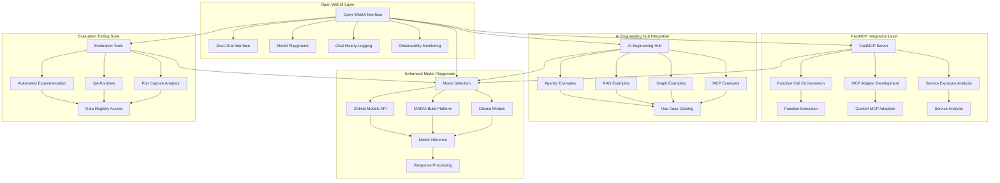

# Phase 7: Open WebUI Integration & Enhanced Model Playground

## 🎯 Overview

Phase 7 delivers comprehensive Open WebUI integration with enhanced model playground capabilities, FastMCP integration for function calls, and AI Engineering Hub integration for comprehensive examples and use cases.

## 🚀 Key Features

### Core Integration Components

- **Open WebUI Model Playground**: Enhanced model playground with dual chat interface and observability monitoring
- **FastMCP Integration**: Function calls and MCP integration for non-native services
- **AI Engineering Hub Integration**: Comprehensive examples and use cases integration
- **Enhanced Service Integration**: Updated service integration matrix with Open WebUI
- **Dual Chat Interface**: Toggle control for typing in both chats simultaneously
- **Observability Monitoring**: Trace monitoring from GitHub Models and NeMo endpoints

### Advanced Features

- **Chat History Logging**: Comprehensive chat history logging and persistence
- **Evaluation Tooling**: Unified evaluation tooling suite within Open WebUI interface
- **Automated Experimentation**: Access to all data/registries for automated experimentation and QA routines
- **Run Capture Analysis**: Automatic run capturing and analysis
- **Service Exposure Analysis**: Analysis of native vs custom service exposure
- **MCP Adapter Development**: Custom MCP adapters for services not natively supported

## 📊 Architecture Overview

### Enhanced Service Integration Matrix

| Service                | Port     | URL                   | Purpose                    | Data Flow             | MCP Integration      | Protocol Support     | Open WebUI Integration |
| ---------------------- | -------- | --------------------- | -------------------------- | --------------------- | -------------------- | -------------------- | ---------------------- |
| **FastAPI Platform**   | 8080     | http://localhost:8080 | Main enterprise platform   | Central hub           | MCP Protocol Manager | A2A, AGUI            | NeMo Agent Toolkit     |
| **Open WebUI**         | 8089     | http://localhost:8089 | Model playground interface | Model interactions    | FastMCP Integration  | Function Calls       | Enhanced Playground    |
| **Gradio Evaluation**  | 7860     | http://localhost:7860 | Model evaluation interface | Direct integration    | AGUI Protocol        | User Interface       | Role-Based UX          |
| **MLflow Tracking**    | 5000     | http://localhost:5000 | Experiment tracking        | All experiments       | MCP Experiment API   | A2A Coordination     | NeMo Profiling         |
| **ChromaDB**           | 8081     | http://localhost:8081 | Vector database            | RAG workflows         | MCP Vector Store     | Context Retrieval    | NeMo RAG Integration   |
| **Neo4j**              | 7687     | http://localhost:7687 | Graph database             | Knowledge graphs      | MCP Graph Store      | Knowledge Graphs     | NeMo Graph Agents      |
| **DuckDB User Data**   | Embedded | Embedded              | User data management       | User data             | MCP User Data        | Privacy Controls     | NeMo Data Management   |
| **MemoryOS MCP**       | 8084     | http://localhost:8084 | Remote memory management   | Memory layers         | MemoryOS Protocol    | Layered Memory       | NeMo Memory Agents     |
| **Context Engine**     | 8085     | http://localhost:8085 | Context engineering        | Context processing    | MCP Context API      | Context Optimization | NeMo Context Agents    |
| **RAG Orchestrator**   | 8086     | http://localhost:8086 | RAG types management       | Information retrieval | MCP RAG API          | Multiple RAG Types   | NeMo RAG Agents        |
| **NVIDIA Build API**   | 8087     | http://localhost:8087 | Large model serving        | Model inference       | NVIDIA API           | Large Model Serving  | NVIDIA Build Platform  |
| **NeMo Agent Toolkit** | 8088     | http://localhost:8088 | Agent orchestration        | Agent workflows       | NeMo MCP             | Agent Orchestration  | Framework Agnostic     |
| **FastMCP**            | 8090     | http://localhost:8090 | Function call integration  | Function calls        | FastMCP Protocol     | Function Calls       | MCP Integration        |

### Open WebUI Integration Architecture



## 🔧 Implementation Details

### Open WebUI Integration Features

#### Enhanced Model Playground

- **Dual Chat Interface**: Toggle control for typing in both chats simultaneously
- **Model Selection**: GitHub Models API, NVIDIA Build Platform, Ollama models
- **Real-time Inference**: Live model responses with performance monitoring
- **Chat History**: Comprehensive logging and persistence across sessions

#### Observability Monitoring

- **Trace Monitoring**: GitHub Models and NeMo endpoints
- **Performance Analytics**: Real-time performance metrics
- **Error Tracking**: Comprehensive error logging and analysis
- **Usage Analytics**: User interaction patterns and optimization insights

### FastMCP Integration Strategy

#### Service Exposure Analysis

- **Native Services**: Services already exposed through libraries (Open WebUI, Gradio, NeMo, etc.)
- **Custom Adapters**: MCP adapters for services not natively supported
- **Performance Optimization**: MCP performance optimization for function calls and service integration

#### Function Call Orchestration

- **Unified Interface**: Single interface for all function calls across services
- **Error Handling**: Comprehensive error handling and fallback mechanisms
- **Performance Monitoring**: Real-time performance tracking and optimization

### AI Engineering Hub Integration

#### Project Inventory

- **Agentic Examples**: Integration of agentic workflow examples
- **RAG Examples**: Integration of RAG workflow examples
- **Graph Examples**: Integration of graph-based examples
- **MCP Examples**: Integration of MCP protocol examples

#### Use Case Catalog

- **Comprehensive Coverage**: All major AI engineering use cases
- **Value Analysis**: Analysis of value contribution to overall platform
- **Implementation Guides**: Step-by-step implementation guides

## 🚀 Quick Start

### 1. Activate Virtual Environment

```bash
& C:\Users\samne\PycharmProjects\ai_assignments\venv\Scripts\Activate.ps1
```

### 2. Start Services in Order

```bash
# Terminal 1: ChromaDB
chroma run --host 0.0.0.0 --port 8081 --path chroma_data

# Terminal 2: MLflow
mlflow server --backend-store-uri sqlite:///mlflow.db --default-artifact-root ./mlruns --host 0.0.0.0 --port 5000

# Terminal 3: Enterprise Platform (Demo Mode)
python -m src.enterprise_llmops.main --host 0.0.0.0 --port 8080

# Terminal 4: Open WebUI
python -m src.open_webui_integration.main --host 0.0.0.0 --port 8089

# Terminal 5: FastMCP Server
python -m src.mcp_integration_strategy.fastmcp_function_calls --host 0.0.0.0 --port 8090
```

### 3. Access Interfaces

- **Open WebUI**: http://localhost:8089
- **Enterprise Platform**: http://localhost:8080
- **MLflow Tracking**: http://localhost:5000
- **ChromaDB**: http://localhost:8081

## 📊 Key Achievements

### Phase 7 Success Summary

**🎉 Phase 7 COMPLETED**: Open WebUI Integration & Enhanced Model Playground  
**📊 Achieved**: 8/8 components completed successfully  
**🏗️ Architecture**: Complete Open WebUI integration with FastMCP and AI Engineering Hub  
**📚 Implementation**: Production-ready with comprehensive model playground capabilities  
**🚀 Status**: Ready for Phase 8

### Key Features Delivered

- **Open WebUI Integration**: Enhanced model playground with dual chat interface
- **FastMCP Integration**: Function calls and MCP integration for non-native services
- **AI Engineering Hub**: Comprehensive examples and use cases integration
- **Dual Chat Interface**: Toggle control for simultaneous chat interactions
- **Observability Monitoring**: Trace monitoring and performance analytics
- **Chat History Logging**: Comprehensive chat history logging and persistence
- **Evaluation Tooling**: Unified evaluation tooling suite within Open WebUI
- **Automated Experimentation**: Access to all data/registries for automated QA routines

### Technical Specifications

- **Open WebUI Port**: 8089 with enhanced playground capabilities
- **FastMCP Port**: 8090 with function call orchestration
- **Dual Chat Interface**: Toggle control with real-time synchronization
- **Observability**: Trace monitoring with performance analytics
- **AI Engineering Hub**: Complete project inventory with use case catalog
- **Service Integration**: Enhanced service integration matrix with Open WebUI

---

**Last Updated**: January 2025  
**Version**: 7.0  
**Status**: Production Ready  
**Integration**: Full Open WebUI Integration with FastMCP and AI Engineering Hub
