# Phase 8: NVIDIA NeMo Agent Toolkit Integration & Role-Based UX

## 🎯 Overview

Phase 8 delivers comprehensive NVIDIA NeMo Agent Toolkit integration with framework-agnostic agent orchestration, NVIDIA Build Platform models integration, and specialized role-based UX for AI Architect and Model Evaluation Engineer roles.

## 🚀 Key Features

### Core Integration Components

- **NVIDIA NeMo Agent Toolkit**: Framework-agnostic agent orchestration with profiling and observability
- **NVIDIA Build Platform Models**: Large model serving with Meta, Microsoft, Mistral, DeepSeek, xAI, and Cohere models
- **Role-Based UX**: Specialized interfaces for AI Architect and Model Evaluation Engineer roles
- **Framework Agnostic Agents**: Works with LangChain, LlamaIndex, CrewAI, Semantic Kernel
- **Advanced Profiling**: Profile workflows down to tool and agent level
- **Comprehensive Observability**: Integrations with Phoenix, Weave, Langfuse, OpenTelemetry

### Advanced Features

- **Reusability**: Every agent, tool, and workflow as function calls
- **Rapid Development**: Pre-built agents, tools, and workflows
- **Evaluation System**: Built-in evaluation tools for agentic workflows
- **User Interface**: NeMo Agent Toolkit UI chat interface
- **Full MCP Support**: MCP client and server capabilities
- **Cost Optimization**: Model selection based on performance and cost

## 📊 Architecture Overview

### Enhanced Service Integration Matrix

| Service                | Port     | URL                   | Purpose                    | Data Flow             | MCP Integration      | Protocol Support     | NVIDIA Integration    |
| ---------------------- | -------- | --------------------- | -------------------------- | --------------------- | -------------------- | -------------------- | --------------------- |
| **FastAPI Platform**   | 8080     | http://localhost:8080 | Main enterprise platform   | Central hub           | MCP Protocol Manager | A2A, AGUI            | NeMo Agent Toolkit    |
| **Gradio Evaluation**  | 7860     | http://localhost:7860 | Model evaluation interface | Direct integration    | AGUI Protocol        | User Interface       | Role-Based UX         |
| **MLflow Tracking**    | 5000     | http://localhost:5000 | Experiment tracking        | All experiments       | MCP Experiment API   | A2A Coordination     | NeMo Profiling        |
| **ChromaDB**           | 8081     | http://localhost:8081 | Vector database            | RAG workflows         | MCP Vector Store     | Context Retrieval    | NeMo RAG Integration  |
| **Neo4j**              | 7687     | http://localhost:7687 | Graph database             | Knowledge graphs      | MCP Graph Store      | Knowledge Graphs     | NeMo Graph Agents     |
| **DuckDB User Data**   | Embedded | Embedded              | User data management       | User data             | MCP User Data        | Privacy Controls     | NeMo Data Management  |
| **MemoryOS MCP**       | 8084     | http://localhost:8084 | Remote memory management   | Memory layers         | MemoryOS Protocol    | Layered Memory       | NeMo Memory Agents    |
| **Context Engine**     | 8085     | http://localhost:8085 | Context engineering        | Context processing    | MCP Context API      | Context Optimization | NeMo Context Agents   |
| **RAG Orchestrator**   | 8086     | http://localhost:8086 | RAG types management       | Information retrieval | MCP RAG API          | Multiple RAG Types   | NeMo RAG Agents       |
| **NVIDIA Build API**   | 8087     | http://localhost:8087 | Large model serving        | Model inference       | NVIDIA API           | Large Model Serving  | NVIDIA Build Platform |
| **NeMo Agent Toolkit** | 8088     | http://localhost:8088 | Agent orchestration        | Agent workflows       | NeMo MCP             | Agent Orchestration  | Framework Agnostic    |
| **MkDocs**             | 8082     | http://localhost:8082 | Documentation              | All docs              | MCP Documentation    | Embedded iframe      | NeMo Documentation    |
| **LangGraph Studio**   | 8083     | http://localhost:8083 | Agent visualization        | Agent workflows       | MCP Agent Protocol   | SmolAgent/LangGraph  | NeMo Visualization    |

### NVIDIA NeMo Agent Toolkit Architecture

```mermaid
graph TB
    subgraph "NeMo Agent Toolkit Layer"
        A[NeMo Agent Toolkit] --> B[Framework Agnostic Agents]
        A --> C[Agent Profiling]
        A --> D[Workflow Orchestration]
        A --> E[Observability Integration]
        A --> F[Evaluation System]
        A --> G[UI Chat Interface]
        A --> H[MCP Server/Client]
    end

    subgraph "Framework Integration"
        I[LangChain] --> B
        J[LlamaIndex] --> B
        K[CrewAI] --> B
        L[Semantic Kernel] --> B
        B --> M[Unified Agent Interface]
    end

    subgraph "NVIDIA Build Platform Integration"
        N[NVIDIA Build API] --> O[Large Model Serving]
        O --> P[Meta Models]
        O --> Q[Microsoft Models]
        O --> R[Mistral Models]
        O --> S[DeepSeek Models]
        O --> T[xAI Models]
        O --> U[Cohere Models]
    end

    subgraph "Role-Based UX"
        V[AI Architect Workspace] --> W[Model Customization]
        V --> X[Fine-tuning Workflow]
        V --> Y[Adapter Composition]
        V --> Z[Custom Embedding Training]
        V --> AA[RAG Workflow Designer]
        V --> BB[Agent Workflow Builder]
        V --> CC[Model Serving Config]
    end

    subgraph "Model Evaluation Engineer Workspace"
        DD[Model Evaluation Engineer] --> EE[Model Profiling Interface]
        DD --> FF[Evaluation Metrics Dashboard]
        DD --> GG[Model Comparison Tools]
        DD --> HH[Performance Benchmarking]
        DD --> II[Stress Testing Framework]
        DD --> JJ[Production Monitoring]
        DD --> KK[Evaluation Reporting]
    end

    subgraph "Observability Platform"
        LL[Phoenix] --> E
        MM[Weave] --> E
        NN[Langfuse] --> E
        OO[OpenTelemetry] --> E
        E --> PP[Comprehensive Monitoring]
    end

    A --> V
    A --> DD
    N --> A
    M --> O
```



## 🔧 Implementation Details

### NVIDIA NeMo Agent Toolkit Features

#### Framework Agnostic Agents

- **LangChain Integration**: Seamless LangChain agent workflows
- **LlamaIndex Integration**: LlamaIndex retrieval and generation workflows
- **CrewAI Integration**: Multi-agent crew workflows
- **Semantic Kernel Integration**: Microsoft Semantic Kernel workflows
- **Unified Interface**: Single interface for all framework agents

#### Advanced Profiling

- **Workflow Profiling**: Profile complete workflows down to tool and agent level
- **Performance Metrics**: Detailed performance metrics and optimization insights
- **Resource Monitoring**: CPU, memory, and GPU utilization tracking
- **Cost Analysis**: Cost per request and optimization recommendations

#### Comprehensive Observability

- **Phoenix Integration**: Advanced observability and debugging
- **Weave Integration**: Experiment tracking and visualization
- **Langfuse Integration**: LLM observability and analytics
- **OpenTelemetry Integration**: Distributed tracing and monitoring

### NVIDIA Build Platform Models

#### Available Models

- **Meta Models**: Llama-3.1-405B-Instruct, Llama-3.1-8B-Instruct, Llama-3.3-70B-Instruct
- **Microsoft Models**: Phi-4, Phi-4-mini-instruct, Phi-4-multimodal-instruct
- **Mistral Models**: Mistral Large 24.11, Mistral Medium 3, Mistral Nemo
- **DeepSeek Models**: DeepSeek-R1, DeepSeek-V3-0324
- **xAI Models**: Grok 3, Grok 3 Mini
- **Cohere Models**: Command R+ 08-2024, Embed v3 English/Multilingual

#### Model Serving Features

- **Large Model Serving**: High-performance model serving infrastructure
- **Model Catalog Management**: Comprehensive model catalog with metadata
- **Inference Optimization**: Optimized inference with caching and batching
- **Dynamic Model Switching**: Runtime model switching based on requirements
- **Cost Optimization**: Cost-effective model selection and usage

### Role-Based UX

#### AI Architect Role Features

- **Model Customization**: Fine-tuning, QLoRA adapters, custom embeddings
- **RAG Workflow Design**: Visual RAG workflow designer
- **Agent Workflow Builder**: Drag-and-drop agent workflow creation
- **Model Serving**: Configuration and deployment of custom models
- **Evaluation Metrics**: Architect-specific model performance metrics
- **Cost Optimization**: Model selection based on performance and cost
- **Version Control**: Model versioning and rollback capabilities

#### Model Evaluation Engineer Role Features

- **Model Profiling**: Comprehensive model performance profiling
- **Evaluation Metrics**: Role-appropriate evaluation metrics and benchmarks
- **Model Comparison**: Side-by-side model comparison tools
- **Performance Benchmarking**: Comprehensive performance testing
- **Stress Testing**: Multi-level stress testing framework
- **Production Monitoring**: Real-time production model monitoring
- **Evaluation Reporting**: Detailed evaluation reports and analytics
- **Model Serving**: Evaluation of model serving performance

## 🚀 Quick Start

### 1. Activate Virtual Environment

```bash
& C:\Users\samne\PycharmProjects\ai_assignments\venv\Scripts\Activate.ps1
```

### 2. Configure NVIDIA Services

```bash
# Configure NVIDIA Build platform API key
export NVIDIA_API_KEY="your_nvidia_api_key"
export NVIDIA_BUILD_ENDPOINT="https://build.nvidia.com"
export NVIDIA_MODELS_ENDPOINT="https://build.nvidia.com/models"

# Configure NeMo Agent Toolkit
export NEMO_AGENT_TOOLKIT_CONFIG="config/nemo_agent_toolkit.yaml"
export NEMO_MCP_SERVER_PORT="8088"
export NEMO_OBSERVABILITY_ENABLED="true"
```

### 3. Start Services in Order

```bash
# Terminal 1: ChromaDB
chroma run --host 0.0.0.0 --port 8081 --path chroma_data

# Terminal 2: MLflow
mlflow server --backend-store-uri sqlite:///mlflow.db --default-artifact-root ./mlruns --host 0.0.0.0 --port 5000

# Terminal 3: Enterprise Platform (Demo Mode)
python -m src.enterprise_llmops.main --host 0.0.0.0 --port 8080

# Terminal 4: NeMo Agent Toolkit
python -m src.nemo_integration.nemo_agent_toolkit_manager --host 0.0.0.0 --port 8088

# Terminal 5: NVIDIA Build API
python -m src.nvidia_models_integration.nvidia_build_client --host 0.0.0.0 --port 8087
```

### 4. Access Interfaces

- **NeMo Agent Toolkit**: http://localhost:8088
- **Enterprise Platform**: http://localhost:8080
- **MLflow Tracking**: http://localhost:5000
- **ChromaDB**: http://localhost:8081

## 📊 Key Achievements

### Phase 8 Success Summary

**🎉 Phase 8 COMPLETED**: NVIDIA NeMo Agent Toolkit Integration & Role-Based UX  
**📊 Achieved**: 8/8 components completed successfully  
**🏗️ Architecture**: Complete NVIDIA integration with framework-agnostic agent orchestration  
**📚 Implementation**: Production-ready with comprehensive role-based UX  
**🚀 Status**: Ready for Phase 9

### Key Features Delivered

- **NVIDIA NeMo Agent Toolkit**: Framework-agnostic agent orchestration with profiling and observability
- **NVIDIA Build Platform Models**: Large model serving with 6 major model providers
- **Role-Based UX**: Specialized interfaces for AI Architect and Model Evaluation Engineer roles
- **Framework Integration**: Works with LangChain, LlamaIndex, CrewAI, Semantic Kernel
- **Advanced Profiling**: Profile workflows down to tool and agent level
- **Comprehensive Observability**: Integrations with Phoenix, Weave, Langfuse, OpenTelemetry
- **Evaluation System**: Built-in evaluation tools for agentic workflows
- **Cost Optimization**: Model selection based on performance and cost

### Technical Specifications

- **NeMo Agent Toolkit Port**: 8088 with framework-agnostic orchestration
- **NVIDIA Build API Port**: 8087 with large model serving
- **Framework Support**: 4 major frameworks with unified interface
- **Model Providers**: 6 major providers with comprehensive model catalog
- **Observability**: 4 observability platforms with comprehensive monitoring
- **Role-Based UX**: 2 specialized workspaces with role-appropriate features

---

**Last Updated**: January 2025  
**Version**: 8.0  
**Status**: Production Ready  
**Integration**: Full NVIDIA NeMo Agent Toolkit Integration with Role-Based UX
