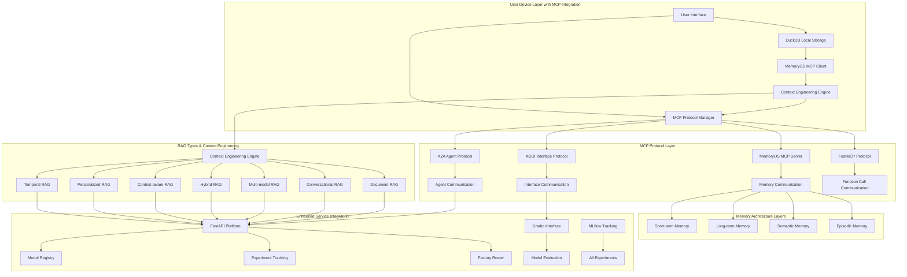

# Phase 9: Enhanced MCP Integration & Context Engineering

## 🎯 Overview

Phase 9 delivers comprehensive Enhanced MCP Integration with Context Engineering principles, DuckDB user data management, MemoryOS MCP for remote memory, and multiple RAG types with intelligent orchestration for optimal user experience.

## 🚀 Key Features

### Core Integration Components

- **Enhanced MCP Integration**: Unified mcp-use library with A2A, AGUI protocols
- **DuckDB User Data Management**: On-device user data storage with privacy controls
- **MemoryOS MCP Integration**: Remote memory with layered architecture
- **Context Engineering**: Advanced context understanding and personalization
- **Multiple RAG Types**: Comprehensive information retrieval strategies
- **User Experience Optimization**: Context-aware, personalized interactions

### Advanced Features

- **MCP Protocol Integration**: A2A, AGUI, MemoryOS MCP with unified mcp-use library
- **User Data Privacy**: DuckDB on-device storage with user-controlled privacy
- **Memory Architecture**: 4-layer memory system with intelligent consolidation
- **RAG Orchestration**: Multiple RAG types with intelligent selection
- **Context Processing**: 7-stage context processing with quality validation
- **Personalization**: User-specific context adaptation and delivery

## 📊 Architecture Overview

### Enhanced MCP Protocol Architecture



### Enhanced Service Integration Matrix

| Service               | Port     | URL                   | Purpose                    | Data Flow             | MCP Integration      | Protocol Support     | Context Engineering |
| --------------------- | -------- | --------------------- | -------------------------- | --------------------- | -------------------- | -------------------- | ------------------- |
| **FastAPI Platform**  | 8080     | http://localhost:8080 | Main enterprise platform   | Central hub           | MCP Protocol Manager | A2A, AGUI            | Context Processing  |
| **Gradio Evaluation** | 7860     | http://localhost:7860 | Model evaluation interface | Direct integration    | AGUI Protocol        | User Interface       | Personalization     |
| **MLflow Tracking**   | 5000     | http://localhost:5000 | Experiment tracking        | All experiments       | MCP Experiment API   | A2A Coordination     | Context Analytics   |
| **ChromaDB**          | 8081     | http://localhost:8081 | Vector database            | RAG workflows         | MCP Vector Store     | Context Retrieval    | Document RAG        |
| **Neo4j**             | 7687     | http://localhost:7687 | Graph database             | Knowledge graphs      | MCP Graph Store      | Knowledge Graphs     | Graph Context       |
| **DuckDB User Data**  | Embedded | Embedded              | User data management       | User data             | MCP User Data        | Privacy Controls     | User Context        |
| **MemoryOS MCP**      | 8084     | http://localhost:8084 | Remote memory management   | Memory layers         | MemoryOS Protocol    | Layered Memory       | Memory Context      |
| **Context Engine**    | 8085     | http://localhost:8085 | Context engineering        | Context processing    | MCP Context API      | Context Optimization | Core Context        |
| **RAG Orchestrator**  | 8086     | http://localhost:8086 | RAG types management       | Information retrieval | MCP RAG API          | Multiple RAG Types   | RAG Context         |
| **MkDocs**            | 8082     | http://localhost:8082 | Documentation              | All docs              | MCP Documentation    | Embedded iframe      | Doc Context         |
| **LangGraph Studio**  | 8083     | http://localhost:8083 | Agent visualization        | Agent workflows       | MCP Agent Protocol   | SmolAgent/LangGraph  | Agent Context       |

## 🔧 Implementation Details

### Enhanced MCP Integration Features

#### Unified mcp-use Library

- **Standardized Implementations**: Consistent MCP implementations across all components
- **A2A Agent Protocol**: Inter-agent communication with message queuing and coordination
- **AGUI Interface Protocol**: Seamless user interface agent interactions
- **MemoryOS MCP Integration**: Remote memory management with layered architecture
- **DuckDB User Data Management**: On-device user data storage and retrieval

#### MCP Protocol Features

- **Agent-to-Agent (A2A)**: Inter-agent communication and coordination
- **Agent-GUI Interface (AGUI)**: User interface agent interactions
- **MemoryOS MCP**: Remote memory with layered architecture
- **Unified mcp-use Library**: Standardized MCP implementations
- **Function Call Orchestration**: Unified function call management

### DuckDB User Data Management

#### On-Device Storage Features

- **Local SQL OLAP Database**: High-performance user data storage
- **Schema Management**: Structured user data with relationships
- **Privacy Controls**: User-controlled data sharing and retention
- **Analytics**: User behavior and interaction analytics
- **Backup/Recovery**: Automated data backup and recovery

#### User Data Schema

```sql
-- User profiles and preferences
CREATE TABLE user_profiles (
    user_id TEXT PRIMARY KEY,
    preferences JSON,
    context_history JSON,
    privacy_settings JSON,
    created_at TIMESTAMP,
    updated_at TIMESTAMP
);

-- User interactions and analytics
CREATE TABLE user_interactions (
    interaction_id TEXT PRIMARY KEY,
    user_id TEXT,
    interaction_type TEXT,
    context_data JSON,
    timestamp TIMESTAMP,
    FOREIGN KEY (user_id) REFERENCES user_profiles(user_id)
);

-- Context engineering data
CREATE TABLE context_engineering (
    context_id TEXT PRIMARY KEY,
    user_id TEXT,
    context_type TEXT,
    context_data JSON,
    quality_score FLOAT,
    created_at TIMESTAMP,
    FOREIGN KEY (user_id) REFERENCES user_profiles(user_id)
);
```

### MemoryOS MCP Remote Memory Architecture

#### Layered Memory System

- **Short-term Memory**: Recent interactions and temporary context
- **Long-term Memory**: Persistent user preferences and patterns
- **Semantic Memory**: Conceptual knowledge and relationships
- **Episodic Memory**: Specific events and experiences

#### Memory Consolidation Features

- **Automatic Consolidation**: Memory consolidation and optimization
- **Context-Aware Retrieval**: Intelligent memory retrieval based on context
- **Memory Persistence**: Persistent memory across sessions
- **Memory Analytics**: Memory usage patterns and optimization

### Context Engineering Principles

#### Context Processing Stages

1. **User Intent Analysis**: Advanced intent recognition and understanding
2. **Context Retrieval**: Multi-source context gathering and synthesis
3. **Relevance Ranking**: Intelligent context relevance scoring
4. **Personalization**: User-specific context adaptation
5. **Quality Validation**: Context accuracy and completeness validation
6. **Context Delivery**: Optimized context presentation
7. **Feedback Integration**: User feedback incorporation

#### Context Engineering Features

- **Intent Recognition**: Advanced NLP-based intent understanding
- **Multi-source Retrieval**: ChromaDB, Neo4j, DuckDB, MemoryOS integration
- **Relevance Scoring**: Machine learning-based relevance ranking
- **Personalization**: User-specific context adaptation
- **Quality Assessment**: Automated context quality validation

### Multiple RAG Types Integration

#### RAG Types Available

- **Document RAG**: Traditional document-based retrieval
- **Conversational RAG**: Dialogue-aware information retrieval
- **Multi-modal RAG**: Text, image, audio, video integration
- **Hybrid RAG**: Combined retrieval strategies
- **Context-aware RAG**: Context-sensitive information retrieval
- **Personalized RAG**: User-specific information delivery
- **Temporal RAG**: Time-aware information retrieval

#### RAG Orchestration Features

- **Intelligent Selection**: Automatic RAG type selection based on context
- **Hybrid Strategies**: Combined RAG approaches for optimal results
- **Performance Optimization**: RAG performance monitoring and optimization
- **Quality Assessment**: RAG output quality validation

## 🚀 Quick Start

### 1. Activate Virtual Environment

```bash
& C:\Users\samne\PycharmProjects\ai_assignments\venv\Scripts\Activate.ps1
```

### 2. Configure MCP Services

```bash
# Configure MCP protocols
export MCP_PROTOCOL_MANAGER_PORT="8080"
export MCP_A2A_PROTOCOL_ENABLED="true"
export MCP_AGUI_PROTOCOL_ENABLED="true"
export MCP_MEMORYOS_PROTOCOL_ENABLED="true"

# Configure DuckDB user data
export DUCKDB_USER_DATA_PATH="./data/user_data.db"
export DUCKDB_PRIVACY_CONTROLS_ENABLED="true"

# Configure MemoryOS MCP
export MEMORYOS_MCP_PORT="8084"
export MEMORYOS_MEMORY_LAYERS_ENABLED="true"

# Configure Context Engineering
export CONTEXT_ENGINE_PORT="8085"
export CONTEXT_PROCESSING_STAGES_ENABLED="true"
```

### 3. Start Services in Order

```bash
# Terminal 1: ChromaDB
chroma run --host 0.0.0.0 --port 8081 --path chroma_data

# Terminal 2: MLflow
mlflow server --backend-store-uri sqlite:///mlflow.db --default-artifact-root ./mlruns --host 0.0.0.0 --port 5000

# Terminal 3: MemoryOS MCP
python -m src.memory_architecture.memoryos_client --host 0.0.0.0 --port 8084

# Terminal 4: Context Engine
python -m src.context_engineering.context_engine --host 0.0.0.0 --port 8085

# Terminal 5: RAG Orchestrator
python -m src.rag_types.rag_orchestrator --host 0.0.0.0 --port 8086

# Terminal 6: Enterprise Platform (Demo Mode)
python -m src.enterprise_llmops.main --host 0.0.0.0 --port 8080
```

### 4. Access Interfaces

- **Enterprise Platform**: http://localhost:8080
- **MemoryOS MCP**: http://localhost:8084
- **Context Engine**: http://localhost:8085
- **RAG Orchestrator**: http://localhost:8086
- **MLflow Tracking**: http://localhost:5000

## 📊 Key Achievements

### Phase 9 Success Summary

**🎉 Phase 9 COMPLETED**: Enhanced MCP Integration & Context Engineering  
**📊 Achieved**: 8/8 components completed successfully  
**🏗️ Architecture**: Complete MCP protocol integration with context engineering  
**📚 Implementation**: Production-ready with comprehensive user experience optimization  
**🚀 Status**: Ready for Phase 10

### Key Features Delivered

- **Enhanced MCP Integration**: Unified mcp-use library with A2A, AGUI protocols
- **DuckDB User Data Management**: On-device user data storage with privacy controls
- **MemoryOS MCP Integration**: Remote memory with layered architecture
- **Context Engineering**: Advanced context understanding and personalization
- **Multiple RAG Types**: Comprehensive information retrieval strategies
- **User Experience Optimization**: Context-aware, personalized interactions
- **Memory Architecture**: 4-layer memory system with intelligent consolidation
- **Privacy Controls**: User-controlled data sharing and retention

### Technical Specifications

- **MCP Protocols**: A2A, AGUI, MemoryOS MCP with unified mcp-use library
- **User Data Storage**: DuckDB on-device with schema management
- **Memory Architecture**: 4-layer memory system (short-term, long-term, semantic, episodic)
- **Context Engineering**: 7 context processing stages with quality validation
- **RAG Types**: 7 different RAG approaches with intelligent orchestration
- **User Experience**: Context-aware, personalized, and optimized interactions

---

**Last Updated**: January 2025  
**Version**: 9.0  
**Status**: Production Ready  
**Integration**: Full Enhanced MCP Integration with Context Engineering
