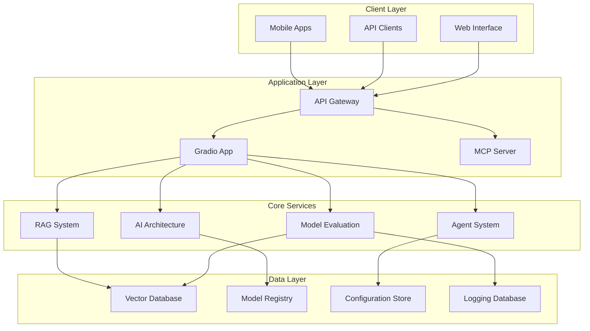
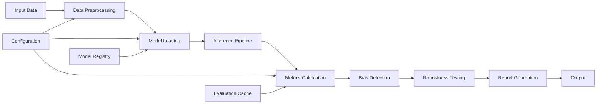
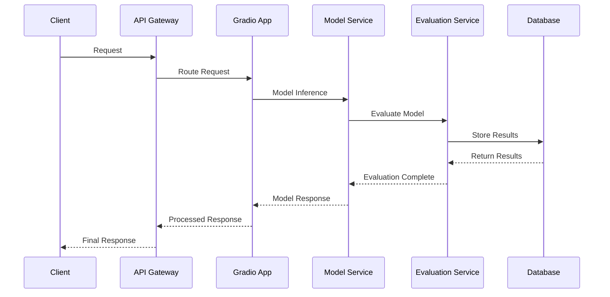
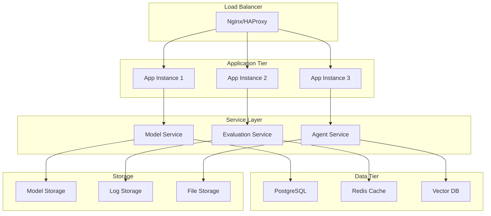
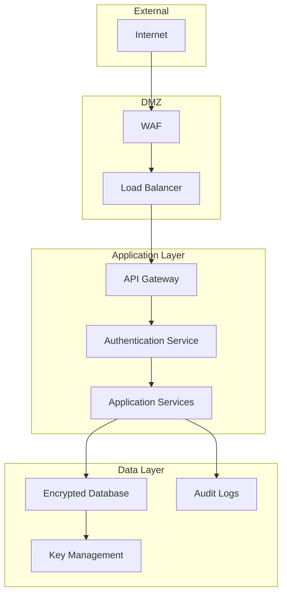
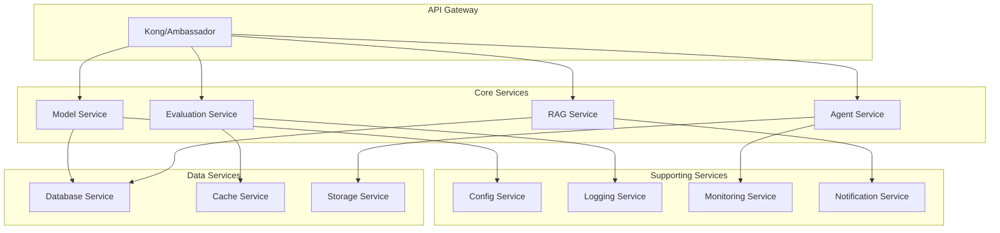
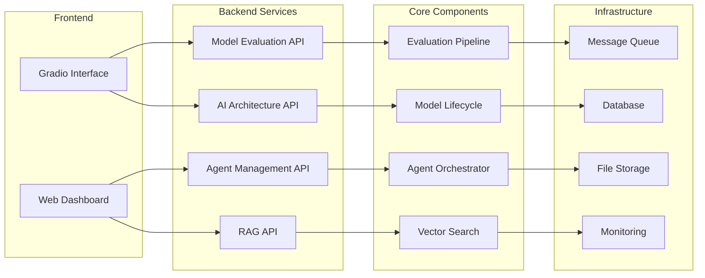

# Architecture Diagrams

## System Overview

The AI Assignments project follows a modular architecture designed for scalability, maintainability, and extensibility.

## High-Level Architecture



## Model Evaluation Architecture



## AI Architecture Components

```mermaid
graph TB
    subgraph "AI Architecture System"
        A[Model Lifecycle Manager]
        B[Agent Orchestrator]
        C[RAG Service]
        D[Monitoring System]
    end
    
    subgraph "Model Lifecycle"
        E[Development]
        F[Training]
        G[Validation]
        H[Deployment]
        I[Monitoring]
        J[Retirement]
    end
    
    subgraph "Agent System"
        K[Workflow Agents]
        L[Decision Agents]
        M[Data Agents]
        N[Monitoring Agents]
    end
    
    A --> E
    A --> F
    A --> G
    A --> H
    A --> I
    A --> J
    
    B --> K
    B --> L
    B --> M
    B --> N
    
    C --> O[Document Processing]
    C --> P[Vector Search]
    C --> Q[Response Generation]
    
    D --> R[Health Monitoring]
    D --> S[Performance Metrics]
    D --> T[Alert Management]
```



## Data Flow Architecture



## Deployment Architecture



## Security Architecture



## Microservices Architecture



## Component Interaction Diagram



## Technology Stack

### Frontend
- **Gradio**: Interactive web interface
- **React**: Dashboard components
- **WebSocket**: Real-time communication

### Backend
- **FastAPI**: REST API framework
- **Python**: Core programming language
- **Pydantic**: Data validation
- **Celery**: Task queue

### AI/ML
- **PyTorch**: Deep learning framework
- **Transformers**: NLP models
- **scikit-learn**: Traditional ML
- **FAISS**: Vector search

### Data Storage
- **PostgreSQL**: Relational database
- **Redis**: Caching and sessions
- **ChromaDB**: Vector database
- **MinIO**: Object storage

### Infrastructure
- **Docker**: Containerization
- **Kubernetes**: Orchestration
- **Nginx**: Load balancer
- **Prometheus**: Monitoring

## Design Patterns

### Repository Pattern
```python
class ModelRepository:
    def save(self, model: Model) -> str:
        """Save model to storage."""
        pass
    
    def find_by_id(self, model_id: str) -> Optional[Model]:
        """Find model by ID."""
        pass
    
    def find_all(self) -> List[Model]:
        """Find all models."""
        pass
```

### Factory Pattern
```python
class ModelFactory:
    @staticmethod
    def create_model(model_type: str, config: Dict) -> Model:
        """Create model instance based on type."""
        if model_type == "transformer":
            return TransformerModel(config)
        elif model_type == "cnn":
            return CNNModel(config)
        else:
            raise ValueError(f"Unknown model type: {model_type}")
```

### Observer Pattern
```python
class ModelObserver:
    def update(self, model: Model, event: str):
        """Handle model events."""
        pass

class ModelSubject:
    def __init__(self):
        self.observers: List[ModelObserver] = []
    
    def attach(self, observer: ModelObserver):
        """Attach observer."""
        self.observers.append(observer)
    
    def notify(self, event: str):
        """Notify all observers."""
        for observer in self.observers:
            observer.update(self, event)
```

## Scalability Considerations

### Horizontal Scaling
- Stateless service design
- Load balancer distribution
- Database sharding strategies
- Caching layers

### Vertical Scaling
- Resource optimization
- Memory management
- CPU utilization
- Storage optimization

### Performance Optimization
- Async/await patterns
- Connection pooling
- Query optimization
- Caching strategies

This architecture provides a solid foundation for building scalable, maintainable AI systems while ensuring flexibility for future enhancements and modifications.
