# Lenovo AAITC Hybrid Cloud AI Architecture Stack

## Comprehensive Enterprise AI Architecture Diagram

```mermaid
graph TB
    %% User Layer
    subgraph "User Layer"
        U1[Enterprise Users]
        U2[Developers]
        U3[Data Scientists]
        U4[Edge Devices]
        U5[Mobile Apps]
    end

    %% API Gateway Layer
    subgraph "API Gateway & Load Balancing"
        AG[API Gateway]
        LB[Load Balancer]
        CDN[CDN]
    end

    %% Application Layer
    subgraph "Application Layer"
        subgraph "Gradio Frontend (Assignment 1)"
            G1[Model Evaluation UI]
            G2[Real-time Dashboards]
            G3[MCP Server Integration]
        end

        subgraph "Enterprise MCP Server (Assignment 2)"
            MCP1[Model Factory APIs]
            MCP2[Global Alerting]
            MCP3[Multi-tenant Management]
            MCP4[CI/CD Orchestration]
        end
    end

    %% AI/ML Services Layer
    subgraph "AI/ML Services Layer"
        subgraph "Model Evaluation Framework"
            ME1[Comprehensive Evaluation Pipeline]
            ME2[Robustness Testing Suite]
            ME3[Bias Detection System]
            ME4[Enhanced Prompt Registries]
        end

        subgraph "AI Architecture Framework"
            AI1[Hybrid AI Platform]
            AI2[Model Lifecycle Manager]
            AI3[Agentic Computing Framework]
            AI4[Advanced RAG System]
        end

        subgraph "Fine-tuning & Quantization"
            FT1[Advanced Fine-Tuner]
            FT2[Custom Adapter Registry]
            FT3[Multi-task Fine-Tuner]
            FT4[Advanced Quantizer]
        end

        subgraph "Agent Systems"
            AG1[CrewAI Multi-Agent]
            AG2[LangGraph Workflows]
            AG3[SmolAgents Edge]
            AG4[Agent Collaboration]
        end
    end

    %% Model Serving Layer
    subgraph "Model Serving Layer"
        subgraph "Production Serving"
            BML[BentoML Production]
            TS[TorchServe]
            KS[KServe]
        end

        subgraph "Edge Serving"
            OLL[Ollama Edge]
            POD[Podman Containers]
        end

        subgraph "AutoML & Optimization"
            AUTO1[Optuna HPO]
            AUTO2[Ray Tune]
            AUTO3[Auto-sklearn]
            AUTO4[Model Ensembling]
        end
    end

    %% Workflow Orchestration
    subgraph "Workflow Orchestration"
        PREF[Prefect Workflows]
        K8S[Kubernetes Orchestration]
        HELM[Helm Charts]
    end

    %% CI/CD Pipeline
    subgraph "CI/CD Pipeline"
        subgraph "GitLab CI/CD"
            GL1[Model Training Pipeline]
            GL2[Infrastructure Pipeline]
            GL3[Security Scanning]
        end

        subgraph "Jenkins Pipeline"
            JK1[Enterprise Workflows]
            JK2[Quality Gates]
            JK3[Environment Promotion]
        end
    end

    %% Infrastructure as Code
    subgraph "Infrastructure as Code"
        TF[Terraform]
        TF1[AWS Modules]
        TF2[Azure Modules]
        TF3[GCP Modules]
        TF4[Edge Infrastructure]
    end

    %% Container Orchestration
    subgraph "Container Orchestration"
        subgraph "Kubernetes Clusters"
            K8S1[Cloud Clusters]
            K8S2[Edge Clusters]
            K8S3[Hybrid Clusters]
        end

        subgraph "Service Mesh"
            ISTIO[Istio Service Mesh]
            ENVOY[Envoy Proxy]
        end

        subgraph "Container Runtime"
            DOCKER[Docker Enterprise]
            PODMAN[Podman Edge]
            CRIO[CRI-O]
        end
    end

    %% Monitoring & Observability
    subgraph "Monitoring & Observability"
        subgraph "Metrics & Alerting"
            PROM[Prometheus]
            GRAF[Grafana Dashboards]
            ALERT[AlertManager]
        end

        subgraph "Logging & Tracing"
            ELK[ELK Stack]
            JAEGER[Jaeger Tracing]
            LANG[LangFuse]
        end

        subgraph "AI-Specific Monitoring"
            DRIFT[Model Drift Detection]
            BIAS[Bias Monitoring]
            PERF[Performance Tracking]
        end
    end

    %% Data Layer
    subgraph "Data Layer"
        subgraph "Vector Databases"
            PINECONE[Pinecone]
            WEAVIATE[Weaviate]
            CHROMA[ChromaDB]
        end

        subgraph "Traditional Databases"
            POSTGRES[PostgreSQL]
            REDIS[Redis Cache]
            MONGODB[MongoDB]
        end

        subgraph "Storage"
            S3[AWS S3]
            BLOB[Azure Blob]
            GCS[GCP Cloud Storage]
        end
    end

    %% Cloud Infrastructure
    subgraph "Multi-Cloud Infrastructure"
        subgraph "AWS"
            AWS1[EC2 Instances]
            AWS2[EKS Clusters]
            AWS3[SageMaker]
            AWS4[Lambda Functions]
        end

        subgraph "Azure"
            AZ1[Virtual Machines]
            AZ2[AKS Clusters]
            AZ3[ML Workspace]
            AZ4[Functions]
        end

        subgraph "GCP"
            GCP1[Compute Engine]
            GCP2[GKE Clusters]
            GCP3[Vertex AI]
            GCP4[Cloud Functions]
        end
    end

    %% Edge Infrastructure
    subgraph "Edge Infrastructure"
        subgraph "Lenovo Edge Devices"
            EDGE1[ThinkEdge Servers]
            EDGE2[Industrial PCs]
            EDGE3[IoT Gateways]
        end

        subgraph "Edge Computing"
            EDGE4[K3s Edge]
            EDGE5[EdgeX Foundry]
            EDGE6[5G Connectivity]
        end
    end

    %% Security & Compliance
    subgraph "Security & Compliance"
        subgraph "Identity & Access"
            IAM[IAM/RBAC]
            VAULT[HashiCorp Vault]
            AD[Active Directory]
        end

        subgraph "Security Scanning"
            TRIVY[Trivy Scanner]
            GRYPE[Grype Scanner]
            CLAIR[Clair Scanner]
        end

        subgraph "Compliance"
            GDPR[GDPR Compliance]
            HIPAA[HIPAA Compliance]
            SOX[SOX Compliance]
        end
    end

    %% Model Registry & Artifacts
    subgraph "Model Registry & Artifacts"
        subgraph "Model Management"
            MLFLOW[MLflow Registry]
            WANDB[Weights & Biases]
            NEPTUNE[Neptune]
        end

        subgraph "Container Registry"
            ECR[AWS ECR]
            ACR[Azure ACR]
            GCR[GCP GCR]
            HARBOR[Harbor Private]
        end

        subgraph "Artifact Storage"
            ART1[Model Artifacts]
            ART2[Container Images]
            ART3[Helm Charts]
        end
    end

    %% Connections - User Layer to API Gateway
    U1 --> AG
    U2 --> AG
    U3 --> AG
    U4 --> AG
    U5 --> AG

    %% API Gateway to Application Layer
    AG --> LB
    LB --> G1
    LB --> MCP1

    %% Application Layer to AI/ML Services
    G1 --> ME1
    MCP1 --> AI1
    MCP2 --> AI2
    MCP3 --> AI3
    MCP4 --> AI4

    %% AI/ML Services to Model Serving
    ME1 --> BML
    AI1 --> TS
    AI2 --> KS
    AI3 --> AG1
    AI4 --> AG2

    %% Fine-tuning to Model Serving
    FT1 --> BML
    FT2 --> OLL
    FT3 --> TS
    FT4 --> KS

    %% Agent Systems to Orchestration
    AG1 --> PREF
    AG2 --> K8S
    AG3 --> HELM
    AG4 --> PREF

    %% Model Serving to Orchestration
    BML --> K8S
    TS --> K8S
    KS --> K8S
    OLL --> POD

    %% Orchestration to CI/CD
    PREF --> GL1
    K8S --> JK1
    HELM --> GL2

    %% CI/CD to Infrastructure
    GL1 --> TF
    GL2 --> TF
    JK1 --> TF
    JK2 --> TF

    %% Infrastructure to Cloud
    TF --> AWS1
    TF --> AZ1
    TF --> GCP1
    TF --> EDGE1

    %% Container Orchestration
    K8S1 --> ISTIO
    K8S2 --> ENVOY
    K8S3 --> DOCKER

    %% Monitoring Connections
    K8S --> PROM
    BML --> GRAF
    TS --> ELK
    KS --> JAEGER

    %% Data Layer Connections
    AI4 --> PINECONE
    ME1 --> WEAVIATE
    AI3 --> CHROMA
    BML --> POSTGRES
    TS --> REDIS

    %% Security Connections
    AG --> IAM
    K8S --> VAULT
    BML --> TRIVY
    TS --> GRYPE

    %% Model Registry Connections
    FT1 --> MLFLOW
    FT2 --> WANDB
    BML --> ECR
    TS --> ACR

    %% Styling
    classDef userLayer fill:#e1f5fe
    classDef apiLayer fill:#f3e5f5
    classDef appLayer fill:#e8f5e8
    classDef aiLayer fill:#fff3e0
    classDef servingLayer fill:#fce4ec
    classDef orchestrationLayer fill:#f1f8e9
    classDef cicdLayer fill:#e0f2f1
    classDef infraLayer fill:#e3f2fd
    classDef containerLayer fill:#f9fbe7
    classDef monitoringLayer fill:#fff8e1
    classDef dataLayer fill:#f3e5f5
    classDef cloudLayer fill:#e8eaf6
    classDef edgeLayer fill:#e0f7fa
    classDef securityLayer fill:#ffebee
    classDef registryLayer fill:#f1f8e9

    class U1,U2,U3,U4,U5 userLayer
    class AG,LB,CDN apiLayer
    class G1,G2,G3,MCP1,MCP2,MCP3,MCP4 appLayer
    class ME1,ME2,ME3,ME4,AI1,AI2,AI3,AI4,FT1,FT2,FT3,FT4,AG1,AG2,AG3,AG4 aiLayer
    class BML,TS,KS,OLL,POD,AUTO1,AUTO2,AUTO3,AUTO4 servingLayer
    class PREF,K8S,HELM orchestrationLayer
    class GL1,GL2,GL3,JK1,JK2,JK3 cicdLayer
    class TF,TF1,TF2,TF3,TF4 infraLayer
    class K8S1,K8S2,K8S3,ISTIO,ENVOY,DOCKER,PODMAN,CRIO containerLayer
    class PROM,GRAF,ALERT,ELK,JAEGER,LANG,DRIFT,BIAS,PERF monitoringLayer
    class PINECONE,WEAVIATE,CHROMA,POSTGRES,REDIS,MONGODB,S3,BLOB,GCS dataLayer
    class AWS1,AWS2,AWS3,AWS4,AZ1,AZ2,AZ3,AZ4,GCP1,GCP2,GCP3,GCP4 cloudLayer
    class EDGE1,EDGE2,EDGE3,EDGE4,EDGE5,EDGE6 edgeLayer
    class IAM,VAULT,AD,TRIVY,GRYPE,CLAIR,GDPR,HIPAA,SOX securityLayer
    class MLFLOW,WANDB,NEPTUNE,ECR,ACR,GCR,HARBOR,ART1,ART2,ART3 registryLayer
```

## Architecture Components Overview

### 🏗️ **Infrastructure Layer**

- **Terraform**: Multi-cloud infrastructure provisioning
- **Kubernetes**: Container orchestration across cloud and edge
- **Helm**: Package management for AI/ML deployments
- **Docker/Podman**: Containerization for enterprise and edge

### 🤖 **AI/ML Services Layer**

- **Model Evaluation**: Comprehensive evaluation with enhanced prompt registries
- **AI Architecture**: Hybrid platform with lifecycle management
- **Fine-tuning**: Advanced techniques with custom adapter registries
- **Agent Systems**: CrewAI, LangGraph, SmolAgents integration

### 🚀 **Model Serving Layer**

- **BentoML**: Production model serving with auto-scaling
- **Ollama**: Edge model deployment for Lenovo devices
- **AutoML**: Automated optimization with Optuna and Ray Tune
- **TorchServe/KServe**: Enterprise model serving

### 🔄 **Workflow Orchestration**

- **Prefect**: Data and ML pipeline orchestration
- **Kubernetes**: Container orchestration and scaling
- **GitLab/Jenkins**: CI/CD pipeline automation

### 📊 **Monitoring & Observability**

- **Prometheus/Grafana**: Metrics collection and visualization
- **ELK Stack**: Centralized logging
- **Jaeger**: Distributed tracing
- **AI-Specific**: Model drift, bias monitoring, performance tracking

### 🔒 **Security & Compliance**

- **Identity Management**: IAM, RBAC, Vault
- **Security Scanning**: Trivy, Grype, Clair
- **Compliance**: GDPR, HIPAA, SOX frameworks

### 🌐 **Multi-Cloud & Edge**

- **Cloud Providers**: AWS, Azure, GCP with native AI services
- **Edge Computing**: Lenovo ThinkEdge, Industrial PCs, IoT gateways
- **Hybrid Deployment**: Seamless cloud-edge orchestration

## Key Features

### ✅ **Enterprise-Grade**

- Multi-tenant architecture with resource isolation
- Comprehensive security and compliance
- High availability and disaster recovery
- Global deployment capabilities

### ✅ **AI/ML Optimized**

- Latest Q3 2025 models (GPT-5, Claude 3.5 Sonnet, Llama 3.3)
- Advanced fine-tuning and quantization
- Custom adapter registries
- Multi-agent collaboration

### ✅ **Production-Ready**

- Complete MLOps pipeline
- Automated CI/CD workflows
- Real-time monitoring and alerting
- Scalable infrastructure

### ✅ **Edge-Capable**

- Local model deployment with Ollama
- Edge-optimized containers with Podman
- Offline inference capabilities
- 5G connectivity support

This architecture demonstrates comprehensive MLOps expertise and enterprise-scale AI deployment capabilities suitable for Lenovo's global operations.
