# Lenovo AAITC Hybrid Cloud AI Architecture Stack

## Comprehensive Enterprise AI Architecture Diagram

```mermaid
graph TB
    %% User Layer
    subgraph "User Layer"
        U1[Enterprise Users]
        U2[Developers]
        U3[Data Scientists]
        U4[Edge Devices]
        U5[Mobile Apps]
        U6[Copilot365 Users]
        U7[Microsoft 365 Integration]
    end

    %% API Gateway Layer
    subgraph "API Gateway & Load Balancing"
        AG[API Gateway]
        LB[Load Balancer]
        CDN[CDN]
    end

    %% Application Layer
    subgraph "Application Layer"
        subgraph "Gradio Frontend (Assignment 1)"
            G1[Model Evaluation UI]
            G2[Real-time Dashboards]
            G3[MCP Server Integration]
        end

        subgraph "Enterprise MCP Server (Assignment 2)"
            MCP1[Model Factory APIs]
            MCP2[Global Alerting]
            MCP3[Multi-tenant Management]
            MCP4[CI/CD Orchestration]
        end

        subgraph "CopilotKit Integration"
            CK1[CopilotKit Frontend]
            CK2[AI Chat Interface]
            CK3[Document Processing]
            CK4[Workflow Automation]
        end

        subgraph "Copilot365 Integration"
            C3651[Microsoft Copilot365]
            C3652[Office 365 Integration]
            C3653[Teams Integration]
            C3654[SharePoint Integration]
        end
    end

    %% AI/ML Services Layer
    subgraph "AI/ML Services Layer"
        subgraph "Model Evaluation Framework"
            ME1[Comprehensive Evaluation Pipeline]
            ME2[Robustness Testing Suite]
            ME3[Bias Detection System]
            ME4[Enhanced Prompt Registries]
        end

        subgraph "AI Architecture Framework"
            AI1[Hybrid AI Platform]
            AI2[Model Lifecycle Manager]
            AI3[Agentic Computing Framework]
            AI4[Advanced RAG System]
        end

        subgraph "Fine-tuning & Quantization"
            FT1[Advanced Fine-Tuner]
            FT2[Custom Adapter Registry]
            FT3[Multi-task Fine-Tuner]
            FT4[Advanced Quantizer]
        end

        subgraph "Agent Systems"
            AG1[CrewAI Multi-Agent]
            AG2[LangGraph Workflows]
            AG3[SmolAgents Edge]
            AG4[Agent Collaboration]
        end
    end

    %% Model Serving Layer
    subgraph "Model Serving Layer"
        subgraph "Production Serving"
            BML[BentoML Production]
            TS[TorchServe]
            KS[KServe]
        end

        subgraph "Edge Serving"
            OLL[Ollama Edge]
            POD[Podman Containers]
        end

        subgraph "AutoML & Optimization"
            AUTO1[Optuna HPO]
            AUTO2[Ray Tune]
            AUTO3[Auto-sklearn]
            AUTO4[Model Ensembling]
        end
    end

    %% Workflow Orchestration
    subgraph "Workflow Orchestration"
        PREF[Prefect Workflows]
        K8S[Kubernetes Orchestration]
        HELM[Helm Charts]
    end

    %% CI/CD Pipeline
    subgraph "CI/CD Pipeline"
        subgraph "GitLab CI/CD"
            GL1[Model Training Pipeline]
            GL2[Infrastructure Pipeline]
            GL3[Security Scanning]
        end

        subgraph "Jenkins Pipeline"
            JK1[Enterprise Workflows]
            JK2[Quality Gates]
            JK3[Environment Promotion]
        end
    end

    %% Infrastructure as Code
    subgraph "Infrastructure as Code"
        TF[Terraform]
        TF1[AWS Modules]
        TF2[Azure Modules]
        TF3[GCP Modules]
        TF4[Edge Infrastructure]
    end

    %% Container Orchestration
    subgraph "Container Orchestration"
        subgraph "Kubernetes Clusters"
            K8S1[Cloud Clusters]
            K8S2[Edge Clusters]
            K8S3[Hybrid Clusters]
        end

        subgraph "Service Mesh"
            ISTIO[Istio Service Mesh]
            ENVOY[Envoy Proxy]
        end

        subgraph "Container Runtime"
            DOCKER[Docker Enterprise]
            PODMAN[Podman Edge]
            CRIO[CRI-O]
        end
    end

    %% Monitoring & Observability
    subgraph "Monitoring & Observability"
        subgraph "Metrics & Alerting"
            PROM[Prometheus]
            GRAF[Grafana Dashboards]
            ALERT[AlertManager]
        end

        subgraph "Logging & Tracing"
            ELK[ELK Stack]
            JAEGER[Jaeger Tracing]
            LANG[LangFuse]
        end

        subgraph "AI-Specific Monitoring"
            DRIFT[Model Drift Detection]
            BIAS[Bias Monitoring]
            PERF[Performance Tracking]
        end
    end

    %% Data Layer
    subgraph "Data Layer"
        subgraph "Vector Databases"
            PINECONE[Pinecone]
            WEAVIATE[Weaviate]
            CHROMA[ChromaDB]
        end

        subgraph "Traditional Databases"
            POSTGRES[PostgreSQL]
            REDIS[Redis Cache]
            MONGODB[MongoDB]
        end

        subgraph "Storage"
            S3[AWS S3]
            BLOB[Azure Blob]
            GCS[GCP Cloud Storage]
        end
    end

    %% Cloud Infrastructure
    subgraph "Multi-Cloud Infrastructure"
        subgraph "AWS Ecosystem"
            AWS1[EC2 Instances]
            AWS2[EKS Clusters]
            AWS3[SageMaker]
            AWS4[Lambda Functions]
            AWS5[Bedrock AI Services]
            AWS6[Comprehend NLP]
            AWS7[Rekognition Vision]
            AWS8[Textract OCR]
            AWS9[Personalize ML]
            AWS10[Forecast Time Series]
        end

        subgraph "Azure Ecosystem"
            AZ1[Virtual Machines]
            AZ2[AKS Clusters]
            AZ3[ML Workspace]
            AZ4[Functions]
            AZ5[Azure OpenAI Service]
            AZ6[Cognitive Services]
            AZ7[Form Recognizer]
            AZ8[Computer Vision]
            AZ9[Language Understanding]
            AZ10[Personalizer]
            AZ11[Azure AI Search]
            AZ12[Bot Framework]
        end

        subgraph "GCP Ecosystem"
            GCP1[Compute Engine]
            GCP2[GKE Clusters]
            GCP3[Vertex AI]
            GCP4[Cloud Functions]
            GCP5[Generative AI Studio]
            GCP6[AutoML Tables]
            GCP7[Vision AI]
            GCP8[Natural Language AI]
            GCP9[Translation AI]
            GCP10[Document AI]
            GCP11[Recommendations AI]
            GCP12[Contact Center AI]
        end

        subgraph "NVIDIA Ecosystem"
            NV1[NVIDIA DGX Systems]
            NV2[NVIDIA HGX Platforms]
            NV3[NVIDIA AI Enterprise]
            NV4[NVIDIA Omniverse]
            NV5[NVIDIA RAPIDS]
            NV6[NVIDIA Triton Inference]
            NV7[NVIDIA NeMo Framework]
            NV8[NVIDIA TAO Toolkit]
            NV9[NVIDIA DeepStream]
            NV10[NVIDIA Clara Healthcare]
            NV11[NVIDIA DRIVE Autonomous]
            NV12[NVIDIA Jetson Edge AI]
            NV13[NVIDIA CUDA Platform]
            NV14[NVIDIA TensorRT]
            NV15[NVIDIA TensorFlow]
            NV16[NVIDIA PyTorch]
            NV17[NVIDIA NIMS]
            NV18[NVIDIA DYMO]
            NV19[NVIDIA Fleet Command]
            NV20[NVIDIA Base Command]
        end
    end

    %% Edge Infrastructure
    subgraph "Edge Infrastructure"
        subgraph "Lenovo-NVIDIA Edge Devices"
            EDGE1[ThinkEdge Servers with NVIDIA GPUs]
            EDGE2[Industrial PCs with Jetson]
            EDGE3[IoT Gateways with Edge AI]
            EDGE4[Lenovo ThinkStation with RTX]
            EDGE5[ThinkPad with RTX Mobile]
        end

        subgraph "NVIDIA Edge AI Platform"
            EDGE6[NVIDIA Jetson Orin]
            EDGE7[NVIDIA Jetson Nano]
            EDGE8[NVIDIA Jetson Xavier]
            EDGE9[NVIDIA DRIVE AGX]
            EDGE10[NVIDIA Clara AGX]
        end

        subgraph "Edge Computing"
            EDGE11[K3s Edge with GPU]
            EDGE12[EdgeX Foundry]
            EDGE13[5G Connectivity]
            EDGE14[NVIDIA Fleet Command]
        end
    end

    %% Security & Compliance
    subgraph "Security & Compliance"
        subgraph "Identity & Access"
            IAM[IAM/RBAC]
            VAULT[HashiCorp Vault]
            AD[Active Directory]
        end

        subgraph "Security Scanning"
            TRIVY[Trivy Scanner]
            GRYPE[Grype Scanner]
            CLAIR[Clair Scanner]
        end

        subgraph "Compliance"
            GDPR[GDPR Compliance]
            HIPAA[HIPAA Compliance]
            SOX[SOX Compliance]
        end
    end

    %% Model Registry & Artifacts
    subgraph "Model Registry & Artifacts"
        subgraph "Model Management"
            MLFLOW[MLflow Registry]
            WANDB[Weights & Biases]
            NEPTUNE[Neptune]
        end

        subgraph "Container Registry"
            ECR[AWS ECR]
            ACR[Azure ACR]
            GCR[GCP GCR]
            HARBOR[Harbor Private]
        end

        subgraph "Artifact Storage"
            ART1[Model Artifacts]
            ART2[Container Images]
            ART3[Helm Charts]
        end
    end

    %% Connections - User Layer to API Gateway
    U1 --> AG
    U2 --> AG
    U3 --> AG
    U4 --> AG
    U5 --> AG
    U6 --> C3651
    U7 --> C3652

    %% API Gateway to Application Layer
    AG --> LB
    LB --> G1
    LB --> MCP1
    LB --> CK1
    C3651 --> C3652
    C3652 --> C3653
    C3653 --> C3654

    %% Application Layer to AI/ML Services
    G1 --> ME1
    MCP1 --> AI1
    MCP2 --> AI2
    MCP3 --> AI3
    MCP4 --> AI4
    CK1 --> AI1
    CK2 --> AI3
    CK3 --> AI4
    CK4 --> AI2
    C3651 --> AZ5
    C3652 --> AZ6
    C3653 --> AZ11
    C3654 --> AZ12

    %% AI/ML Services to Model Serving
    ME1 --> BML
    AI1 --> TS
    AI2 --> KS
    AI3 --> AG1
    AI4 --> AG2
    AI1 --> NV6
    AI2 --> NV7
    AI3 --> NV8
    AI4 --> NV9
    AI1 --> NV17
    AI2 --> NV18
    AI3 --> NV19
    AI4 --> NV20

    %% Fine-tuning to Model Serving
    FT1 --> BML
    FT2 --> OLL
    FT3 --> TS
    FT4 --> KS

    %% Agent Systems to Orchestration
    AG1 --> PREF
    AG2 --> K8S
    AG3 --> HELM
    AG4 --> PREF

    %% Model Serving to Orchestration
    BML --> K8S
    TS --> K8S
    KS --> K8S
    OLL --> POD

    %% Orchestration to CI/CD
    PREF --> GL1
    K8S --> JK1
    HELM --> GL2

    %% CI/CD to Infrastructure
    GL1 --> TF
    GL2 --> TF
    JK1 --> TF
    JK2 --> TF

    %% Infrastructure to Cloud
    TF --> AWS1
    TF --> AZ1
    TF --> GCP1
    TF --> EDGE1
    TF --> AWS5
    TF --> AZ5
    TF --> GCP5
    TF --> NV1
    TF --> NV2
    TF --> NV3

    %% Container Orchestration
    K8S1 --> ISTIO
    K8S2 --> ENVOY
    K8S3 --> DOCKER

    %% Monitoring Connections
    K8S --> PROM
    BML --> GRAF
    TS --> ELK
    KS --> JAEGER

    %% Data Layer Connections
    AI4 --> PINECONE
    ME1 --> WEAVIATE
    AI3 --> CHROMA
    BML --> POSTGRES
    TS --> REDIS

    %% Security Connections
    AG --> IAM
    K8S --> VAULT
    BML --> TRIVY
    TS --> GRYPE

    %% Model Registry Connections
    FT1 --> MLFLOW
    FT2 --> WANDB
    BML --> ECR
    TS --> ACR

    %% Styling
    classDef userLayer fill:#e1f5fe
    classDef apiLayer fill:#f3e5f5
    classDef appLayer fill:#e8f5e8
    classDef aiLayer fill:#fff3e0
    classDef servingLayer fill:#fce4ec
    classDef orchestrationLayer fill:#f1f8e9
    classDef cicdLayer fill:#e0f2f1
    classDef infraLayer fill:#e3f2fd
    classDef containerLayer fill:#f9fbe7
    classDef monitoringLayer fill:#fff8e1
    classDef dataLayer fill:#f3e5f5
    classDef cloudLayer fill:#e8eaf6
    classDef edgeLayer fill:#e0f7fa
    classDef securityLayer fill:#ffebee
    classDef registryLayer fill:#f1f8e9

    class U1,U2,U3,U4,U5,U6,U7 userLayer
    class AG,LB,CDN apiLayer
    class G1,G2,G3,MCP1,MCP2,MCP3,MCP4,CK1,CK2,CK3,CK4,C3651,C3652,C3653,C3654 appLayer
    class ME1,ME2,ME3,ME4,AI1,AI2,AI3,AI4,FT1,FT2,FT3,FT4,AG1,AG2,AG3,AG4 aiLayer
    class BML,TS,KS,OLL,POD,AUTO1,AUTO2,AUTO3,AUTO4 servingLayer
    class PREF,K8S,HELM orchestrationLayer
    class GL1,GL2,GL3,JK1,JK2,JK3 cicdLayer
    class TF,TF1,TF2,TF3,TF4 infraLayer
    class K8S1,K8S2,K8S3,ISTIO,ENVOY,DOCKER,PODMAN,CRIO containerLayer
    class PROM,GRAF,ALERT,ELK,JAEGER,LANG,DRIFT,BIAS,PERF monitoringLayer
    class PINECONE,WEAVIATE,CHROMA,POSTGRES,REDIS,MONGODB,S3,BLOB,GCS dataLayer
    class AWS1,AWS2,AWS3,AWS4,AWS5,AWS6,AWS7,AWS8,AWS9,AWS10,AZ1,AZ2,AZ3,AZ4,AZ5,AZ6,AZ7,AZ8,AZ9,AZ10,AZ11,AZ12,GCP1,GCP2,GCP3,GCP4,GCP5,GCP6,GCP7,GCP8,GCP9,GCP10,GCP11,GCP12,NV1,NV2,NV3,NV4,NV5,NV6,NV7,NV8,NV9,NV10,NV11,NV12,NV13,NV14,NV15,NV16,NV17,NV18,NV19,NV20 cloudLayer
    class EDGE1,EDGE2,EDGE3,EDGE4,EDGE5,EDGE6,EDGE7,EDGE8,EDGE9,EDGE10,EDGE11,EDGE12,EDGE13,EDGE14 edgeLayer
    class IAM,VAULT,AD,TRIVY,GRYPE,CLAIR,GDPR,HIPAA,SOX securityLayer
    class MLFLOW,WANDB,NEPTUNE,ECR,ACR,GCR,HARBOR,ART1,ART2,ART3 registryLayer
```

## Architecture Components Overview

### 🏗️ **Infrastructure Layer**

- **Terraform**: Multi-cloud infrastructure provisioning
- **Kubernetes**: Container orchestration across cloud and edge
- **Helm**: Package management for AI/ML deployments
- **Docker/Podman**: Containerization for enterprise and edge

### 🤖 **AI/ML Services Layer**

- **Model Evaluation**: Comprehensive evaluation with enhanced prompt registries
- **AI Architecture**: Hybrid platform with lifecycle management
- **Fine-tuning**: Advanced techniques with custom adapter registries
- **Agent Systems**: CrewAI, LangGraph, SmolAgents integration
- **CopilotKit Integration**: AI chat interface, document processing, workflow automation
- **Copilot365 Integration**: Microsoft 365, Teams, SharePoint integration

### 🚀 **Model Serving Layer**

- **BentoML**: Production model serving with auto-scaling
- **Ollama**: Edge model deployment for Lenovo devices
- **AutoML**: Automated optimization with Optuna and Ray Tune
- **TorchServe/KServe**: Enterprise model serving

### 🔄 **Workflow Orchestration**

- **Prefect**: Data and ML pipeline orchestration
- **Kubernetes**: Container orchestration and scaling
- **GitLab/Jenkins**: CI/CD pipeline automation

### 📊 **Monitoring & Observability**

- **Prometheus/Grafana**: Metrics collection and visualization
- **ELK Stack**: Centralized logging
- **Jaeger**: Distributed tracing
- **AI-Specific**: Model drift, bias monitoring, performance tracking

### 🔒 **Security & Compliance**

- **Identity Management**: IAM, RBAC, Vault
- **Security Scanning**: Trivy, Grype, Clair
- **Compliance**: GDPR, HIPAA, SOX frameworks

### 🌐 **Multi-Cloud & Edge**

- **AWS Ecosystem**: Bedrock AI, Comprehend NLP, Rekognition Vision, Textract OCR, Personalize ML, Forecast
- **Azure Ecosystem**: OpenAI Service, Cognitive Services, Form Recognizer, Computer Vision, Language Understanding, AI Search, Bot Framework
- **GCP Ecosystem**: Generative AI Studio, AutoML Tables, Vision AI, Natural Language AI, Translation AI, Document AI, Recommendations AI, Contact Center AI
- **NVIDIA Ecosystem**: DGX/HGX Systems, AI Enterprise, Triton Inference, NeMo Framework, TAO Toolkit, NIMS, DYMO, Fleet Command, Base Command, CUDA Platform, TensorRT, Jetson Edge AI
- **Lenovo-NVIDIA Edge**: ThinkEdge with GPUs, Industrial PCs with Jetson, ThinkStation/ThinkPad with RTX, Jetson Orin/Nano/Xavier, DRIVE AGX, Clara AGX
- **Hybrid Deployment**: Seamless cloud-edge orchestration with NVIDIA acceleration

## Key Features

### ✅ **Enterprise-Grade**

- Multi-tenant architecture with resource isolation
- Comprehensive security and compliance
- High availability and disaster recovery
- Global deployment capabilities

### ✅ **AI/ML Optimized**

- Latest Q3 2025 models (GPT-5, Claude 3.5 Sonnet, Llama 3.3)
- Advanced fine-tuning and quantization
- Custom adapter registries
- Multi-agent collaboration

### ✅ **Production-Ready**

- Complete MLOps pipeline
- Automated CI/CD workflows
- Real-time monitoring and alerting
- Scalable infrastructure

### ✅ **Edge-Capable**

- Local model deployment with Ollama
- Edge-optimized containers with Podman
- Offline inference capabilities
- 5G connectivity support

This architecture demonstrates comprehensive MLOps expertise and enterprise-scale AI deployment capabilities suitable for Lenovo's global operations.
